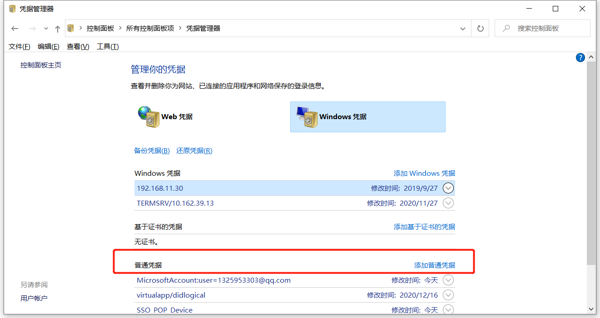
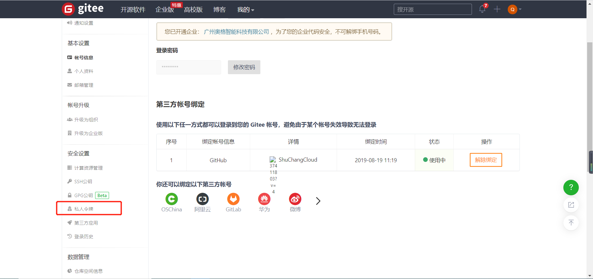
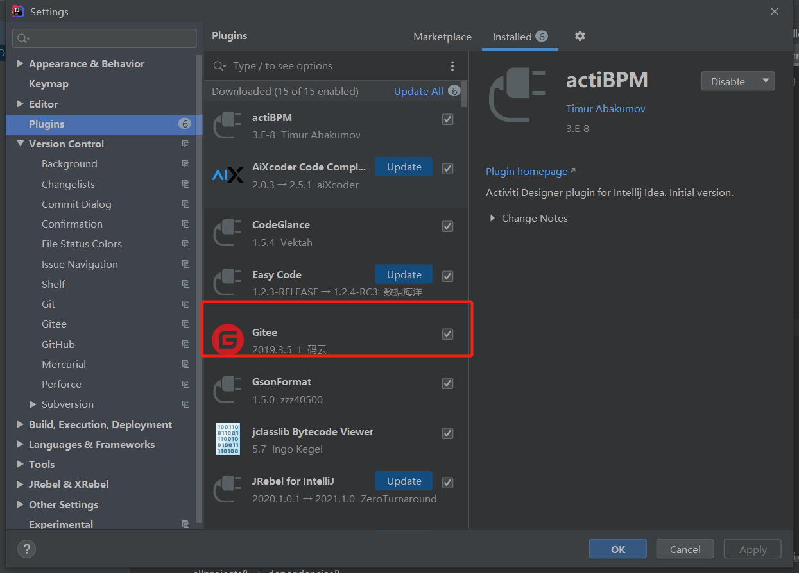
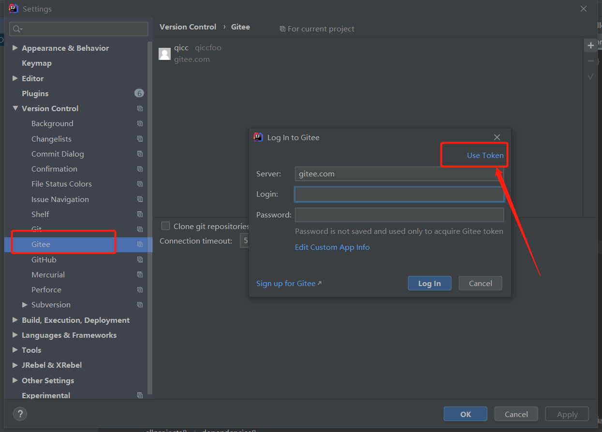
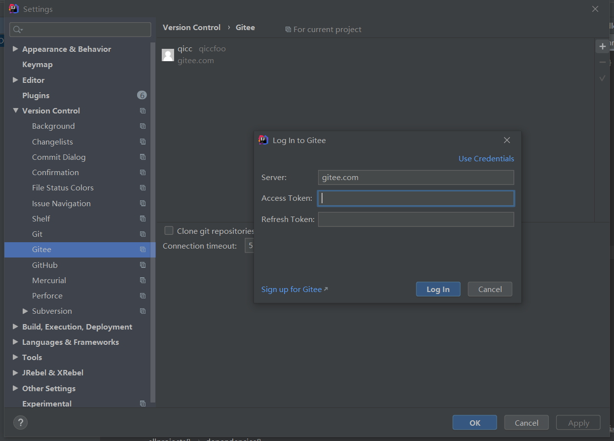
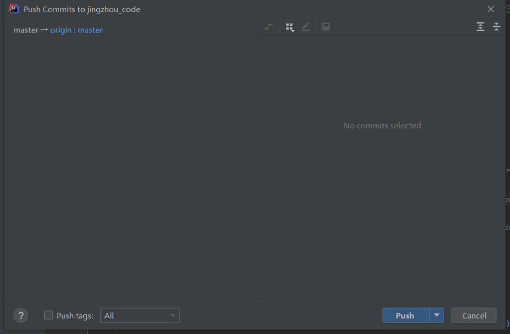

# 在idea提交代码到码云的时候使用第三方平台登录

进入Windows凭证管理页面。

在Windows凭据中先删除码云的登录账号和密码。

进入到码云设置中的`私人令牌`

按步骤生成一个私人令牌.

在idea中下载gitee插件

将刚才生成的令牌放到idea中

将生成的令牌复制到这里

提交代码

如果这时仍然提示要输出账号密码,直接关闭提示的对话框即可。

可以看到代码就能提交上去了。