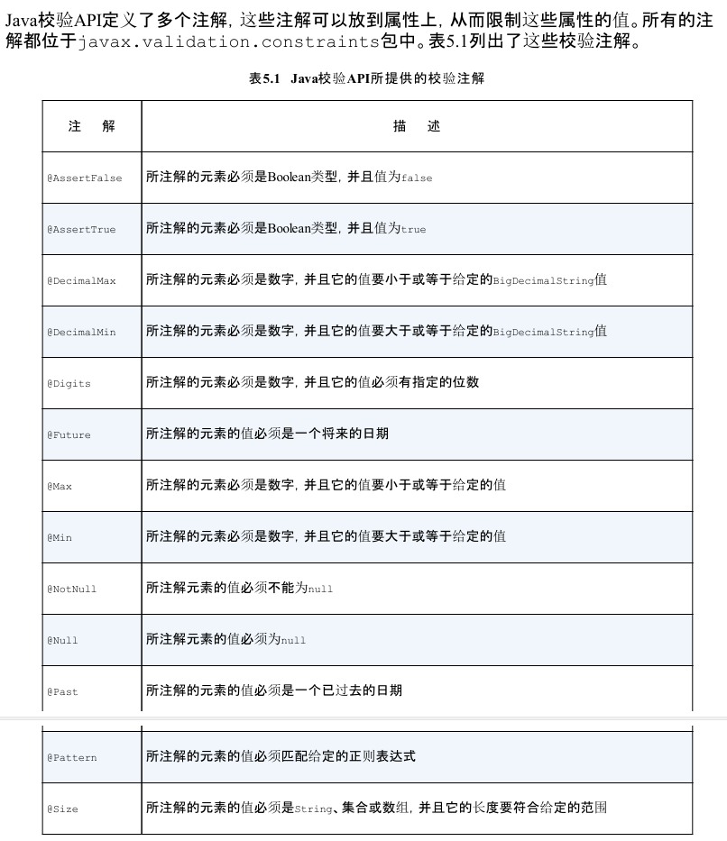

### 一. 导入maven依赖:

```xml
 <!-- https://mvnrepository.com/artifact/org.hibernate/hibernate-validator -->
    <dependency>
      <groupId>org.hibernate</groupId>
      <artifactId>hibernate-validator</artifactId>
      <version>5.4.2.Final</version>
    </dependency>
    <!-- https://mvnrepository.com/artifact/javax.validation/validation-api -->
    <dependency>
      <groupId>javax.validation</groupId>
      <artifactId>validation-api</artifactId>
      <version>2.0.1.Final</version>
    </dependency>
```


### 二. 对普通对象校验

```java
@Setter
@Getter
@NoArgsConstructor
@AllArgsConstructor
@ToString
public class Student {

    private Integer id;
    @NotNull				//此字段不能为空
    @Size(min = 3,max = 5)	//最小3个字符,最大长度5个字符
    private String name;
}

```

### 三. 封装校验工具类

```java
import java.util.Set;
import javax.validation.ConstraintViolation;
import javax.validation.Validation;
import javax.validation.Validator;
import org.hibernate.validator.HibernateValidator;
import com.atai.framework.lang.AppException;

public class ValidationUtils {
    
    /**
     * 使用hibernate的注解来进行验证
     * 
     */
    private static Validator validator = Validation
            .byProvider(HibernateValidator.class).configure().failFast(true).buildValidatorFactory().getValidator();

    /**
     * 功能描述: <br>
     * 〈注解验证参数〉
     *
     * @param obj
     * @see [相关类/方法](可选)
     * @since [产品/模块版本](可选)
     */
    public static <T> void validate(T obj) {
        Set<ConstraintViolation<T>> constraintViolations = validator.validate(obj);
        // 抛出检验异常
        if (constraintViolations.size() > 0) {
            throw new AppException("0001", String.format("参数校验失败:%s", constraintViolations.iterator().next().getMessage()));
        }
    }
}
```


### 四 使用

```java
ValidationUtils.validate(studentDto);
```


### 五.其他校验注解


