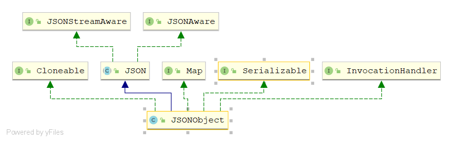
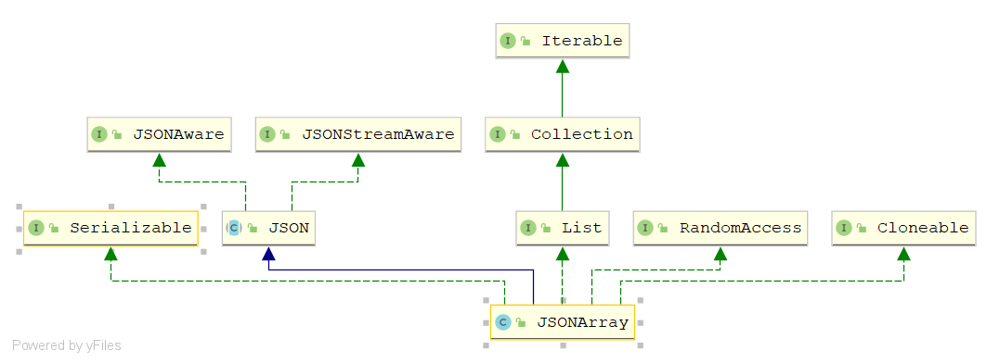

**以开源框架fastJson为例讲解**


为什么需要将json和jsonarr, json  obj  arr , map和bean list之间互相转换。

> JSON只是一个字符串,而字符串的操作方法就那么几个,限制了使用。如果能将字符串转换成其它对象，大大丰富了使用方法和范围。


JSONObject是什么?



> 可以看出JSONObjec本质上就是一个map，那不言而喻JSONObjec可以直接向上转型为Map。而且作为一个K-V类型的数据结构。map又可以转换为普通javaBean。那可见JSONObjec也可以通过框架特有的方法直接转为javaBean. 并且这些转换肯定都是双向的。
>
> 结论：javaBean,Map,JSONObjec可以非常快捷的互相转换。


再来看JSONArray和List的关系



发现JSONArray继承自List,那岂不是可以直接转换

```java
JSONArray jsonarr=new JSONArray();
List list=jsonarr;
```

你要只是想`System.out.println()`一下,这样写完全没问题。但是只有一个这个并没有什么卵用，我们真正想要的是**泛型**！！！


```java
JSONArray ssqyArr=new JSONArray();
List<CountryDto> countryDtos = JSONObject.parseArray(ssqyArr.toString(), CountryDto.class);
```


### 最后唠嗑一句

JSONObject也好，JSONArray也好，这些名字并不是fastjson框架所独有的。Apache，spring，jdk,fasjon,gson,jackson等等类库或框架都有这些相同的类名。

那么当项目中同事A开发的接口返回了Apache的JSONObject对象。但你觉得你不熟悉，或者不好用，想用别的框架类的JSONObject该怎么办？

**同类名转换**（自己发明的概念）

> 注意同类名转换并不是让你把Apache的JSONObject直接转换为fastjson的JSONObject对象，如果是这样的话，那现在开源框架和类库层出不穷，还没完没了了。每处一个类库或框架都要更新一个版本的转换。
>
> 同类名转换是指先将Apache的JSONObject转换为String字符串,在把字符串转换为目标框架类库的JSONObject


下面是使用同类名转换的例子，把jdk类库中的JSONArray转换为List

```java
//ssqyArr是jdk类库的JSONArray对象
List<CountryDto> countryDtos = com.alibaba.fastjson.JSONArray.parseArray(ssqyArr.toString(), CountryDto.class);
```

如果是fastjson自己的JSONArray可以直接使用toJavaList方法。注意toJavaList不是静态方法，因为几乎所有框架类库的JSONArray都实现了List接口,如果是静态方法可能会带入泛型为题。

