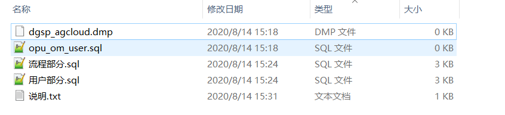
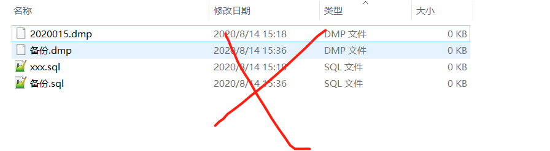
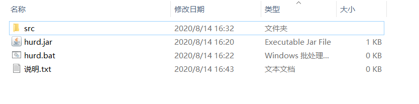
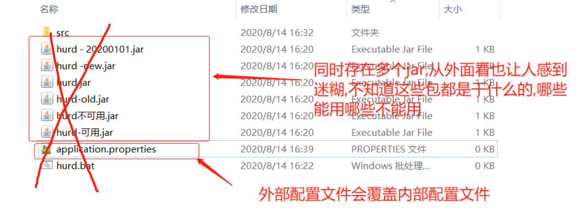

| 日期      | 部门         | 创建人 | 版本  |
| --------- | ------------ | ------ | ----- |
| 2020-8-13 | 规划事业五部 | 祁唱   | 1.0 √ |
|           |              |        |       |
|           |              |        |       |

**起步环境**

Windows OS

**目的**

见名知意，少踩坑，不踩坑，约定大于配置，提高效率。

**来源**

参考网上搜集的技巧,阿里麻麻手册和其它来源

## 存放路径及命名


统一存放位置 磁盘根目录A,B,C,D,E,F/backup/xx

示例:

```shell
#Oracle
D:\backup\Oracle

#MySQL
D:\backup\MySQL

#应用备份
D:\backup\app

#文件备份
D:\backup\files
或
D:\backup\MongoDB

有其它类型的时候随便加。
```


**快速输入日期**


其它输入法也是大同小异，示例：


## 数据库备份

### 文件夹命名

`强制:` **日期+字母+简述改动**，禁止加入任何特殊符号,如$，】【￥！—- _@#等等。

> 字母和简述改动可选，推荐加上。否则可能过段时间就不知道这个备份是干什么的。

`正例：`

```shell
2020-8-14

2020-8-14 简述改动

2020-8-11 加入a1功能

2020-8-12 放入b2数据,

2020-8-13 删除c3

有时一天可能要进行多次手动备份,在日期后加上字母a-z表示备份先后的顺序,如:

2020-8-18-a

2020-8-18-a 放入b2数据

2020-8-18-b 删除b2数据
```


`反例:`

```shell
$@202012a,备份,备份1 备份2.....
```


### 数据命名

`强制:` 

数据泵格式

```shell
Oracle数据泵以用户名命名,如dgsp_agcloud.dmp
MySQL以数据库名称命名,如agcloud.dmp ,dgsp_agcloud.dmp
```

SQL脚本备份

```sql
以备份的数据表名称命名,如 opu_om_user.sql
如果SQL脚本中存在多个表,则直接简述关系,如 用户部分.sql , 流程部分.sql
如果备份整个库(MySQL)或者整个用户(Oracle),则同上,库名或用户名.sql  如dgsp_agcloud.sql
```

说明部分

只是简述可能并无法把这次备份描述清楚,此时在放置一个说明文档更清楚不过了。

说明文档内容要求：日期，人员，说明，它可能看起来像下面这样


`正例:`



`反例:`



最终的目录结构看起来可能如下:

```shell
├─2020-8-11 加入a1功能
│      dgsp_agcloud.dmp
│      opu_om_user.sql
│      流程部分.sql
│      用户部分.sql
│      说明.txt
│
├─2020-8-13 删除c3
├─2020-8-14
├─2020-8-14 导入x4
└─2020-8-14 简述改动
```


## 应用备份

### 二级文件夹命名

`强制:` 禁止文件夹名称中包含任何中文和特殊符号。二级文件夹名应直接以**工程项目+版本号**命名

`解释:`

我司众多项目都有工作流引擎的支持,工作流项目在中文路径下可能会存在难以预估的问题,如项目无法启动,项目无法发起协调，项目流程无法继续向下执行，流程图保存时报错。。。。。等等

另外word等office文件转pdf的项目也会出类似的问题,如果存在中文路径,则可能导致转换成pdf失败。

`正例:`


`反例:`


### 三级文件夹命名

`强制:`直接以日期命名,如: 2020-8-14,其它规则同上

`解释:`依旧不能出现中文名称

`正例:`


`反例`


### 数据命名

应用文件大多数以jar包形式存在，少数项目自带webapp文件夹。

`推荐:`文件命名符合一般规范即可

`推荐:`最好不要在该目录下放置以下文件,比如application.properties，config文件夹,xx.config等

`强制:`不允许出现中文名称

`强制:`不允把不能运行的jar包做备份。不能运行或不能启动的jar包完全没有备份的意义！！！

`解释:` 现在大多数项目都使用springboot框架

> springboot官方文档
>
> 实际上，Spring Boot应用程序有多种设置途径。Spring Boot能从多种属性源获得属性，包括
> 如下几处。
>
> * 命令行参数
>
> * java:comp/env 里的JNDI属性
>
> * JVM系统属性
>
> * 操作系统环境变量
>
> * 随机生成的带 random.* 前缀的属性（在设置其他属性时，可以引用它们，比如 ${random.long} ）
>
> * 应用程序以外的application.properties或者appliaction.yml文件
>
> * 打包在应用程序内的application.properties或者appliaction.yml文件
>
> * 通过 @PropertySource 标注的属性源
>
> * 默认属性
>
>   这个列表按照优先级排序，也就是说，任何在高优先级属性源里设置的属性都会覆盖低优先级的相同属性。例如，命令行参数会覆盖其他属性源里的属性。

**如在外部放置的application.properties的启动端口是9090,jar包内的启动端口是8080,那么9090这覆盖jar包内的启动端口。**

`正例:`

```shell
│  hurd.bat
│  hurd.jar
│  说明.txt
└─src
    └─main
        └─webapp
```




`反例:`



文件备份最终效果可能如下

```shell
├─front-opus_v2.5
├─hurd_v2.3
│  ├─2020-8-14
│  ├─2020-8-19
│  ├─2020-8-20
│  │  │  hurd.bat
│  │  │  hurd.jar
│  │  │  说明.txt
│  │  │
│  │  └─src
│  │      └─main
│  │          └─webapp
│  ├─2020-8-20-a
│  │  │  hurd.bat
│  │  │  hurd.jar
│  │  │  说明.txt
│  │  │
│  │  └─src
│  │      └─main
│  │          └─webapp
│  └─2020-8-20-b
├─hurd_v2.4
├─hurd_v2.6
│  └─2020-8-14
│      │  hurd.bat
│      │  hurd.jar
│      │  说明.txt
│      │
│      └─src
│          └─main
│              └─webapp
└─micro_v2.4
```

