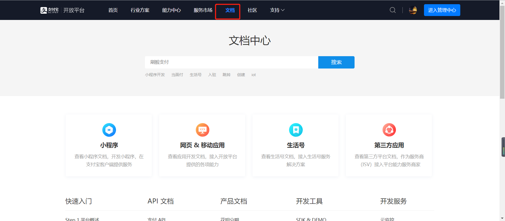
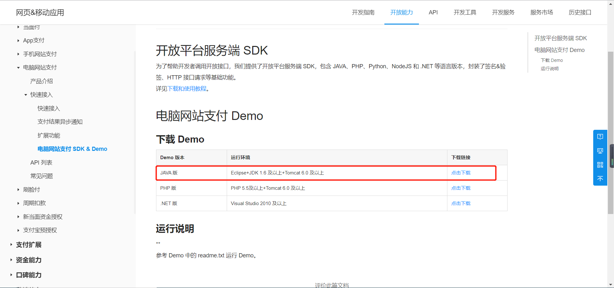

登录[蚂蚁金服开放平台](https://openhome.alipay.com/docCenter/docCenter.htm)

**配置沙箱环境**

**下载官方demo**

该demo是基于eclipse开发的。eclipse导入后可以直接运行。

> 注意:  公钥加密，私钥解密；私钥签名，公钥验签。
>
> 有两对公钥和私钥,过程是先生成商户的一对公钥和私钥,在用商户的公钥换支付宝官方的公钥.
>
> 在配置文件中填入支付宝官方的公钥和商户的私钥即可.