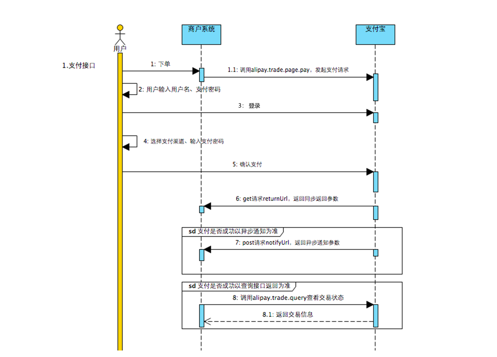
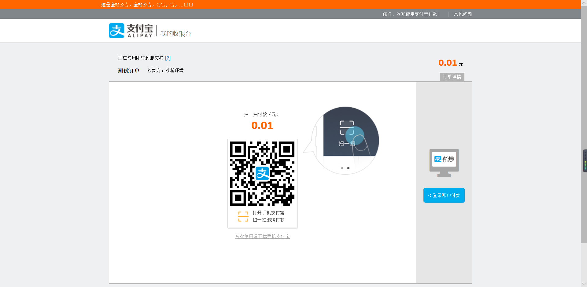
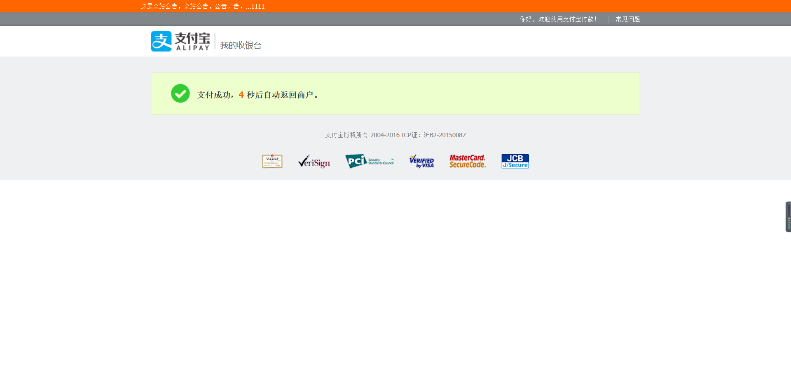
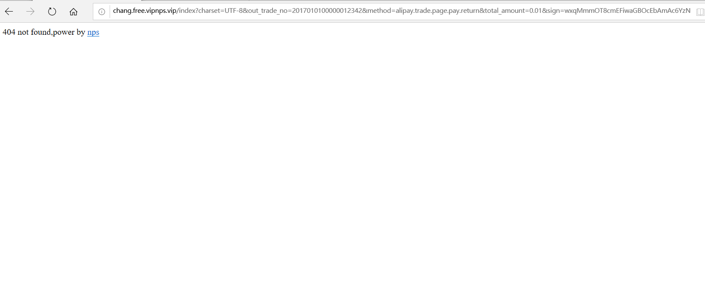

**第三方支付测试**


电脑网站支付接口调用原理




1.1后面应该有一步是支付宝返回支付页面给用户。


### 起步依赖

```xml
        <dependency>
            <groupId>com.alibaba</groupId>
            <artifactId>fastjson</artifactId>
            <version>1.2.7</version>
        </dependency>

        <!-- 支付宝 -->

        <dependency>
            <groupId>net.guerlab</groupId>
            <artifactId>sdk-alipay-starter</artifactId>
            <version>2.1.0</version>
        </dependency>
```

application.properties配置

```properties
server.port=80
#应用appid
alipay.app-id=2016102900777371
#true为沙箱环境,false为正式环境
alipay.dev=true
#用户私钥
alipay.private-key=MIIEvAIBADANBgkqhkiG9w0BAQEFAASCBKYwggSiAgEAAoIBAQCTHcLBUul7XINJPBchARH9ZGilyN09gMQDNl3gVl/1vxKUorJNaVu+IU40KyKxcVYGTrvoUzo5zl2FCtZPxXfdfe0rAVEzc/zdaydy1uSIXF3kM9l65TGnMqGmYqdMm0/9oLe5rwcefCUFeH4gEuungv2dFIX5Ozu7fWh34ayWed9shxHNs8eaKEJzppnrgX2fgnKRinU6hMkIAK88dA/OOMplsBUPz2t0EgWW9Z1XhLSxqlultJUlDbZQftxOgqrrloCo+80TZWzFtr+qcXLEG1eZh9Hoay+YbfgCbXF2TW6iw9BUbF8gPnmRU6y7l0az8Nh0o5jmlos4gbiz2YSlAgMBAAECggEAcYHj0w9qr9CYRvgDDGbr/2rqRwdsk9h249edpMpf7ZbH+kBxe8LPkynVUfD6Kpg8fE9hMgaNBS7Q/yZ2ZkQAkLdpNuYkRaO3NQtI+5UL7J3/n2PV57lQjyVEjcDOPhATLqhDORPvVTkJw2fNQGf4xF0P2pOMLtjh5G4FHYHUjKA+FwRGhot7SeBBxnrMP9/yFBKOsGI2i6gP6Do1YSle2kfgF2YsB73zyuywdgq1OX0LQecNzyOG06ry1XxV9YepZimc4H9rFaf3rB/6OkLGRO4yQVazNSQuHs6GwDNpST0dV+6hM0xeRbj+JwxEdoug8Pr0KrSUddr34wKagd3FXQKBgQDGI3Lrcwb4gqLAf+hEBvYSYbFnKgnxcelNCWtXDwNM+/k510lHRlMMN+JroDDahqtjt16YhDwD416JAh88O8KCBEZPRJgpjiFmKWy8wpovio0kl5yjIiW35Trw58U3z/AtFtXayEbeXJIDMi7BS3P/F8gQ8nXRoRtsB7JVBRKpMwKBgQC+E/aPZJAIa83YtulCXLbJeaALAnwR7BBmziMPGrgztUUwAzQxq9ks4ZcFq82Ro9L6nzmStZDmPApYXOxSswUuYJjvVl0hT27Mt48fKOxLugv2jM0nDKrhBr9OAog4iGKuLwhTVLij1XaGKEBWUIKVlDYUGu33VdjGTvTgcVQKxwKBgDAc54j485Zg0niAFrx+HD62bkeo06VHjelhAimvwZNuFETRXD/sebobz+VmjrZhwTiDjHrokVI4YfpPA5qywDamJxSUiYZ9tuqB4J+teZdVw5RBJI4Qeqw/A6MABMnaum2Yf/GSdHMGc4ZHJ0dUtSQaeEB1P9rZjjkbXVh71N41AoGAHqCY2gIaM0Erqf/PFiJaUZyHbT65PyoKeoY8n/JuO+a5f0ME5fwKwnCXJRLJzO3Y0QlW/YzEDFUgVZyjd6/g5dgqzGXeG7/w2ou5RAwUBx+zTcbiR6iC4D92E9vUl0diny506Ph9x+hdcMCLnVzbrb5z+ElejrwGce3HB2M7Z4ECgYAvZMvitqueObEIGzA95J7vQa5I/wZZs2wAMn5jxEsLtbvBvxS252mtZyT2a2DhffBKNd++sWN8iBDDph1IKswgso2tTbHqph6/5LrKMV/uxgXTNbln3alUqolc5IkYzt5A0Rs9iOb/XCXDyBPtGNqE0femj0njIhi7vMurrKqzyQ==
#支付宝公钥
alipay.alipay-public-key=MIIBIjANBgkqhkiG9w0BAQEFAAOCAQ8AMIIBCgKCAQEAxNQcC7F8N5rGB5kKlMfMl/leFuGho15d9NhpA05i7jEklxBGV2ytKX6vcZ5jvBPRj+0rEEdgCuyo+KeL6+6qQCVAMJ71kOZwexeLdb1+FwmhC23EtP65YoksaV5Ts3DP7AsIFCJalBsmEzswFZPcSBrS+A0GHU78x9VR5uLUlPBczj6v8RQgnREX3hYrjB6xzln2xfvBMp8NF8E3F+3yznmKLJ82AY0tLFIRlranjWL1MOf9LFOu4AZOzzVKdcvb40Qb5EBnyc+K1o8BvJAltCAJHiA5rznFvQV/dMrkUQNDNeR+dZruvQBpVT5eGswUUSxMWPbvDEys1nW5B3RFhQIDAQAB
#签名方式
alipay.sign-type=RSA2
```


AliPayController

```java
package com.github.alipaydemo.controller;

/**
 * @author Chang
 * @create 2020-07-13
 */

import com.alibaba.fastjson.JSONObject;
import com.alipay.api.AlipayApiException;
import com.alipay.api.AlipayClient;
import com.alipay.api.request.AlipayTradePagePayRequest;
import com.alipay.api.response.AlipayTradePagePayResponse;
import lombok.extern.slf4j.Slf4j;
import org.springframework.beans.factory.annotation.Autowired;
import org.springframework.stereotype.Controller;
import org.springframework.web.bind.annotation.*;

import javax.servlet.http.HttpServletRequest;
import javax.servlet.http.HttpServletResponse;
import java.io.IOException;


@Slf4j
@Controller
@RequestMapping("/pay/alipay")
public class AliPayController {
    @Autowired
    private AlipayClient client;//支付宝请求sdk客户端

    /**
     * 支付请求
     */
    @GetMapping("/app/{orderId}")
    public void app(
            @PathVariable Long orderId,
            HttpServletResponse response) throws AlipayApiException, IOException {

        JSONObject data = new JSONObject();
        data.put("out_trade_no", "201701010000001234"); //商户订单号
        data.put("product_code", "FAST_INSTANT_TRADE_PAY"); //产品码, APP支付 QUICK_MSECURITY_PAY, PC支付 FAST_INSTANT_TRADE_PAY, 移动H5支付 QUICK_WAP_PAY
        data.put("total_amount", "0.01"); //订单金额
        data.put("subject", "测试订单"); //订单标题

        //APP支付
        //AlipayTradeAppPayRequest request = new AlipayTradeAppPayRequest();
        //PC支付
        AlipayTradePagePayRequest request = new AlipayTradePagePayRequest();
        //移动H5支付
        //AlipayTradeWapPayRequest request = new AlipayTradeWapPayRequest();
        request.setNotifyUrl("http://chang.free.vipnps.vip/pay/alipay/notify/1"); //异步通知地址
        request.setReturnUrl("http://chang.free.vipnps.vip/index");
        request.setBizContent(data.toJSONString()); //业务参数
        AlipayTradePagePayResponse alipayResponse=client.pageExecute(request);
        response.setContentType("text/html;charset=UTF-8");
        response.getWriter().write(alipayResponse.getBody());
    }

    @PostMapping("/notify/{orderId}")
    @ResponseBody
    public String notify(@PathVariable Long orderId, HttpServletRequest request) {
        //todo 这里可以加入验签失败的逻辑
        request.getParameter("trade_no");//获取请求参数中的商户订单号
        return "success";
    }

}

```

1.  request.setNotifyUrl("http://chang.free.vipnps.vip/pay/alipay/notify/1"); 异步通知就是支付完以后会去调用我们系统开发的接口。比如可以在这里面修改订单状态或者记录一些日志等等。
2.  request.setReturnUrl("http://chang.free.vipnps.vip/index"); 同步通知就是回调跳转的页面。其实现方式就是给浏览器响应让浏览器重定向到某个页面。
3. out_trade_no，product_code，total_amount等等都是必选参数，参加官方文档


在src/main/resources/templates新建一个回调测试页面,叫index.html

```html
<!DOCTYPE html>
<html lang="en">
<head>
    <meta charset="UTF-8">
    <title>Title</title>
</head>
<body>

回调页面测试

</body>
</html>

```


### 测试

在页面输入请求的地址

http://localhost:80/pay/alipay/app/11111

发现自动跳转到支付页面




使用沙箱钱包扫码成功后跳转至同步回调的测试页面






这里的同步页面必须是能在互联网上访问的,如果访问不到就会出现上述404页面。

可以申请一个免费的内网穿透做测试。