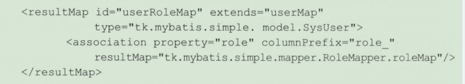

## mybatis动态SQL 

使用动态sql进行基本的增删改查能满足我们大部分的需求

### if用法

**在where条件中使用**

```xml
<select id="selectByUser" resultMap="baseMap">
    select  * from sys_user 
    where 1=1
    <if test=" userName!=null and userName!=''">
       and  user_name=#{userName}
    </if>
    <if test=" userEmail!=null and userEmail!=''">
       and  user_email=#{userEmail}
    </if>
</select>
```

上面的demo所涉及的知识点有很多

* where 1=1防止后面的条件不成立,导致生成的SQL报错
* if标签test属性中是实体属性userEmail而不是数据库字段user_email 
* baseMap可以复用,时mapper命名空间下的其它sql语句更加灵活


**在update更新列中使用**

updaet table set id=#{id} where id=#{id}

防止造成sql语法错误


**在insert动态插入列中使用**

有则插入字段,无则忽略字段

```xml
<insert>
    insert into sys_user(user_name,user_email
    <if test="passWord!=null and passWord!=''">
    	,pass_word
    </if>
    ) values(#{userName},#{userEmail}
    <if test="passWord!=null and passWord!=''">
    	,pass_word=#{passWord}
    </if>
    )
</insert>
```

值得注意的是 上面列中使用了if标签,下面插入的时候也要使用if标签

另外if标签中还可以使用_databaseId来适配不同数据库,但是要在全局配置文件中开启多数据库支持.

```xml
<select>
select * from sys_user
    <where>
        <if test="userName!=null and userName!=''">
             <if test="_databaseId=='mysql'">
            and user_name like concat("%",#{userName},"%")
            </if>
          <if test="_databaseId=='oracle'">
        	and user_name like '%'||#{userName}||'%'
        	</if>
        </if> 
    </where> 
</select>
```


### choose用法

if标签已经很灵活但它仍然无法满足if..else, if..else.if..的逻辑

所以这时候就轮到choose when otherwise标签


choose组合标签类似于java中的if..else if..else

```xml
<select>
select user_name userName,
    user_email userEmail.
    pass_word passWord
    from sys_user
    where 1=1
    <choose>
        <when test="userName!=null and userName!=''">
            and use_name=#{userName}
        </when>
         <when test="id!=null and id!=''">
            and id=#{id}
        </when>
        <otherwise>
            and 1=2
        </otherwise>
    </choose>
</select>
```

在if..else if ..else结构中满足一个,后续的就不会在执行了.choose标签也是如此,使用该标签时,一定要严谨,避免得到错误的sql语句.


### where   set  trim标签

where和set标签都是trim的一种特殊形式

**where用法**

where标签作用: 如果where标签内有内容就插入where关键字,如果where后面的内容是以and 或 or开头的,则去掉第一个and或or.

```xml
<select>
	select * from sys_user 
    <where>
        <if id!=null and id!=''>
            and id=#{id}
        </if>
         <if userName!=null and userName!=''>
           and user_name=#{userName}
        </if>
    </where>
</select>
```


### set用法

set标签作用 :如果标签里有内如则插入set关键字,如果set结尾的字符串是逗号,则去掉结尾的逗号

```xml
<update>
	update  sys_user
    <set>
         <if userEmail!=null and userEmail!=''>
            and user_email=#{userEmail},
        </if>
         <if userName!=null and userName!=''>
           and user_name=#{userName},
        </if> 
        id=#{id},
    </set>
   where id=#{id}
</insert>
```

set没能解决标签内容不存在会报错的问题,因此还是需要 where id=#{id}


### trim用法

* **prefix** 标签中有内容时,在最前面加上的内容
* **prefixOverride** 标签有内容时,去掉最前面的内容
* **suffix** 标签有内容时,在最后面要加的内容
* **suffixOverride** 标签有内容时,去掉最后面的内容

trim中都是先去掉内容在加上内容.


### foreach语法

foreach主要用来遍历iterable(List和Set实现了该接口,而数组会转换成List类型)和map类型的数据.


#### foreach实现in集合

```java
/**
根据用户id集合查询
*/
List<SysUser> selectByIdList(List idList)
```


```xml
<select>
select * from sys_user where id in
    <foreach collection="list" open="(" close=")" separator="," item="id">
        #{id}
    </foreach>
</select>
```

collection的值和接口中传入的参数有关,

* 如果是数组,则值是array. 
* 如果是List,则值是list
* 如果是map,值是collection
*  使用@param注解会更加灵活.


#### foreach实现批量插入

如果数据库支持批量插入语法,就可以通过foreach实现,目前支持的数据库有MySQL,sqlserver 2008以上,DB2,PostGreSQL,H2等, Oracle不直接支持(有别的办法)

接口方法声明:

```java
int insertUserList(List<SysUser> userList)
```

xml中:

```xml
<insert>
insert into sys_user(user_name,user_email,user_info)  values
   <foreach collection="list"  seprator="," item="user">
      ( #{user.userName},#{user.userEmail},{user.userInfo} )
    </foreach>
</insert>
```

**注意:item指定了循环变量名后,在引用值的时候应该使用 "属性.属性" 的方式,如user.userName**


如果要使用批量插入返回自增主键值,只需简单的改动

```xml
<insert id="insertList" useGeneratedKeys="true" keyProperty="id"></insert>
```

* **useGeneratedKeys** 返回自增主键
* **keyProperty** 将返回的主键值封装到实体的哪个属性中

在使用insertList方法后,

```java
//打印返回的id
idList.stream.map(User::getId).foreach(System.out::println)
```

**但是完美支持批量插入返回主键功能的数据库目前只有MySQL**


#### foreach动态实现update

当参数类型是Map的时候,foreach标签中的index属性不是索引值,而是map的key

```xml
<update>
	update sys_user set
    <foreach collection="_parameter" serprator="," index="key" item="value">
        #{key} = #{value}
    </foreach>
    where id=#{id}
</update>
```

通过map参数更新列的接口方法

```java
int updateByMap(Map<String,Object> map)
```

实例

```java
Map<String,Object> map=new HashMap();
//id作为查询条件必须存在,上面的sql语句可以看出来
map.put("id",1L);
map.put("user_name","zhangasns");
userMapper.updateByMap(map);
```


## MyBatis高级查询

mybatis的高级结果映射主要处理数据库中一对一,一对多,存储过程调用等.


**写多个方法组合成一个查询的分布查询方式适合大型系统. 由于分库分表可以减少表和库之间的耦合.**

就简单的RBAC来说由于这些表都存在一个库中,使用mybatis自带的高级映射足以解决问题.


### 一对一映射

#### 使用resultmap配置一对一映射

使用自动映的嵌套映射这种关联方法,是最原始的方法.查询一次会全部返回,无法做到延迟加载的特性

假设sysuer和sysrole是一对一的关系,所以在sysuer中新建一个字段来关联sysrole,这个字段的名字就叫role.

```xml
<select resultType="XXX">
select 
    user_name userName,
    user_email userEmial,
    r.id "role.id",
    r.role_name "r.roleName"
    from sys_user u
    inner join sys_user_role ur
    on u.id=ur.user_id
    inner join sys_role r
    on ur.role_id=r.id
    where u.id=#{id}
</select>
```

该方法的好处是只查询一次数据库,减轻数据库的压力,但是要写很复杂的sql.  当一定会使用到嵌套映射的结果时,且关联的类较少时可以使用这方方法.


#### 使用resultmap配置一对一映射

该方法不常用  和关联的嵌套映射写法差不多  甚至更复杂


#### 使用resultmap + association配置一对一映射  (推荐)

选一个比较复杂的例子做解释


```xml
<resultMap id="userRoleMap" exetnds="userMap" type="com.github.xx.SysUser">
    <association columnPrefix="role_" property="role" javaType="sysrole的全限定类名">
        <id property="id" column="id"></id>
        <result property="roleName" column="role_name"></result>
    </association>
</resultMap>
```

* **columnPrefix** 查询列的前缀,配置前缀后,在子标签配置result的column时可以省略. 当关联的属性中有和原来的查询中有相同的字段时可以使用该属性,否则没必要使用该属性.  例如 sys_user和sys_role表中都有id的字段

Sql语句如下

```xml
<select resultMap="userRoleMap">
    select u.* 
    r.id role_id
    r.role_name role_role_name
    from sys_user
    inner join sys_user_role ur
    on u.id=ur.user_id
    inner join sys_role
    on ur.role_id=r.id
    where id=#{id}
</select>
```


上面的resultMap也可以改造一下,技巧是利用resultMap标签自带的extend属性和association标签自带的resultMap属性.



引用resultmap时注意,如果是在不同命名空间,则必须加上全限定Map名.


**association标签的嵌套查询**

association标签中使用select属性引用已有的查询

```xml
<resultMap id="userRoleMap" extends="userMap" type="XXX">
<association property="role" select="com.github.xx.xx.selectByRoleId" column="id">
</association>
</resultMap>
```

assocation标签中的column的值是主查询得列名,然后将查到的结果的列值作为参数传递给附加查询.

**主查询查询一次的话,如果结果有N条数据,就会再执行N次附加查询,也就是N+1查询.**

如果这些附加的查询都没有使用到那就是对性能的浪费.为了解决这个问题,可以在association标签中加入**fetchType属性的值为lazy**,改为延迟加载,这样只有在用到的时候,才会去查询.**也可以在全局配置文件中开启延迟加载.**

<font color="red">注意 :mybatis和spring集成时,要确保service层调用延迟加载的属性,当结果从service层返回到controller层时,再在controller调用获取属性时,会因为sqlsession已经关闭而抛出异常</font>

> mybatis框架并不是只有在获取属性时才执行延迟加载的sql. 关于什么时候触发,这个可以自定义.


### 一对多映射

一对多映射主要使用collection标签,它和association标签几乎是一样的.

假设用户和角色是一对多的关系,现在sysuser实体类中声明了一个属性:

```java
private List<SysRole> roleList;
```

经过前面的学习,现在大概可以写出最简单的resultmap了

```xml
<resultmap id="userRoleListMap" extends="BaseMap" type="xx.sysUser">
    <collection property="roleList" columnPrefix="role_" resultMap="xx.SysRoleMapper.BaseMap">
    </collection>
</resultmap>
```

sql查询如下

```xml
<select id="selectAllUserAndRole" resultMap="userRoleListMap">
select
    u,id,
    u.email,
    r.id "role_id",
    r.role_name "role_role_name"
    from sys_user u
    inner join sys_user_role ur
    on u.id=ur.user_id
    innser join sys_role 
    on r.id=ur.role_id
</select>
```


mybatis是如何将多个结果合并到一个集合中的?比如一个用户下有多个角色时,它怎么知道哪些要合并,哪些不合并.

答案是id标签,id标签可以和数据库中的主键没有任何关系,但是一旦配置了该标签,它就是比较两个对象是否相等的条件,所以查询时尽量带上id标签,可以减少比较次数.加快映射速度.

