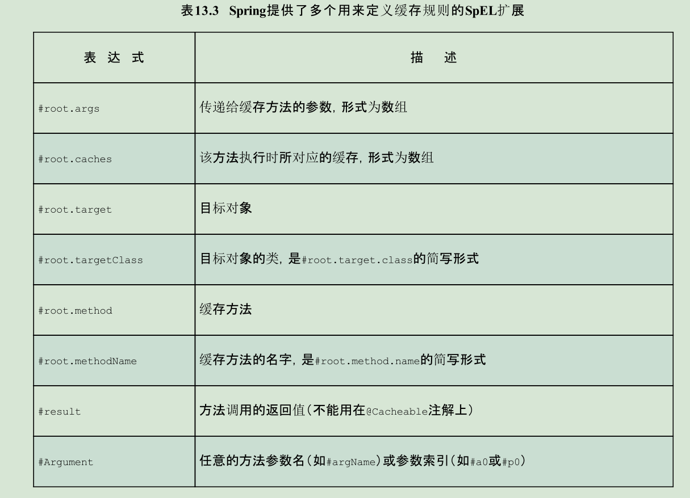

## spring cache

### Spring缓存中的几个重要概念

1. **CacheManage** 缓存管理器 :与缓存提供商有关的组件,每一个方案都可以提供不同的缓存风格常见的有

* RedisCacheManager
* EhCacheCacheManager
* ConcurrentMapCacheManager
* SimpleCacheManager

2. **Cache** 缓存 一个类似于Map的数据结构 ,K-V结构 ,一个cache仅被一个CacheManage拥有
3. **缓存边界** 缓存规则

