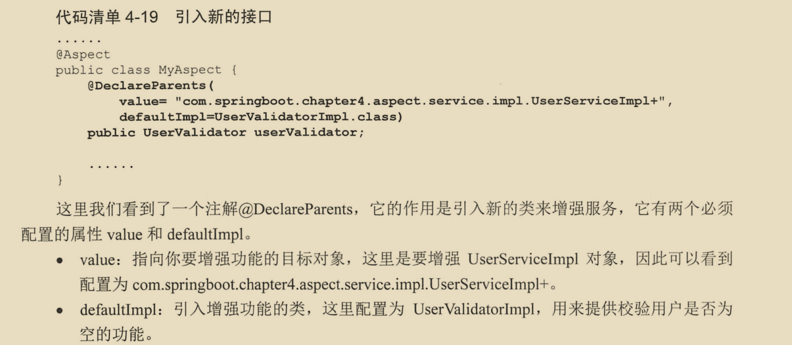
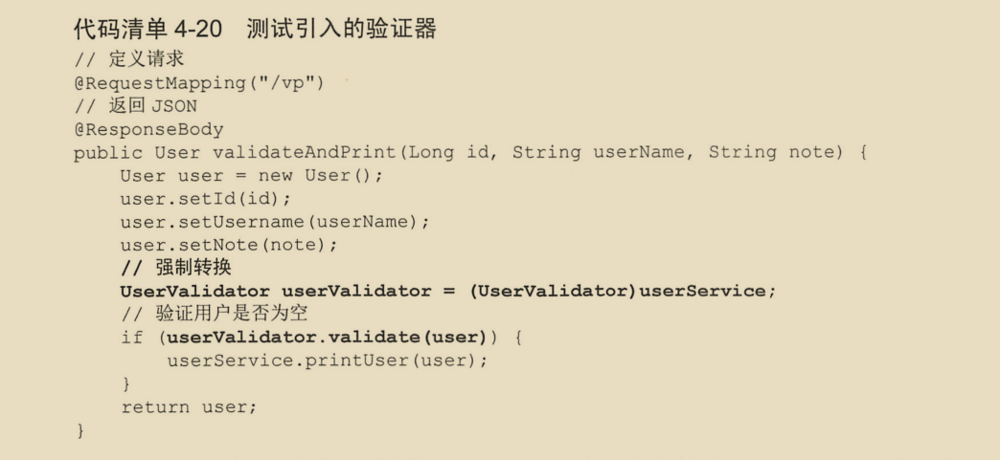

# Spring


### 一  AOP

#### 1.1 概念

- 基于schema-base实现的aop，无论是什么类型的通知，都必须实现接口     

- 基于aspectj的方式，对通知类的要求没有那么严格，也就是说，在一个切面类中可以写任何的方法，而且不必继承任何接口  

   但是aspect对配置文件的要求非常高，必须指定通知在哪个切面类中，还必须指定是类中的哪个方法

- 出了异常就不会执行后置通知。

- aop一般应用于service层中，service中的方法出现异常不应该处理，必须抛出，否则spring aop就无调用异常通知，因为异常已经被service中的方法try catch过了   (声明式事物失效的原理同样)

-  **spring aop中的几个通知之前的关系**  

   ```java
   /**
   *	运行结果
   *	before
   *	after
   *	after-throwing
   */
   @Test
       public void simpleTest(){
           try {
               try {
                   System.out.println("before");
                   int a=1/0;
               }finally {
                   System.out.println("after");
               }
               System.out.println("after-returning");
           }catch (Exception e){
               e.printStackTrace();
               System.out.println("after-throwing");
           }
       }
   ```

   

- JDK动态代理也是基于接口的，即只能对实际对象所实现的功能接口中的方法进行代理。

**注意：使用注解来配置切面只适合个别方法，当大面积的方法都需要被代理时，切面类中的方法上的注解就无法复用了**


> 自动注入（自动装配）和依赖注入      

- 自动装配是反射机制实现的。
- 以来注入式通过setter或构造器注入的

#### 1.2Aop的三种实现方式

##### 1.2.1 基于javaConfig的配置

**具体的业务类**

```java
@Service
public class PerformanceService {

    public void performanceSingSong(){
        System.out.println("唱一首歌");
    }
    public void performanceDance(){
        System.out.println("跳一支舞");
    }
}

```

**Aspect切面类LoggerAspect**

```java
@Aspect
public class LoggerAspect {

    Logger logger = LoggerFactory.getLogger(this.getClass());

    @Before("execution(* com.xmcc.aop.PerformanceService.performanceDance(..))")
    public void myBefore(){
        logger.debug("前置通知");
    }
}
```

这里的切面类只是简单的做了一个日志记录. 切面包含切点和通知,简单的说切面就是决定了是**"什么","何时","何处"** 

**java配置类MyAopConfig** 

```java
@EnableAspectJAutoProxy		//开启切面自动代理 1
@Configuration				//声明配置类 2
@ComponentScan				// 扫描包,此步骤根据情况省略    3
public class MyAopConfig {

    @Bean	//4   步骤1有效,此步骤才能生效,LoggerAspect类的定义中必须在类上标注@Aspect注解
    public LoggerAspect loggerAspect(){
        return new LoggerAspect();
    }
}
```


##### 1.2.2 基于xml和业务注解的混合配置

**具体的业务类**

```java
@Service
public class PerformanceService {

    public void performanceSingSong(){
        System.out.println("唱一首歌");
    }
    public void performanceDance(){
        System.out.println("跳一支舞");
    }
}
```

这里不改变具体的业务类,**@Service**可以在xml中声明,也可以用注解.

**xml配置文件**

```xml
<?xml version="1.0" encoding="UTF-8"?>
<beans xmlns="http://www.springframework.org/schema/beans"
       xmlns:xsi="http://www.w3.org/2001/XMLSchema-instance"
       xmlns:aop="http://www.springframework.org/schema/aop"
       xmlns:context="http://www.springframework.org/schema/context"
       xsi:schemaLocation="http://www.springframework.org/schema/beans
        http://www.springframework.org/schema/beans/spring-beans.xsd
        http://www.springframework.org/schema/aop
        http://www.springframework.org/schema/aop/spring-aop.xsd
        http://www.springframework.org/schema/context
        http://www.springframework.org/schema/context/spring-context.xsd">
    <!--启用注解扫描,非必须,根据情况而定-->
    <context:component-scan base-package="com.xmcc.aop"></context:component-scan>
    
    <!--开启自动代理, proxy-target-class="false"基于jdk的代理,如果没有接口,则选true-->
    <aop:aspectj-autoproxy proxy-target-class="false"></aop:aspectj-autoproxy>
</beans>
```

**Aspect切面类LoggerAspect**

```java
@Aspect
//切面类必须声明为bean,这里使用xml配置了bean 所以不用注解声明了
public class LoggerAspect {

    Logger logger = LoggerFactory.getLogger(this.getClass());

    @Before("execution(* com.xmcc.aop.PerformanceService.performanceDance(..))")
    public void myBefore(){
        logger.debug("前置通知");
    }
}
```

由于xml配置文件中已经开启了aop自动代理,锁一切面类上就不必在使用**@EnableAspectJAutoProxy** 注解了.

##### 1.2.3基于纯XML的配置

**具体业务类**

```java
//由于是纯XML配置,这里没有@Service注解
public class PerformanceService {

    public void performanceSingSong(){
        System.out.println("唱一首歌");
    }
    public void performanceDance(){
        System.out.println("跳一支舞");
    }
}
```

**Aspect切面类LoggerAspect**

```java
//这里也不需要任何注解
public class LoggerAspect {
    Logger logger = LoggerFactory.getLogger(this.getClass());

    @Before("execution(* com.xmcc.aop.PerformanceService.performanceDance(..))")
    public void myBefore(){
        logger.debug("前置通知");
    }
}
```

**XML配置**

```xml
<?xml version="1.0" encoding="UTF-8"?>
<beans xmlns="http://www.springframework.org/schema/beans"
       xmlns:xsi="http://www.w3.org/2001/XMLSchema-instance"
       xmlns:aop="http://www.springframework.org/schema/aop"
       xmlns:context="http://www.springframework.org/schema/context"
       xsi:schemaLocation="http://www.springframework.org/schema/beans
        http://www.springframework.org/schema/beans/spring-beans.xsd
        http://www.springframework.org/schema/aop
        http://www.springframework.org/schema/aop/spring-aop.xsd
        http://www.springframework.org/schema/context
        http://www.springframework.org/schema/context/spring-context.xsd">
 
    <!--注册业务类-->
    <bean id="performanceService" class="com.xmcc.aop.PerformanceService"></bean>
    <!--注册切面类-->
    <bean id="loggerAspect" class="com.xmcc.aop.LoggerAspect"></bean>
    <!--配置aop切面-->
    <aop:config>
        <aop:aspect ref="loggerAspect">
            <aop:before method="myBefore" pointcut="execution(* com.xmcc.aop.PerformanceService.performanceDance(..))"></aop:before>
        </aop:aspect>
    </aop:config>
</beans>
```

**测试类**

```java
@RunWith(SpringJUnit4ClassRunner.class)
@ContextConfiguration(locations="classpath:applicationContext.xml")
public class SpringAopTest {
    @Autowired
    PerformanceService performanceService;

    @Test
    public void test(){
        performanceService.performanceDance();
    }
}

```


#### 1.3 @PointCut注解

当使用基于javaConfig或xml和注解混合开发的时候,可以使用**@Pointcut**注解声明那些使用率高的连接点为切点,这样就避免在切面中频繁使用**execution()切点表达式** .

示例:

```java
@Aspect
public class PerformanceAspect {
    @Pointcut("execution(* com.xmcc.aop.Performance.dance(..))")	//1
    public void performance(){
    }
    
    @Before("performance()")		//2
    public void myBefore(){
        System.out.println("前置通知");
    }
}
```

**@Pointcut**注解中的**execution切点表达式**抽取需要重复使用的切点,**@Before("performance()")** 直接引用方法名即可**performance()**.

注意:

这里的**performance()**方法是空方法,实际上本来就应该是空方法,它只是提供了一个方法名让**@Pointcut注解**可以**依附**在上面而已.


#### 1.4 @DeclareParents注解

```java
public @interface DeclareParents {

    /**
     * @return the target types expression
     */
    String value();

    /**
     * Optional class defining default implementation
     * of interface members (equivalent to defining
     * a set of interface member ITDs for the
     * public methods of the interface).
     * 
     * @return define the default implementation of interface members (should always be specified)
     */
    Class defaultImpl() default DeclareParents.class;

    // note - a default of "null" is not allowed,
    // hence the strange default given above.
}
```



使用时将被增强的类也就是value值的类强制转换成defaultImpl的接口类型.




#### 1.5 当有多个切面时

要想准确的控制切面执行顺序,可以使用@Order注解或Ordered接口

```java
@Aspect
@Order(1)
public class MyAspect1{
    
    .....
}

@Aspect
@Order(2)
public class MyAspect2{
    
    .....
}

@Aspect
@Order(3)
public class MyAspect3{
    
    .....
}
```

各类通知执行的顺序是

```cmd
前置通知:MyAspect1,MyAspect2,MyAspect3
后置通知和返回通知(after,afterreturnning):MyAspect3,MyAspect2,MyAspect1
```


#### 1.6小结

* 各类通知执行顺序:before-- around-- after  -- afterreturnning 和afterthrowing只有一个会执行
* around和target方法只有一个会执行,但是around中可以调用target方法)

* **切面**定义了"**何时何地以及是什么**",而生成动态代理对象并且将切面和目标对象方法编织成约定流程的过程就是**织入**. 由于springAOP只提供方法级别的织入,所以也可以认为目标对象就是类中被增强的方法.

面试题:你在哪些地方使用过AOP?

声明式事务,声明式缓存等

### 二 关于依赖注入(装配与注入)

#### 2.1装配方式

* 自动化装配
* JavaConfig
* XML装配


#### 2.2注意事项

* P域和C域无法装配集和 但是导入util命名空间.就可以使用util-list功能装配集合了.

用xml装配集合

```xml
<bean class="com.xmcc.pojo.Apple">
<construct-arg>
  <list>
  	<value>zhangsan</value>
    <value>lsi</value>
    <value>wangwu</value>
  </list>
</construct-arg>
</bean>
```

同理集合中也可以是bean,但是此时把**\<value>**要换成**\<ref bean="apple">**

* 构造器注入实现强制依赖,setter注入实现可选依赖.


### 三  高级装配

#### 3.1 环境与profile

可以根据不同的环境创建不同的profile

spring3.1以后,@Profile注解可以使用在方法上了,同时和@Bean一起在配置类中使用

```java
@Configuration
public class DataSourceConfig{
  
  @Bean
  @Profile("dev")
  public DataSource jndiDatasource(){
    ....
      return  datasource;
  }
}
```


* 在bean上使用了**@Profile**注解后,对应的profile被激活时,bean才被创建

* 没有使用**@Profile**的bean无论何时都会被创建.

* 同样可以在XML中使用profile环境

* 在XML中配置多个profile时,beans标签中可以嵌套beans标签

  ```xml
  <beans>
  	<beans profile="dev">
        ...
      </beans>
   	<beans profile="qa">
      ....  
      </beans>
  </beans>
  ```


#### 3.2条件化的bean

* **@Conditional**注解可以用在**@bean**注解上，就表示满足条件才创建bean，否则忽略这个bean。

* **@Primary**可以与**@Conditiona**注解一起使用或者与**@Bean**一起使用，当自动装配存在歧义性的时候可以解决此冲突，@Primary表示将bean声明为首选的（首选bean）

  ```java
  @Component
  @Primary		//有多个bean同时满足了fruit
  public class Origin extends Fruit {
  ....
  }
  ```

若使用xml配置的话，则直接在bean后面加上属性primary=true即可。如果一个类型的bean（fruit）有多个@primary注解同时存在，那也会有歧义问题，这也就没有任何意义了。

* 使用面向特性的限定符注解**@Qualifier**指定装配具体的bean

  ```java
  @AutoWired
  @Qualifier("origin")
  public void setFruit(){}
  ```

  但是，当多个bean具有相同的特性，此时在按照特性注入也会产生歧义，但是同一个bean可以同时添加多个Qualifier注解，来解决此问题。

  在使用的时候：

  ```java
  @AutoWired	//这个bean表示是甜的origin
  @Qualifier("origin")		//多个相同注解在一个类或方法需要java8以上的版本才能支持，但恰码头是此注解上加了@repeatable 所以次数也是不可取的
  @Qualifier("dessert")
  public void setFruit(){}
  ```

  也可以使用**自定义注解**来替代**@Qualifier注解** ,如下自定义了一个@Dessert注解来表示bean的特性

  ```java
  @Qualifier("dessert")	//这里实际上还是使用了@Qualifier注解
  public @interface Dessert {}
  ```

#### 3.3 bean的作用域

##### 3.3.1bean的作用域：

* single
* prototype
* session
* request

后面两个似乎用处比较小，但是在有的情况下不可替代，如购物车作用域可以是session。如果是single那么所有用户的购物都放在一个购物车里，这不合理。如果是prototype，当一个用户在此处生成一个购物车，在点击别的页面买的商品又生成一个购物车，这似乎也不合理。

**作用域冲突**

```java
@Service
public class StoreService{
    @Autowired
    private ShoppingCar shoppingCar;
}
```

在一个web应用中storeservice是单例的，而购物车shoppingcar是session级别的。此时需要解决作用域冲突的问题。shoppingCar一开是空的直到某个用户进入系统后才生成一个ShoppingCar的实例（session）。另外系统中有许多个shoppingcar的实例，我们并不能让某个特定的shoppingcar注入到storeservice中。

**spring是如何解决的：**

spring并不会将实际的shoppingcar注入到service实例中，spring会注入一个到shoppingcar bean的代理。

#### 3.4 Environment类

Environment提供了与属性和环境有关的内容，以下是重要的方法。

*  T env.getProperty(string key)
* String[] getActiveProfile()
* boolean acceptsProfile(String... profiles)  如果env支持指定的profile的话，返回true。

#### 3.5 运行时注入 SPEL

SPEL与属性占位符的区别

SPEL: 形如#{ ...}

属性占位符：形如 ${ ...}

##### 3.5.1 **使用SPEL可以做什么：**

* 调用方法和访问对象的属性
* 通过bean的id来引用bean
* 对值进行算术运算
* 正则表达式匹配
* 集合操作


##### 3.5.2 常用实例

```java
#{fruit.color} //获取水果id为fruit的颜色属性
#{fruit.getPrice()} //调用对象的方法
#{fruit.color.toUpperCase（）}  //对获取的值进行方法调用的追加操作
#{fruit.color?.toUpperCase（）}  // ?.能在访问右边的内容之前对该操作符左边的内容判空，如果为空则右边就不会被访问到，此时表达式的值就是null
#{T(java.lang.Math).PI}  //T()的运算结果是一个Class对象，T()的真正威力在于可以调用类的静态方法和静态属性，括号中是全限定类名。
#{2 * T(java.lang.Math).PI *circle.radius} //使用SPEL进行表达式运算
#{'math' == 'since'} //使用SPEL做逻辑运算，此处可替换为 #{'math'  eq 'since' },返回值是boolan
#{100>90?true:false} //使用SPEL做三元运算
#{fruit ?: 'orange'}  // ?:判断是否为null值，此处若fruit为null，则返回'orange'
#{people.emaul  mathches '[a-zA-Z0-9]'}  //SPEL表达式正则匹配


/*--------以下是与集合操作有关的------------*/
#{store.fruits[4].price} //商店属性的fruits集合中第五个水果的价格
#{store.fruits[T(java.lang.Math).random()*store.fruits.size].price}  //同上，从fruits集合中随机取出一个水果，查看价格
#{'this is a test'[3]}  //获取字符串的第四个字符
#{store.fruits.?[price>10]} //查询fruits集合中价格大于10的水果   .?提供了过滤查询集合的效果
#{store.fruits.![title]}  //映射生成一个新的集合，这个集合是每个fruit的价格  .!映射结果集

```


#### 3.6 将bean注入容器中

##### 3.6.1 通过xml注入

```xml
<bean>org.example.MyClazz</bean>
```

##### 3.6.2 通过@bean和@configuration注入

```java
@Configuration
public class DataSourceConfiguration {
	@Bean
    public DruidDataSource druidDataSource() {
        DruidDataSource dataSource = new DruidDataSource();
        return dataSource;
    }
}
```

##### 3.6.3 通过@import注解在运行时动态注入

Dog类:

```java
public class Dog { 
}
```

Cat类:

```java
public class Cat {
}
```

```
@Configuration
@Import(Cat.class)
public class CatConfig {

    @Autowired
    private Cat cat ;

    public void print(){
        cat.run();
    }
 }
```

测试类中测试

```java
@RunWith(SpringRunner.class)
@SpringBootTest
public class SpringBootMyStartPomApplicationTests {

    @Autowired
    private CatConfig catConfig;

    @Test
    public void contextLoads() {
        catConfig.print();
    }
}
```

##### 3.6.4 通过@importresource注解同理

