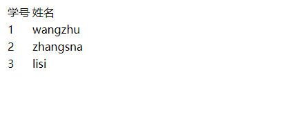

# springmvc笔记

> 404问题

    <bean id="handlerMapping" class="org.springframework.web.servlet.handler.SimpleUrlHandlerMapping">
    <property name="urlMap">
    	<map>
    		<entry key="as" value-ref="dea"></entry>
    	</map>
    </property>
    </bean>
以上配置文件中 entry中的key是映射地址，映射地址路径中不能有数字，不然报错。


> 在设置过滤器后，仍然出现页面传值获取get和post中文乱码问题

- 参考<https://www.cnblogs.com/Hxinguan/p/5971779.html>


> spring mvc的拦截器只拦截controller不拦截jsp文件，如果不拦截jsp文件也会给系统带安全性问题。      

1.将所有的jsp文件放入到WEB-INF文件夹下    
2.jsp如果不放在WEB-INF文件下，spring mvc是无法拦截的，这种请情况下需要用最原始的servlet的Filter接口


### 一.springMVC组件

#### 1.1 HandlerAdapter(处理器适配器) 

```java
public class SimpleControllerHandlerAdapter implements HandlerAdapter {

	@Override
	public boolean supports(Object handler) {
		return (handler instanceof Controller);
	}

	@Override
	@Nullable
	public ModelAndView handle(HttpServletRequest request, HttpServletResponse response, Object handler)
			throws Exception {
		//这里推出handlerAdapter是给controller处理请求用的
		return ((Controller) handler).handleRequest(request, response);
	}

	@Override
	public long getLastModified(HttpServletRequest request, Object handler) {
		if (handler instanceof LastModified) {
			return ((LastModified) handler).getLastModified(request);
		}
		return -1L;
	}

}
```

所以HandlerAdapter就是执行处理controller中的handlerMethod用的.


#### 1.2 Controller(Handler)

**在Controller的handlerMethod方法中如下:**

```java
  @RequestMapping("/s")
    public Student showSt(){
        return new Student(1,"showstu");
    }
```

**xml中配置InternalResourceViewResolver**

```xml
 <bean id="viewResolver" class="org.springframework.web.servlet.view.InternalResourceViewResolver">
        <property name="suffix" value=".jsp"></property>
    </bean>

```

**s.jsp**

```jsp
<%@ page contentType="text/html;charset=UTF-8" language="java" %>
<html>
<head>
    <title>Title</title>
</head>
<body>
<h1>${student.name}</h1>
<br>
<h1>${student.id}</h1>
</body>
</html>
```


可以看到handlerMethod直接返回的pojo对象,而且没有在方法上声明**@ResponseBody** 注解,  

此时模型会自动将返回的pojo加入(key-valye)模型中,list集合也是如此,此外,由于没有返回逻辑视图名,则默认逻辑视图名就是 @RequestMapping("/s")中的值"s",因为已经在mvc配置文件中配置了视图解析器的后缀了.

**测试请求** 

在浏览器发起请求<http://localhost:8080/day01/s>,得到如下响应:


#### 1.3 handlerMethod

handlerMethod就是controller中的方法

```java
	 @RequestMapping("/findAll")  //1
    @ResponseBody	// 2 这里有@ResponseBody注解
    public JsonData findAll(){
        return JsonData.success(accountService.findAll());
    }
```

如果2处没有**@ResponseBody**注解,则跳转到 **@RequestMapping("/findAll")** 中配置的路径findAll.jsp页面.

### 二.springmvc Hello World

pringMVC的最少配置的几种方式

#### 2.1 添加maven依赖

```xml
  <!--单元测试-->
	<dependency>
      <groupId>junit</groupId>
      <artifactId>junit</artifactId>
      <version>4.11</version>
      <scope>test</scope>
    </dependency>
  <!--*********************springMVC相关配置******************************-->
    <dependency>
      <groupId>org.springframework</groupId>
      <artifactId>spring-core</artifactId>
      <version>5.1.6.RELEASE</version>
    </dependency>
    <dependency>
      <groupId>org.springframework</groupId>
      <artifactId>spring-beans</artifactId>
      <version>5.1.6.RELEASE</version>
    </dependency>
    <dependency>
      <groupId>org.springframework</groupId>
      <artifactId>spring-context</artifactId>
      <version>5.1.6.RELEASE</version>
    </dependency>
    <dependency>
      <groupId>org.springframework</groupId>
      <artifactId>spring-expression</artifactId>
      <version>5.1.6.RELEASE</version>
    </dependency>
    <dependency>
      <groupId>org.springframework</groupId>
      <artifactId>spring-web</artifactId>
      <version>5.1.6.RELEASE</version>
    </dependency>
    <dependency>
      <groupId>org.springframework</groupId>
      <artifactId>spring-webmvc</artifactId>
      <version>5.1.6.RELEASE</version>
    </dependency>
    <dependency>
      <groupId>org.springframework</groupId>
      <artifactId>spring-aop</artifactId>
      <version>5.1.6.RELEASE</version>
    </dependency>
  <!--jstl配置-->
    <dependency>
      <groupId>javax.servlet</groupId>
      <artifactId>jstl</artifactId>
      <version>1.2</version>
    </dependency>
```

#### 2.2 在web.xml中配置dispatcherServlet

```xml
<web-app xmlns="http://xmlns.jcp.org/xml/ns/javaee"
         xmlns:xsi="http://www.w3.org/2001/XMLSchema-instance"
         xsi:schemaLocation="http://xmlns.jcp.org/xml/ns/javaee http://xmlns.jcp.org/xml/ns/javaee/web-app_4_0.xsd"
         version="4.0">

  <servlet>
    <servlet-name>dispatcherServlet</servlet-name>
    <servlet-class>org.springframework.web.servlet.DispatcherServlet</servlet-class>
    <init-param>
      <param-name>contextConfigLocation</param-name>
      <param-value>classpath:applicationContext.xml</param-value>
    </init-param>
    <load-on-startup>1</load-on-startup>
  </servlet>
    
  <servlet-mapping>
    <servlet-name>dispatcherServlet</servlet-name>
    <url-pattern>/</url-pattern>
  </servlet-mapping>
</web-app>
```

#### 2.3 springMVC的配置文件

```xml
<?xml version="1.0" encoding="UTF-8"?>
<beans xmlns="http://www.springframework.org/schema/beans"
       xmlns:xsi="http://www.w3.org/2001/XMLSchema-instance"
       xmlns:context="http://www.springframework.org/schema/context"
       xmlns:mvc="http://www.springframework.org/schema/mvc"
       xsi:schemaLocation="
        http://www.springframework.org/schema/beans
        http://www.springframework.org/schema/beans/spring-beans.xsd
        http://www.springframework.org/schema/context
        http://www.springframework.org/schema/context/spring-context.xsd
        http://www.springframework.org/schema/mvc
        http://www.springframework.org/schema/mvc/spring-mvc.xsd">

    <!--开启注解扫描,base-package的值是扫描使用注解的那个包-->
    <context:component-scan base-package="com.xmcc"></context:component-scan>

    <!--开启mvc驱动-->
    <mvc:annotation-driven></mvc:annotation-driven>

    <!--配置视图解析器-->
    <bean id="viewResolver" class="org.springframework.web.servlet.view.InternalResourceViewResolver"></bean>

</beans>
```

#### 2.4 编写一个controller和一个pojo(普通)类

**Student类** 

```java
public class Student {
    private Integer id;
    private String name;
    //省略getter setter construct
}
```

**StudentController类** 

```java
@Controller
public class StudentController{

    @RequestMapping("/stu")
    public ModelAndView showStus(ModelAndView mav){
        List<Student> stus=new ArrayList<>();
        stus.add(new Student(1,"wangzhu"));
        stus.add(new Student(2,"zhangsna"));
        stus.add(new Student(3,"lisi"));
        mav.addObject("stus",stus);
        mav.setViewName("/WEB-INF/stu.jsp");
        return mav;
    }
}
```

#### 2.5 编写stu.jsp

把stu.jsp放在路径**/WEB-INF/** 下.

```jsp
<%@ page contentType="text/html;charset=UTF-8" language="java" %>
<%@ taglib prefix="c" uri="http://java.sun.com/jsp/jstl/core" %>
<html>
<head>
    <title>Title</title>
</head>
<body>
<table>
    <tr>
        <td>学号</td>
        <td>姓名</td>
    </tr>

    <c:forEach items="${stus }" var="stu">
        <tr>
            <td>${stu.id}</td>
            <td>${stu.name}</td>
        </tr>
    </c:forEach>
</table>
</body>
</html>
```

#### 2.6 在浏览器中发起请求

<http://localhost:8080/day01/stu>

#### 2.7 运行结果



### 三.springMVC参数的日期类型转换

#### 3.1 导入maven依赖

```xml
    <!-- https://mvnrepository.com/artifact/com.fasterxml.jackson.core/jackson-databind -->
    <dependency>
      <groupId>com.fasterxml.jackson.core</groupId>
      <artifactId>jackson-databind</artifactId>
      <version>2.9.8</version>
    </dependency>
    <!-- https://mvnrepository.com/artifact/com.fasterxml.jackson.core/jackson-core -->
    <dependency>
      <groupId>com.fasterxml.jackson.core</groupId>
      <artifactId>jackson-core</artifactId>
      <version>2.9.8</version>
    </dependency>
    <!-- https://mvnrepository.com/artifact/com.fasterxml.jackson.core/jackson-annotations -->
    <dependency>
      <groupId>com.fasterxml.jackson.core</groupId>
      <artifactId>jackson-annotations</artifactId>
      <version>2.9.8</version>
    </dependency>
```

#### 3.2 pojo类

```java
package com.xmcc.pojo;

import com.fasterxml.jackson.core.JsonGenerator;
import com.fasterxml.jackson.databind.JsonSerializer;
import com.fasterxml.jackson.databind.SerializerProvider;
import com.fasterxml.jackson.databind.annotation.JsonSerialize;
import org.springframework.format.annotation.DateTimeFormat;

import java.io.IOException;
import java.text.SimpleDateFormat;
import java.util.Date;

public class Student extends JsonSerializer<Date> {

    private String pass;

    private String name;

    private Date bir;


    @Override
    public String toString() {
        return "Student{" +
                "pass='" + pass + '\'' +
                ", name='" + name + '\'' +
                ", bir=" + bir +
                '}';
    }

    public Student() {
    }

    @Override
    public void serialize(Date date, JsonGenerator gen, SerializerProvider serializers) throws IOException {
        SimpleDateFormat sdf=new SimpleDateFormat("yyyy-MM-dd");
        String s = sdf.format(date);
        gen.writeString(s);
    }

    public Student(String pass, String name,Date bir) {
        this.pass = pass;
        this.name = name;
        this.bir=bir;
    }

    public String getPass() {
        return pass;
    }

    public void setPass(String pass) {
        this.pass = pass;
    }

    public String getName() {
        return name;
    }

    public void setName(String name) {
        this.name = name;
    }

    @JsonSerialize(using = Student.class)
    public Date getBir() {
        return bir;
    }

    public void setBir(Date bir) {
        this.bir = bir;
    }

}
```

pojo类要继承**JsonSerializer**抽象类,重写serialize()方法.

#### 3.3 控制器方法

```java
 @RequestMapping("json")
    @ResponseBody
    public  Student getJson(@RequestBody  Student stu){
        System.out.println(stu);
        return stu;
    }
```

控制器方法的参数必须使用**@RequestBody** 注解.

#### 3.4 前端传过来的数据

```javascript
 $.ajax({
               url:"/mvc02/stu/json",
               contentType:"application/json",
               dataType:"json",
               data:'{"name":"zhangsna","pass":"lisi","bir":"1998-02-22"}',
               type:"post",
               success:function (data) {
                   alert(data.pass+"***"+data.name+data.bir)
               }
           })
```

bir的值中,月份必须是两位,二月就是02,而不能只写一个2,否则出现400 bad request错误.

```javascript
 data:'{"name":"zhangsna","pass":"lisi","bir":"1998-02-22"}'
```

