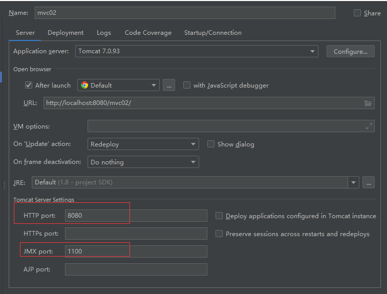
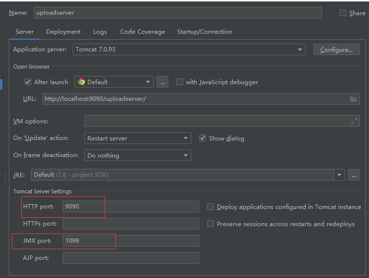

# springMVC跨域请求

### 一. 思路

* 需要两台服务器,一台**文件上传服务器**,一台**开发服务器.**

* 统一服务器(Tomcat)版本

### 二. Maven依赖

```xml
<dependencies>
    <dependency>
      <groupId>junit</groupId>
      <artifactId>junit</artifactId>
      <version>4.11</version>
      <scope>test</scope>
    </dependency>

    <dependency>
      <groupId>org.springframework</groupId>
      <artifactId>spring-core</artifactId>
      <version>5.1.6.RELEASE</version>
    </dependency>
    <dependency>
      <groupId>org.springframework</groupId>
      <artifactId>spring-test</artifactId>
      <version>5.1.6.RELEASE</version>
    </dependency>
    <dependency>
      <groupId>org.springframework</groupId>
      <artifactId>spring-beans</artifactId>
      <version>5.1.6.RELEASE</version>
    </dependency>
    <dependency>
      <groupId>org.springframework</groupId>
      <artifactId>spring-context</artifactId>
      <version>5.1.6.RELEASE</version>
    </dependency>
    <dependency>
      <groupId>org.springframework</groupId>
      <artifactId>spring-expression</artifactId>
      <version>5.1.6.RELEASE</version>
    </dependency>
    <dependency>
      <groupId>org.springframework</groupId>
      <artifactId>spring-web</artifactId>
      <version>5.1.6.RELEASE</version>
    </dependency>
    <dependency>
      <groupId>org.springframework</groupId>
      <artifactId>spring-webmvc</artifactId>
      <version>5.1.6.RELEASE</version>
    </dependency>
    <dependency>
      <groupId>org.springframework</groupId>
      <artifactId>spring-aop</artifactId>
      <version>5.1.6.RELEASE</version>
    </dependency>
    <dependency>
      <groupId>org.projectlombok</groupId>
      <artifactId>lombok</artifactId>
      <version>1.18.6</version>
    </dependency>

    <dependency>
      <groupId>org.aspectj</groupId>
      <artifactId>aspectjweaver</artifactId>
      <version>1.9.2</version>
    </dependency>

    <dependency>
      <groupId>aopalliance</groupId>
      <artifactId>aopalliance</artifactId>
      <version>1.0</version>
    </dependency>

    <dependency>
      <groupId>javax.servlet</groupId>
      <artifactId>jstl</artifactId>
      <version>1.2</version>
    </dependency>


    <!-- https://mvnrepository.com/artifact/com.fasterxml.jackson.core/jackson-databind -->
    <dependency>
      <groupId>com.fasterxml.jackson.core</groupId>
      <artifactId>jackson-databind</artifactId>
      <version>2.9.8</version>
    </dependency>
    <!-- https://mvnrepository.com/artifact/com.fasterxml.jackson.core/jackson-core -->
    <dependency>
      <groupId>com.fasterxml.jackson.core</groupId>
      <artifactId>jackson-core</artifactId>
      <version>2.9.8</version>
    </dependency>
    <!-- https://mvnrepository.com/artifact/com.fasterxml.jackson.core/jackson-annotations -->
    <dependency>
      <groupId>com.fasterxml.jackson.core</groupId>
      <artifactId>jackson-annotations</artifactId>
      <version>2.9.8</version>
    </dependency>

    <!-- https://mvnrepository.com/artifact/org.hibernate/hibernate-validator -->
    <dependency>
      <groupId>org.hibernate</groupId>
      <artifactId>hibernate-validator</artifactId>
      <version>5.4.2.Final</version>
    </dependency>
    <!-- https://mvnrepository.com/artifact/javax.validation/validation-api -->
    <dependency>
      <groupId>javax.validation</groupId>
      <artifactId>validation-api</artifactId>
      <version>2.0.1.Final</version>
    </dependency>
	<!-- 跨服务器jar包支持 -->
    <!-- https://mvnrepository.com/artifact/com.sun.jersey/jersey-client -->
    <dependency>
      <groupId>com.sun.jersey</groupId>
      <artifactId>jersey-client</artifactId>
      <version>1.19.4</version>
    </dependency>

    <!-- https://mvnrepository.com/artifact/com.sun.jersey/jersey-core -->
    <dependency>
      <groupId>com.sun.jersey</groupId>
      <artifactId>jersey-core</artifactId>
      <version>1.19.4</version>
    </dependency>
    
    
	<!-- Apache文件上传jar包支持 -->
      <!-- https://mvnrepository.com/artifact/commons-io/commons-io -->
      <dependency>
          <groupId>commons-io</groupId>
          <artifactId>commons-io</artifactId>
          <version>2.6</version>
      </dependency>

   <!-- https://mvnrepository.com/artifact/commons-fileupload/commons-fileupload -->
    <dependency>
      <groupId>commons-fileupload</groupId>
      <artifactId>commons-fileupload</artifactId>
      <version>1.4</version>
    </dependency>


  </dependencies>
```

### 三. springMVC配置文件 applicationContext

```xml
<?xml version="1.0" encoding="UTF-8"?>
<beans xmlns="http://www.springframework.org/schema/beans"
       xmlns:xsi="http://www.w3.org/2001/XMLSchema-instance"
       xmlns:context="http://www.springframework.org/schema/context"
       xmlns:mvc="http://www.springframework.org/schema/mvc"
       xsi:schemaLocation="
        http://www.springframework.org/schema/beans
        http://www.springframework.org/schema/beans/spring-beans.xsd
        http://www.springframework.org/schema/context
        http://www.springframework.org/schema/context/spring-context.xsd
        http://www.springframework.org/schema/mvc
        http://www.springframework.org/schema/mvc/spring-mvc.xsd">

    <!--开启注解扫描-->
    <context:component-scan base-package="com.xmcc"></context:component-scan>

    <!--开启mvc驱动-->
    <mvc:annotation-driven></mvc:annotation-driven>

    <!--配置视图解析器-->
    <bean id="viewResolver" class="org.springframework.web.servlet.view.InternalResourceViewResolver">
        <property name="suffix" value=".jsp"></property>
        <property name="viewClass" value="org.springframework.web.servlet.view.JstlView"></property>
        <property name="prefix" value="/WEB-INF/"></property>
    </bean>

    <!--静态资源-->
    <mvc:resources mapping="/js/**" location="/js/"></mvc:resources>

	 <!--文件上传解析器-->
    <bean id="multipartResolver" class="org.springframework.web.multipart.commons.CommonsMultipartResolver">
        <property name="maxUploadSize" value="10485760"></property>
    </bean>
</beans>
```

### 四. web.xml

```xml
<web-app xmlns="http://xmlns.jcp.org/xml/ns/javaee"
         xmlns:xsi="http://www.w3.org/2001/XMLSchema-instance"
         xsi:schemaLocation="http://xmlns.jcp.org/xml/ns/javaee http://xmlns.jcp.org/xml/ns/javaee/web-app_4_0.xsd"
         version="4.0">


  <servlet>
    <servlet-name>dispatcherServlet</servlet-name>
    <servlet-class>org.springframework.web.servlet.DispatcherServlet</servlet-class>
    <init-param>
      <param-name>contextConfigLocation</param-name>
      <param-value>classpath:applicationContext.xml</param-value>
    </init-param>
    <load-on-startup>1</load-on-startup>
  </servlet>

  <servlet-mapping>
    <servlet-name>dispatcherServlet</servlet-name>
    <url-pattern>/</url-pattern>
  </servlet-mapping>
</web-app>
```

比较简单的配置,没有额外多余的配置,包括spring文件,和ContextLoadListener.

### 五. Controller中的代码

```java
@Controller
@RequestMapping("stu")
public class StudentController{
    @RequestMapping("upload3")
    @ResponseBody
    public String upload3(MultipartFile file, HttpSession session) throws IOException {
        String filename = file.getOriginalFilename();
		// String path = "http://localhost:9090/uploadserver/upload/";
        //远程服务器IP地址和端口,还有服务器项目名和路径
        String path = "http://94.191.55.179:8080/upload-server/upload/";
        String uuid = UUID.randomUUID().toString();
        filename=uuid+filename;

        Client client=Client.create();
        WebResource webResource = client.resource(path + filename);
        webResource.put(file.getBytes());
        return "success";
    }
}
```

### 六. 前端jsp中的代码

```jsp
<%@ page contentType="text/html;charset=UTF-8" language="java" %>
<!DOCTYPE html>
<html>
<script type="text/javascript" src="js/jquery-3.3.1.js"></script>
    <p>上传到远程服务器测试</p>
    <form action="${pageContext.servletContext.contextPath}/stu/upload3" method="post" enctype="multipart/form-data">
        文件上传:<input type="file" name="file">
        <input type="submit" value="submit">
    </form>
</div>
</body>
</html>
```

### 七. 细节

由于开发服务器和开发文件服务器都是在本机上的,所以同时部署两个项目在两台服务器上时,端口号不能一样.

**开发服务器配置**  




**文件上传服务器配置** 




完成本地电脑上的两台服务器测试以后,将文件上传服务器项目使用maven打成war包.

得到**upload-server.war** 包

### 八 . 文件上传服务器迁移到云服务器上

#### 1. 修改云服务器上的服务器配置文件

在 /tomcat/conf/web.xml中修改servlet的参数,加上如下配置

```.xml
 <init-param>
      <param-name>readonly</param-name>
      <param-value>false</param-value>
 </init-param>
```

#### 2. 打开tomcat/webapps目录,将刚才打包好的war包扔进改目录下


#### 3.将命令行切到tomcat/bin目录下,输入catalina run

tomcat服务器正在启动,启动完成后,回道tomcat/webapps下看到多了一个文件


可以通过开发及其正常访问和上传文件,然后看到文件上传服务器上就多了我们上传的文件了.


#### 4. 防重复上传,要用redirect