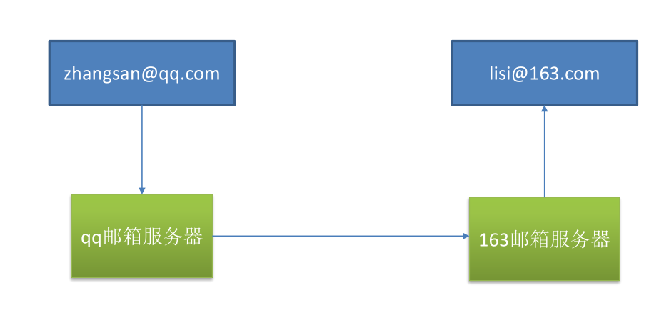

### 任务


#### 异步任务

```java
@Service
public class MyAsyncService {
    @Async	
    public void task() throws InterruptedException {
        Thread.sleep(3000);
        System.out.println("task success!");
    }
}
```

@Async注解利用spring自带的线程池将任务转换为异步任务

```java
@SpringBootApplication
@EnableAsync //开启异步任务支持
public class Application {

    public static void main(String[] args) {
        SpringApplication.run(Application.class, args);
    }

}

```


#### 定时任务

```java
@Service
public class MyScheduleService {
    @Scheduled(cron = "0/5 * * * * ? ")
    public void sayhello(){
        System.out.println("hello");
    }
}
```

 @Scheduled里面写corn表达式

```java
@SpringBootApplication
@EnableScheduling	//开启定时任务支持
public class Application {
    public static void main(String[] args) {
        SpringApplication.run(Application.class, args);
    }

}
```


#### 邮件任务

**原理**





##### pom依赖

```xml
<dependency>
    <groupId>org.springframework.boot</groupId>
    <artifactId>spring-boot-starter-mail</artifactId>
</dependency>
```

##### 配置

```properties
#配置发件人服务器
spring.mail.host=smtp.qq.com
#发件人账号
spring.mail.username=1325953303@qq.com
#发件人密码 动态令牌
spring.mail.password=pdttubevlxtwjiac
#开启ssl认证
spring.mail.properties.mail.smtp.ssl.enable=true
```

##### 发件任务

使用发件功能前,注入**JavaMailSenderImpl**

```java
 @Autowired
 private JavaMailSenderImpl mailSender;
```


简单邮件任务:

````java
    /**
     * 简单邮件发送 使用SimpleMailMessage
     */

    @Test
    public void contextLoads() {
        SimpleMailMessage message=new SimpleMailMessage();
        message.setFrom("1325953303@qq.com");
        message.setTo("qccscript@163.com");
        message.setText("测试邮件内容");
        message.setSubject("测试邮件标题");
        mailSender.send(message);
    }
````

发送复杂类型邮件,比如带附件

```java
 @Test
public void sendmail() throws MessagingException {
    MimeMessage message = mailSender.createMimeMessage();
    MimeMessageHelper helper=new MimeMessageHelper(message,true);
    helper.setFrom("1325953303@qq.com");
    helper.setTo("qccscript@163.com");
    helper.setText("测试邮件内容,带有附件");
    helper.setSubject("测试邮件标题");
    helper.addAttachment("简历.pdf",new File("C:\\Users\\Chang\\Desktop\\ds.pdf"));
    mailSender.send(message);
}
```


