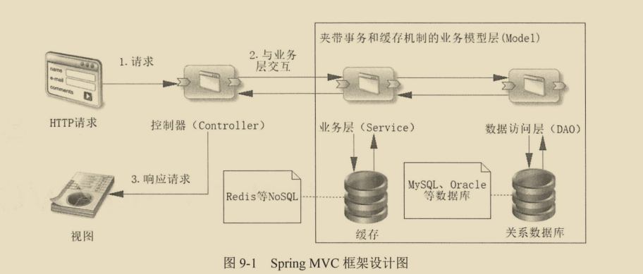
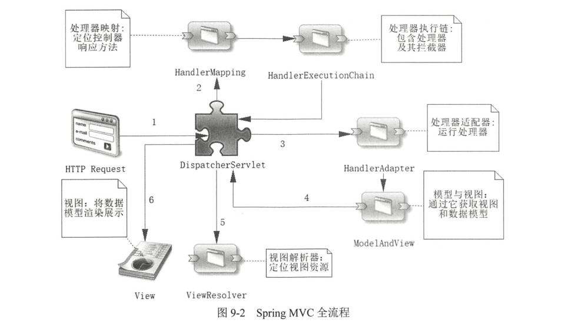

# 1 初识SpringMVC

学习springMVC,首先是学习其基于分层的思想。

SpringMVC一开始就定位于一个较为松散的组合。展示给用户的视图（View）,控制器返回的模型数据(Model),

定位视图解析器的(ViewResolver)和处理器适配器HandlerAdapter)等内容(组件)都是独立的。

## 1.1 springMVC的框架设计

请求先到达控制器，它的作用请求分发。它会根据请求的内容去访问模型层（model），模型层主要分为两层分别是DAO层和service层。当控制器获取到模型层返回的数据后，将内容渲染到视图中，这样就能展现给用户了。这只是一个大概的说明，还有很多细节需要讨论。

## 1.2 Spring MVC流程

流程和组件是SpringMVC的核心。不学习他们就很难理解springboot为我们自动配置了哪些组件，这些组件有什么用。而在SpringMVC的流程就是围绕DispatchServlet工作的。

下图是SpringMVC运行的全流程，但是，SpringMVC处理并不一定要经过全部流程，有时候某些流程不一定存在。比如在控制器的方法上加上@responsebody注解,是不会经过视图解析器和视图渲染的.

