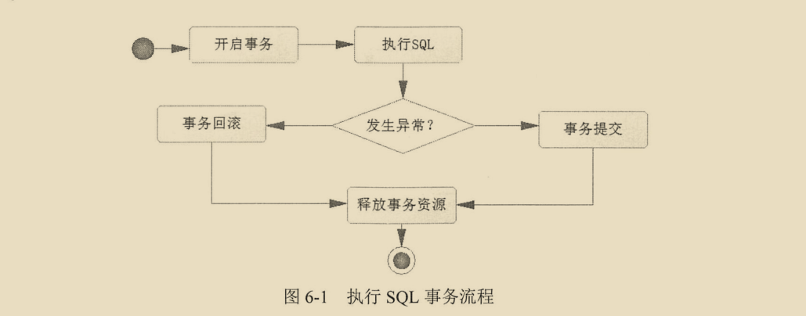
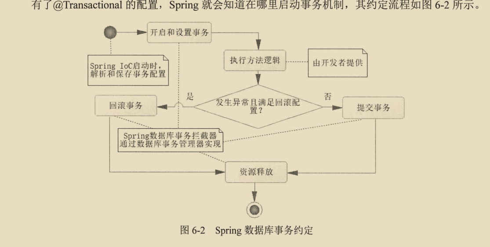
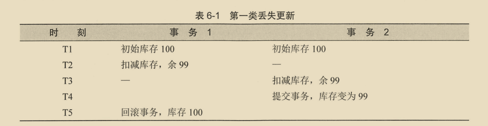
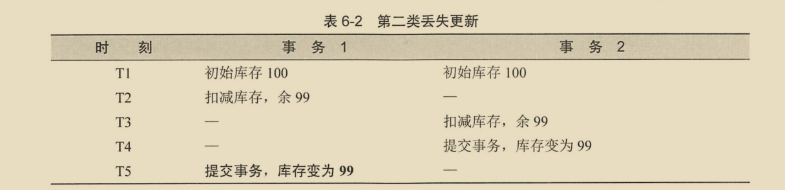

# 1. 数据库事务处理

## 1.1 JDBC的数据库事务

```java
public class OrderTest {
    private String driverClass="com.mysql.jdbc.Driver";
    private String url="jdbc:mysql://localhost:3306/database_transaction?useUnicode=true&characterEncoding=UTF8";
    private String userName="root";
    private String password="root";

    @Test
    public void addOrder(){
        try {
            //加载驱动
            Class.forName(driverClass);
        } catch (ClassNotFoundException e) {
            e.printStackTrace();
        }
        Connection connection=null;
        try {
            //创建连接
            connection= DriverManager.getConnection(url,userName,password);
            //设置手动提交事务
            connection.setAutoCommit(false);
            //创建Statement对象
            Statement statement = connection.createStatement();
            // 执行SQL    //now()表示当前时间
            statement.execute("insert into orders values ('10021','100001',5,2699,now(),null ," +
                    "null ,'王大傻','13535878996','广州番禺','待发货')"); 
            statement.execute("update products set stock=stock-5 where id='100001'");
            //关闭语句
            statement.close();
            //提交事务
            connection.commit();
        } catch (SQLException e) {
            e.printStackTrace();
            try {
                //遇到异常，则回滚事务
                connection.rollback();
            } catch (SQLException e1) {
                e1.printStackTrace();
            }
        }finally {
            try {
                //关闭连接
                connection.close();
            } catch (SQLException e) {
                e.printStackTrace();
            }
        }
    }
}
```

可以看到除了执行sql得到结果这个步骤之外，里面使用了大量的jdbc代码和异常处理的代码。这么多和业务毫不相干的代码很让人头疼。



按照aop的设计思想，就可以把执行sql这个步骤之外的其它步骤都抽离出来单独实现，这就是spring数据库事务编程的思想。

## 1.2 spring声明式事务的使用

### 1.2.1 声明式数据库事务约定

使用aop思维后，执行SQL的代码就可以**织入**spring约定的数据库事务流程中。

对于事务,需要告诉spring在什么地方启用事务功能。对于声明式事务，是使用@Transactional注解标注。


### 1.2.2 @Transactional的配置项

这个注解可以标注在类或者方法上，当标注在类上时，代表类中所有public且非静态的方法都将启用事务。

下面是@Transactional注解的源码

```java
package org.springframework.transaction.annotation;

@Target({ElementType.TYPE, ElementType.METHOD})
@Retention(RetentionPolicy.RUNTIME)
@Inherited
@Documented
public @interface Transactional {
    @AliasFor("transactionManager")
    String value() default "";

    @AliasFor("value")
    String transactionManager() default "";

    Propagation propagation() default Propagation.REQUIRED;

    Isolation isolation() default Isolation.DEFAULT;

    int timeout() default -1;

    boolean readOnly() default false;

    Class<? extends Throwable>[] rollbackFor() default {};

    String[] rollbackForClassName() default {};

    Class<? extends Throwable>[] noRollbackFor() default {};

    String[] noRollbackForClassName() default {};
}
```

@Transactional中可以配置许多属性，如事务隔离级别和传播行为等。这些配置内容，是在IOC容器在加载时就会将这些配置信息解析出来，保存到事务定义器（TransactionDefinition接口的实现类）中。

这个过程中，我们只需要给需要事务的类或者方法上标注@Transactional注解和配置信息即可。




当spring上下文开始调用被@Transactional标注的类或方法时，spring就会产生aop功能。注意事务的底层需要启用aop功能，这是spring事务的底层实现。

spring通过@Transactional注解属性去配置和设置数据库事务，接着spring就会去调用开发者编写的业务代码。这个过程中可能出现异常，也可能没有异常发生。如果没有异常，spring数据库拦截器就会自动帮我们提交事务。如果发生了异常，还要看注解中配置的是否回滚异常类型，最后spring自动帮我们提交事务或回滚事务。

无论异常是否发生，spring都会释放事务资源，这样就可以保证连接池正常使用，这也是spring事务拦截器完成的内容。

还有一个传播行为没有讨论：**传播行为是事务方法之间调用的行为**。

无论怎样，开发者只用完成业务逻辑即可，spring会帮助我们做异常处理和事务控制的脏活和累活。

**spring团队推荐@Transactional注解放在实现类上.**


### 1.2.3 spring事务管理器

事务流程中,事务的打开,回滚,提交都是由事务管理器来完成的.在spring中,事务管理器的顶级接口是PlatformTransactionManager,下面是它的源码

````java
package org.springframework.transaction;

public interface PlatformTransactionManager {
    TransactionStatus getTransaction(@Nullable TransactionDefinition var1) throws TransactionException;

    void commit(TransactionStatus var1) throws TransactionException;

    void rollback(TransactionStatus var1) throws TransactionException;
}
````

在spring的事务管理中,就是将这些方法织入到对应的事务流程中去。getTransaction方法依赖事务定义器TransactionDefinition，而事务定义器又依赖@Transactional注解中的配置信息，于是通过它就能设置事务的属性了。最常用的是他的实现类DataSourceTransactionManager。

依赖了`mybatis-spring-boot-starter`后,springboot会自动创建事务管理器,mybatis的sqlsessionfactory和sqlsessiontemplate等内容。


## 1.3 隔离级别

多个事务同事访问数据库的同一记录，这样引起出现的数据不一致性问题便是数据库的**丢失更新**。


### 1.3.1 数据库事务的知识

**数据库事务**具有以下四个特性，也就是ACID

* 原子性（Atomicity）
  原子性是指事务是一个不可分割的工作单位，事务中的操作要么都发生，要么都不发生。
* 一致性（Consistency）
  事务前后数据的完整性必须保持一致。
* 隔离性（Isolation）
  事务的隔离性是多个用户并发访问数据库时，数据库为每一个用户开启的事务，不能被其他事务的操作数据所干扰，多个并发事务之间要相互隔离。为了压制丢失更新的问题，数据库提出来隔离级别的概念。
* 持久性（Durability）
  持久性是指一个事务一旦被提交，它对数据库中数据的改变就是永久性的，接下来即使数据库发生故障也不应该对其有任何影响


第一类丢失更新：一个事务回滚，另外一个事务提交而引发的数据不一致的情况称为第一类丢失更新。目前大部分数据库系统已经克服第一类丢失更新。



看到T5时刻，事务1回滚了，但是事务2减库存的操作被抹掉了。

如果多个事务并发提交，会出现怎样的的不一致场景，下面是其中的一种可能。



事务2先提交了,T5时刻事务1也提交了,但是它没法感知到事务2的操作,因为不知道事务2已经提交的操作，所以事务又得到了一个错误的结果。

**这样多个事务都提交引发的丢失更新称为第二类丢失更新**。


### 1.3.2详解隔离级别

为了压制丢失更新，数据库提出了标注的4个隔离级别。

为什么不一次性完全解决数据丢失更新问题？这个主要是因为数据一致性，另一个是性能。要完全解决丢失更新问题，要付出锁的代价。过多的使用锁，导致性能大大降低，而大量的并发，引起过多的使用锁，就会导致系统的宕机。


* 读未提交 Read uncommitted，顾名思义，就是一个事务可以读取另一个未提交事务的数据。是一种危险的隔离级别，主要用在对数据一致性没有要求而追求高并发场景中。最大的坏处就是造成**脏读**现象。
* 读已提交 Read committed，顾名思义，就是一个事务要等另一个事务提交后才能读取数据。它能克服**脏读**现象，但是可能会出现**不可重复读**的场景。
* 可重复读 Repeatable read，就是在开始读取数据（事务开启）时，不再允许修改操作。它解决了**不可重复读**的现象，但是可能会出现**幻读**的场景。
* 串行化 Serializable 是最高的事务隔离级别，在该级别下，事务一个一个的按顺序执行，可以避免脏读、不可重复读与幻读。但是这种事务隔离级别效率低下，比较耗数据库性能，一般不使用。

**幻读与不可重复读的区别是**：幻读不是针对一条数据库记录而言，而是多条记录。

追求更高的隔离级别，它能更好的保证数据的一致性，但也要付出锁的代价。有了锁就意味着性能的丢失。而且隔离级别越高，锁的力度越大，性能就直线下降。

现实情况大多会使用读已提交隔离级别。

为了克服数据不一致和性能问题，程序开发者设计了乐观锁，甚至不在使用数据库。比如使用redis作为数据载体。

Oracle只支持两种隔离级别，读已提交和串行化，它默认的隔离级别是读已提交。

MySQL支持4中隔离级别，默认是可重复读。

知道 隔离级别就可以直接使用@Transactional注解直接配置隔离级别信息了。

```java
@Transactional(isolation=Isolation.READ_COMMITTED)
```

隔离级别的类

```java
public enum Isolation {
    DEFAULT(-1),
    READ_UNCOMMITTED(1),
    READ_COMMITTED(2),
    REPEATABLE_READ(4),
    SERIALIZABLE(8);
}
```

一个个指定太麻烦,也可以在全局配置文件application.properties中指定默认隔离级别.


## 1.4 传播行为

在spring中,当一个方法调用另一个方法时,可以让事务采取不同的策略工作,这就是事务传播行为。举个例子：当银行业务里有100个转账任务，在执行这个批任务的时候，中间出现了某个转账任务失败了。这个时候我肯定希望的是只回滚失败的那个转账任务，其它已经正常执行的任务不做任何处理。这个时候就可以使用spring事务传播行为。

spring事务传播行为定义的类：

```java
public enum Propagation {
    //如果当前没有事务，就新建一个事务，如果已经存在一个事务中，加入到这个事务中。这是最常见的选择。
    REQUIRED(0),
    //支持当前事务，如果当前没有事务，就以非事务方式执行。
    SUPPORTS(1),
    //使用当前的事务，如果当前没有事务，就抛出异常。
    MANDATORY(2),
    //新建事务，无论当前事务是否存在. 这样新建的事务可以获得新的隔离级别和锁,与当前事务相互独立.
    REQUIRES_NEW(3),
    //以非事务方式执行操作，如果当前存在事务，就把当前事务挂起。
    NOT_SUPPORTED(4),
    //以非事务方式执行，如果当前存在事务，则抛出异常。
    NEVER(5),
    //在当前方法中调用字方法,如果子方法发生异常,只回滚子方法执行过的事务,而不回滚当前方法的事务
    NESTED(6);
    private final int value;

    private Propagation(int value) {
        this.value = value;
    }
    public int value() {
        return this.value;
    }
}
```

常见的传播行为就只有三个REQUIRED，REQUIRES_NEW，NESTED。


## 1.5 @Transactional调用失效问题

* 调用自己类自身的方法。原因是spring事务的实现原理是aop.在自身调用的过程中,是类的自身调用,而不是代理对象去调用,所以不会产生aop,这样spring就无法把你的代码织入到约定的流程中
* 只在service接口上加了注解,如果使用的是cglib代理,就失效
* 异常被捕获和处理