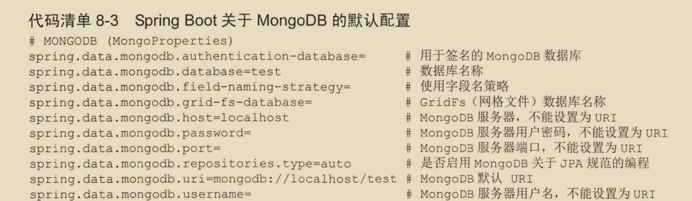
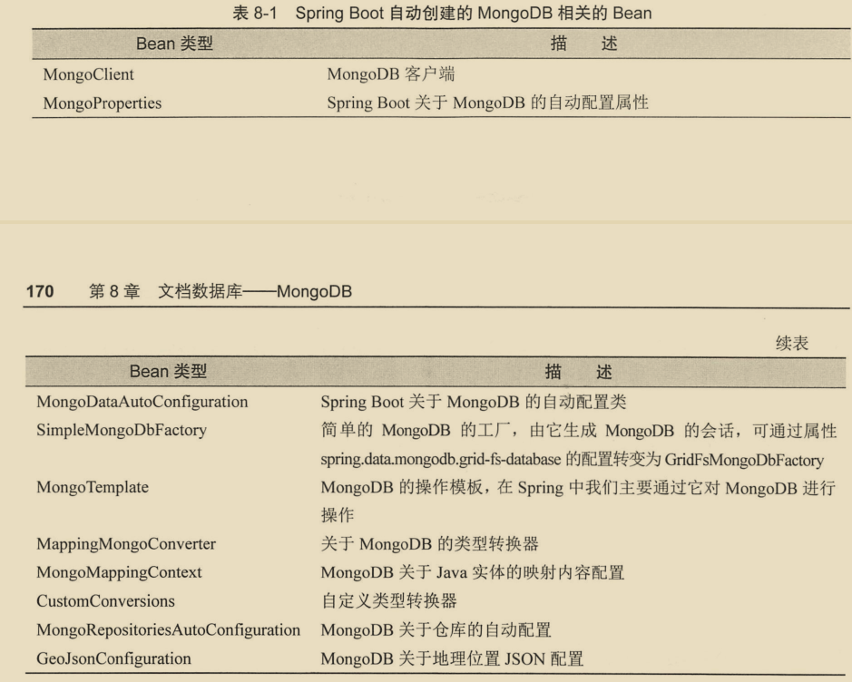
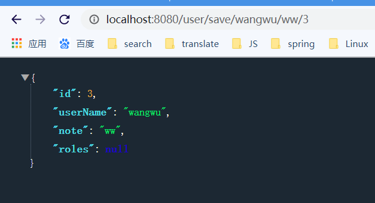
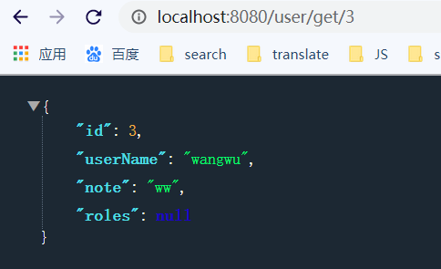
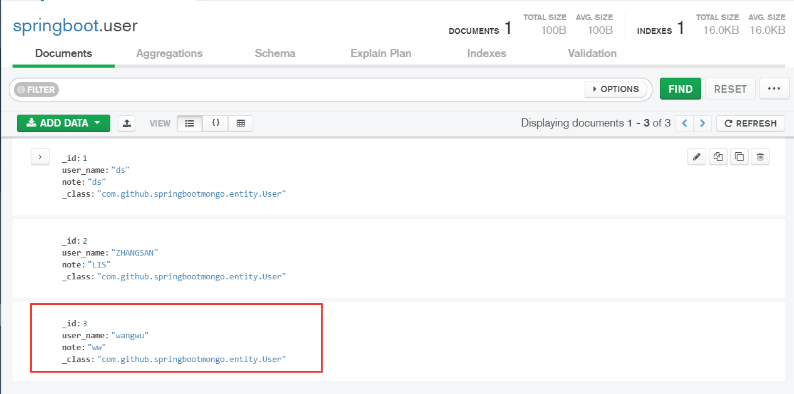
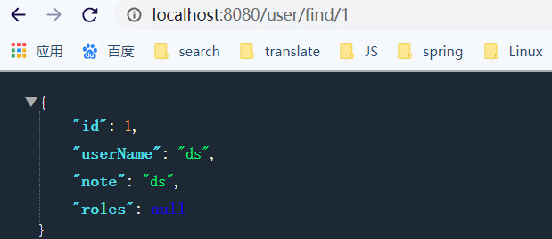
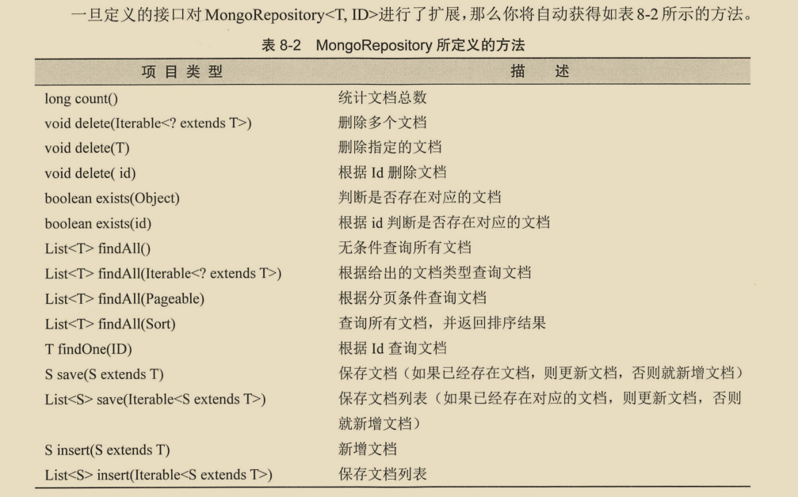
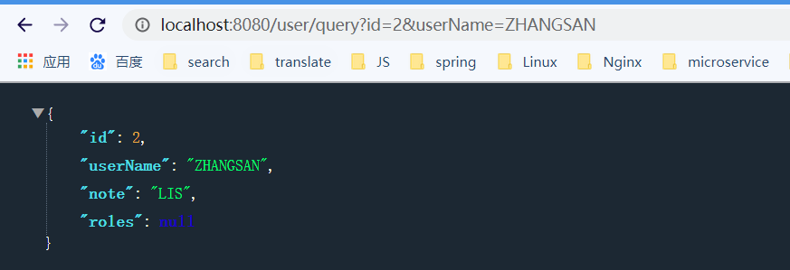

# 文档数据库-MongoDB

MongoDB菜鸟笔记

https://www.runoob.com/mongodb/mongodb-indexing.html


**什么是MongoDB ?**

MongoDB 是由C++语言编写的，是一个基于分布式文件存储的开源数据库系统。

在高负载的情况下，添加更多的节点，可以保证服务器性能。

MongoDB 旨在为WEB应用提供可扩展的高性能数据存储解决方案。

MongoDB 将数据存储为一个文档，数据结构由键值(key=>value)对组成。MongoDB 文档类似于 JSON 对象。字段值可以包含其他文档，数组及文档数组。


**主要特点**

- MongoDB 是一个面向文档存储的数据库，操作起来比较简单和容易。
- 你可以在MongoDB记录中设置任何属性的索引 (如：FirstName="Sameer",Address="8 Gandhi Road")来实现更快的排序。
- 你可以通过本地或者网络创建数据镜像，这使得MongoDB有更强的扩展性。
- 如果负载的增加（需要更多的存储空间和更强的处理能力） ，它可以分布在计算机网络中的其他节点上这就是所谓的分片。
- Mongo支持丰富的查询表达式。查询指令使用JSON形式的标记，可轻易查询文档中内嵌的对象及数组。
- MongoDb 使用update()命令可以实现替换完成的文档（数据）或者一些指定的数据字段 。
- Mongodb中的Map/reduce主要是用来对数据进行批量处理和聚合操作。
- Map和Reduce。Map函数调用emit(key,value)遍历集合中所有的记录，将key与value传给Reduce函数进行处理。
- Map函数和Reduce函数是使用Javascript编写的，并可以通过db.runCommand或mapreduce命令来执行MapReduce操作。
- **GridFS是MongoDB中的一个内置功能，可以用于存放大量小文件。**
- MongoDB允许在服务端执行脚本，可以用Javascript编写某个函数，直接在服务端执行，也可以把函数的定义存储在服务端，下次直接调用即可。
- MongoDB支持各种编程语言:RUBY，PYTHON，JAVA，C++，PHP，C#等多种语言。
- MongoDB安装简单。

## 1.1 配置MongoDB

springboot集成MongoDB加入spring-boot-starter-data-mongodb依赖即可。由于MongoDB数据存储是文档形式，他和json的结构非常类似。所以开发时经常和其它json库一块使用，比如阿里巴巴的fastjson。

```xml
<dependency>
            <groupId>org.springframework.boot</groupId>
            <artifactId>spring-boot-starter-data-mongodb</artifactId>
</dependency>
```


一旦集成了MongoDB的起步依赖，springboot的就会为我们自动配置以下默认配置。




可以看到有了很多默认的配置,在开发的时候非常方便,甚至只要指定两个配置就可以启动springboot的MongoDB项目.

```properties
spring.data.mongodb.database=springboot
spring.data.mongodb.port=27017
#host有默认配置localhost 可省略
#username和password 只要MongoDB数据不开启认证即可就可省略
```


集成了起步依赖后,springboot就会为我们自动配置下列bean:



## 1.2使用MongoTemplate

和jdbctemplate相似,springboot主要通过MongoTemplate进行操作数据库.

用户和服务的接口

```java
public interface UserService {

    User save(User user);

    User getUser(Long id);
}
```

用户服务简单实现类及查询

```java
import com.github.springbootmongo.entity.User;
import com.github.springbootmongo.service.UserService;
import org.springframework.beans.factory.annotation.Autowired;
import org.springframework.data.mongodb.core.MongoTemplate;
import org.springframework.stereotype.Service;

@Service
public class UserServiceImpl implements UserService {
    @Autowired
    private MongoTemplate mongoTemplate;
    @Override
    public User save(User user) {
        return mongoTemplate.insert(user);
    }

    @Override
    public User getUser(Long id) {
        return mongoTemplate.findById(id,User.class);
    }
}
```

用户控制器

```java
@RestController
@RequestMapping("user")
public class UserController {
    @Autowired
    private UserService userService;

    @GetMapping("save/{userName}/{note}/{id}")
    public User saveUser(@PathVariable String userName,
                         @PathVariable("note") String note,
                         @PathVariable("id") Long id){
        User user = new User();
        user.setNote(note);
        user.setUserName(userName);
        user.setId(id);
        return  userService.save(user);
    }

    @GetMapping("get/{id}")
    public User getUser(@PathVariable("id") Long id){
        return userService.getUser(id);
    }
}
```

用户实体类

```java
@Document
public class User implements Serializable {
    private static final long serialVersionUID = -8802007385018088167L;

    //MongoDB文档编号,主键
    @Id
    private Long id;

    //在MongoDB中保存为user_name字段
    @Field("user_name")
    private String userName;
    private String note;
    private List<Role> roles;
    // 省略getter和setter
}
```

@Document注解标明改类的实例作为MongoDB的文档对象. @Field注解将驼峰命名保存到数据库时,使用符合数据库字段规划的下划线代替。

下面是Role类

```
@Document
public class Role implements Serializable {
    private static final long serialVersionUID = -9086974963193093558L;

    private Long id;
    @Field("role_name")
    private String roleName;

    private String note;
    //省略getter和setter
 }
```

@Document注解也可以省略。


发起插入用户的测试




发起查询用户的测试




来看看数据库中保存的数据：




## 1.3 使用jpa

MongoDB是与关系型数据库非常类似的NOSQL数据库.它还允许使用jpa编程.只是与关系型数据库不一样的地方是提供给我们的接口不是`JpaRepository<T, ID>`, 而是` MongoRepository<T, ID>`

### 1.3.1 基本用法

要使用jpa只需自定义接口，按照其名称就能扩展。而不需实现接口的方法。

定义dao层

```java
@Repository
public interface MongoJpaRepository extends MongoRepository<User,Long> {
    @Override
    Optional<User> findById(Long id);
}
```

service层

```java
 @Override
    public User findUserById(Long id) {
        return mongoJpaRepository.findById(id).get();
    }
```

controller层

```java
@GetMapping("find/{id}")
    public User findUser(@PathVariable("id") Long id){
        return userService.findUserById(id);
    }
```

测试:





剩下的就是根据jpa命名规范,自行扩展,如模糊查询等。


### 1.3.2 使用自定义查询

Jpa规范虽然能自动生成查询的逻辑,但是还有一些不足.比如你的查询需要很多字段,总不能写个超级长的方法名吧.

这是就要使用自定义查询了,在spring中提供了@query注解给我们自定义查询。例如如果需要编号(id)和用户名(username)进行查询.

在mongoJpaRepository中添加方法:

```java
@Query("{'id':?0,'userName':?1}")
User find(Long id,String name);
```

可以看到虽然该方法在repository中,但是它也没有符合jpa的命名规范, 这里的0和1是占位符,0代表find方法的第一个参数,1代表方法的第二个参数.

剩下的步骤都是一样的。

service：

```java
User find(User user);
```

实现类:

```java
@Override
public User find(User user) {
    return  user!=null?mongoJpaRepository.find(user.getId(),user.getUserName()):null ;
}
```

控制器:

```java
@GetMapping("query")
public User find(Long id,String userName){
    User user = new User();
    user.setId(id);
    user.setUserName(userName);
    return userService.find(user);
}
```

测试的结果:




当然如果要实现更灵活的查询,可能@query注解可能也要乏力了。这个时候可以借用**Criteria类(准则)**，它能实现更加复杂的查询。

最后可以在springboot的启动类上加上@EnableMongoRepositories注解，可以更精确的配置其它信息，不加也没关系，它和sql的jpa一样,不加该注解也可以，但是想更加精确的配置就可以使用它。