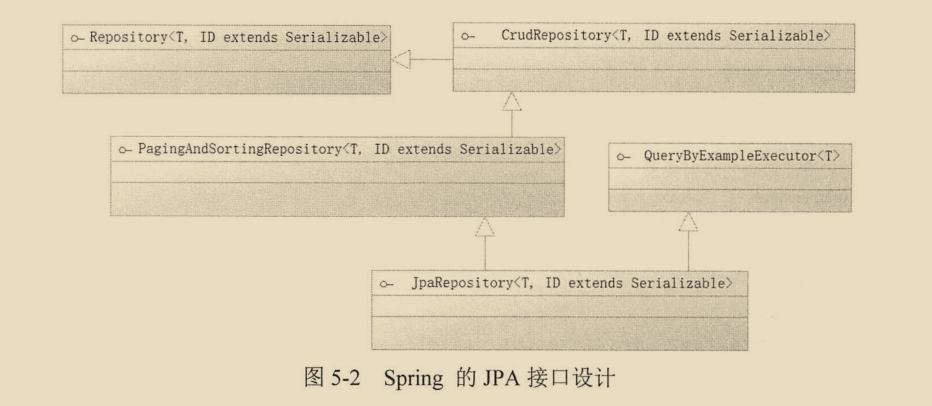
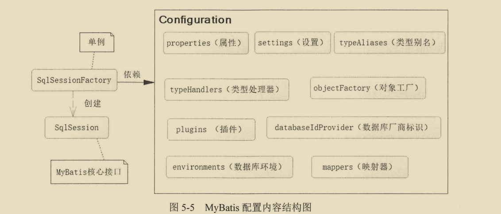
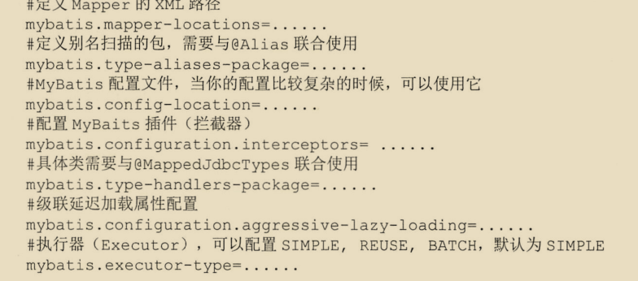

## 1.1 配置数据源

### 1.1.1启动默认数据源

在依赖`spring-boot-starter-data-jpa`以后,springboot就会为我们配置数据源,这些数据源主要是内存数据库,如 h2等内存数据.

在maven中加入`spring-boot-starter-data-jpa`和`h2`的依赖就可以不用做任何配置启动springboot项目.


### 1.1.2配置自定义数据源

以MySQL作为自定义数据源,在Maven中加入

```xml
<!-- MySQL Driver驱动包 -->
      <dependency>
          <groupId>mysql</groupId>
          <artifactId>mysql-connector-java</artifactId>
          <version>5.1.38</version>
          <scope>runtime</scope>
      </dependency>
<!-- Spring Boot的JPA依赖包 -->
      <dependency>
          <groupId>org.springframework.boot</groupId>
          <artifactId>spring-boot-starter-data-jpa</artifactId>
      </dependency>
<!-- 阿里系的Druid依赖包 -->
      <dependency>
          <groupId>com.alibaba</groupId>
          <artifactId>druid</artifactId>
          <version>1.0.20</version>
      </dependency>
```

然后在application.properties文件中配置数据库连接信息即可.

```properties
# 驱动配置信息
#指定数据源类型是druid
spring.datasource.type=com.alibaba.druid.pool.DruidDataSource
spring.datasource.url = jdbc:mysql://127.0.0.1:3306/myspringboot
spring.datasource.username = root
spring.datasource.password = 123456

#驱动名可省略
spring.datasource.driverClassName = com.mysql.jdbc.Driver
 
# 连接池的配置信息
# 初始化大小，最小，最大
spring.datasource.initialSize=5
spring.datasource.minIdle=5
spring.datasource.maxActive=20
# 配置获取连接等待超时的时间
spring.datasource.maxWait=60000
# 配置间隔多久才进行一次检测，检测需要关闭的空闲连接，单位是毫秒
spring.datasource.timeBetweenEvictionRunsMillis=60000
# 配置一个连接在池中最小生存的时间，单位是毫秒
spring.datasource.minEvictableIdleTimeMillis=300000
spring.datasource.validationQuery=SELECT 1 FROM DUAL
spring.datasource.testWhileIdle=true
spring.datasource.testOnBorrow=false
spring.datasource.testOnReturn=false
# 打开PSCache，并且指定每个连接上PSCache的大小
spring.datasource.poolPreparedStatements=true
spring.datasource.maxPoolPreparedStatementPerConnectionSize=20
# 配置监控统计拦截的filters，去掉后监控界面sql无法统计，'wall'用于防火墙
spring.datasource.filters=stat,wall,log4j
# 通过connectProperties属性来打开mergeSql功能；慢SQL记录
spring.datasource.connectionProperties=druid.stat.mergeSql=true;druid.stat.slowSqlMillis=5000
```


## 1.2 使用jdbcTemplate操作数据库

在配置好数据源后,springboot就会自动配置jdbc模板. 体现了springboot自动配置,尽量减少工作量的能力.

需要注意的是jdbcTemplate每执行一条sql就会从数据库连接池中取出一个连接,执行完毕后才释放连接,把资源返还给连接池. 如果希望jdbcTemplate一个连接执行多条SQL,则需要StatementCallback或ConnectionCallback接口实现回调.


## 1.3 使用JPA操作数据

### 1.3.1 概述

JPA(JAVA持久化API)是定义了对象关系映射(ORM)以及实体对象持久化的标准接口.

JPA是一个标准,hibernate是他的实现.

### 1.3.2 开发JPA

```JAVA
import javax.persistence.*;
//标明是一个实体类
@Entity
//指定表名，指定唯一约束
@Table(name = "t_user",uniqueConstraints = {@UniqueConstraint(columnNames = {"id","name"})})
public class User {
    @Id//指定主键
    @GeneratedValue
    private int id;
    //定义属性和表字段映射的关系
    @Column(name="user_name")
    private String name;
    @Column
    private String password;
 
    //一对一映射
    @OneToOne(optional = true, cascade = CascadeType.ALL)
    @JoinColumn(name = "articleId", unique = true)
    public Article article;
 
    //省略了getter和setter
}
```

数据库类型和java类型不一致时,如java类型是性别的枚举,数据库是int类型时,可以写一个转换器,它需要实现AttributeConvert接口定义转换规则.

有了上述的pojo对象,还需要一个JpaRepository来对应操作.




直接继承JpaRepository接口即可,并不需要任何实现,就能提供一些基本的增删改查. jpa可以根据方法名自动生成HQL.

要想进一步的配置jpa可以在启动类上添加@EntityScan和@EnbaleJpaRepositories. 不加这两个注解也没关系,只要Maven中添加了jpa的起步依赖,springboot也会自动给我们配置.

百度搜索springboot jpa常见配置.可以了解更多配置信息,例如打印sql.


## 1.4 整合mybatis框架

### 1.4.1 引入mybatis的起步依赖

```xml
<dependency>
			<groupId>org.mybatis.spring.boot</groupId>
			<artifactId>mybatis-spring-boot-starter</artifactId>
			<version>1.3.2</version>
</dependency>
```

该起步依赖是由mybatis社区开发的.从名字就能看出.

### 1.4.2 mybatis配置




**从图中能看出sqlsessionfactory是单例的,它主要用于创建核心接口sqlsession,而构建sqlsessionfactory是依赖Configuration配置类的,它可以从application.properties配置文件中读取配置内容.**

下面是sqlsession接口中部分代码,可以看到它几乎定义了和数据库有关的所有操作.

```java
package org.apache.ibatis.session;
public interface SqlSession extends Closeable {
    <T> T selectOne(String var1);

    <E> List<E> selectList(String var1);

    void select(String var1, Object var2, ResultHandler var3);

    void select(String var1, ResultHandler var2);

    void select(String var1, Object var2, RowBounds var3, ResultHandler var4);

    int insert(String var1);

    int update(String var1);

    int delete(String var1);

    void commit();
    void rollback();
    List<BatchResult> flushStatements();
    void close();
    void clearCache();
    Configuration getConfiguration();
    <T> T getMapper(Class<T> var1);
    Connection getConnection();
    
    //....省略许多
}

```

**TypeHandler转换指定数据库中数据为Enum枚举**

 https://www.cnblogs.com/dyf-stu/p/10162301.html 


### 1.4.3 springboot整合mybatis

mybatis和spring整合,提供了两个类MapperFactoryBean和MapperScannerConfigurer.

MapperFactoryBean是针对一个接口配置的,比如可以用MapperFactoryBean来获取操作user的mapper接口.

MapperScannerConfigurer是扫描装配,也就是提供扫描装配mapper接口到IOC容器中.

由于上面两个类都需要用java代码去配置,很不方便, mybatis还提供了@MapperScan注解,可以直接指定扫描路径.


### 1.4.4 mybatis的其它配置




### 1.4.5 小结

* mapper接口上可以加注解@Mapper或@Repository,不加也没关系,只不过加了可以起提示作用,另外还可以在@mapperscan注解中利用上述两个注解,限制类型的mapper接口装配到IOC容器中.不常用.