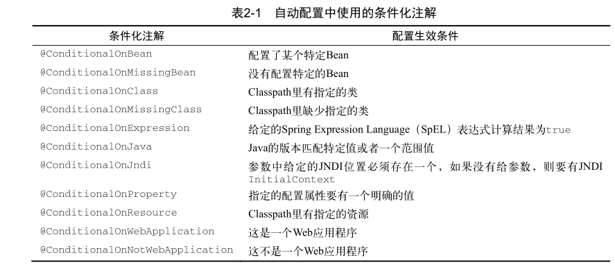

# Spring Boot  In  Action 


> ## Spring Boot  的核心是起步依赖和自动配置


### 开发运行第一个应用程序


#### 测试spring boot应用程序

```java
@RunWith(SpringRunner.class)
@SpringBootTest
public class MallTinyApplicationTests {
    @Test
    public void contextLoads() {
    }
}
```

这里还有一个简单的测试方法，即 contextLoads() 。实际上它就是个空方法。先测试运行这个空方法,如果测试通过,说明前期的配置和部署都是没有问题的.


**配置应用程序属性**

> Initializr为你生成的application.properties文件是一个空文件。实际上，这个文件完全是可选的，你大可以删掉它，这不会对应用程序有任何影响，但留着也没什么问题。
>
> application.properties文件可以很方便地帮你细粒度地调整Spring Boot的自动配置。
>
> 注意的是，你完全不用告诉Spring Boot为你加载 application.properties ，只要它存
> 在就会被加载，Spring和应用程序代码都能获取其中的属性。

说起依赖，无论哪个构建说明文件，都只有五个依赖，除了你手工添加的H2之外，其他的Artifact ID都有 spring-boot-starter- 前缀。这些都是Spring Boot起步依赖，它们都有助于Spring Boot应用程序的构建。


#### 指定基于功能的依赖

假设你想开发一个spring的web应用程序,那么首先:

你会向项目里添加哪些依赖呢？要用Spring MVC的话，你需要哪个Spring依赖？你还记得
Thymeleaf的Group和Artifact ID吗？你应该用哪个版本的Spring Data JPA呢？它们放在一起兼容
吗？

但你是怎么知道的？你怎么保证你选的这些版本能相
互兼容？也许可以，但构建并运行应用程序之前你是不知道的。再说了，你怎么知道这个列表是
完整的？在一行代码都没写的情况下，你离开始构建还有很长的路要走。

**如果我们只在构建文件里指定功能，让构建过程自己搞明白我们要什么东西，岂不是更简单？这正是Spring Boot起步依赖的功能。**


#### 覆盖起步依赖引入的传递依赖

但是，即使经过了Spring Boot团队的测试，起步依赖里所选的库仍有问题该怎么办？如何覆盖起步依赖呢？

说到底，起步依赖和你项目里的其他依赖没什么区别。也就是说，你可以通过构建工具中的功能，选择性地覆盖它们引入的传递依赖的版本号，排除传递依赖，当然还可以为那些Spring Boot起步依赖没有涵盖的库指定依赖。

比方说你的起步依赖里面有jsonAPI Jackson的库,但是你不想使用它,可以用<exclusions>标签排除.

```xml
<dependency>
<groupId>org.springframework.boot</groupId>
<artifactId>spring-boot-starter-web</artifactId>
<exclusions>
        <exclusion>
        <groupId>com.fasterxml.jackson.core</groupId>
        </exclusion>
</exclusions>
</dependency>
```

另一方面，也许项目需要Jackson，但你需要用另一个版本的Jackson来进行构建，而不是Web起步依赖里的那个。假设Web起步依赖引用了Jackson 2.3.4，但你需要使用2.4.3。在Maven里，你可以直接在pom.xml中表达诉求，就像这样：

```xml
<dependency>
    <groupId>com.fasterxml.jackson.core</groupId>
    <artifactId>jackson-databind</artifactId>
    <version>2.4.3</version>
</dependency>
```

Maven总是会用最近的依赖，也就是说，你在项目的构建说明文件里增加的这个依赖，会**覆盖**传递依赖引入的另一个依赖。


不管什么情况，在覆盖Spring Boot起步依赖引入的传递依赖时都要多加小心。虽然不同的版本放在一起也许没什么问题，但你要知道，起步依赖中各个依赖版本之间的兼容性都经过了精心的测试。应该只在特殊的情况下覆盖这些传递依赖（比如新版本修复了一个bug）。

**查看maven依赖树结构**

```cmd
mvn dependency:tree
```

#### 使用自动配置

简而言之，Spring Boot的自动配置是一个运行时（更准确地说，是应用程序启动时）的过程，考虑了众多因素，才决定Spring配置应该用哪个，不该用哪个。举几个例子，下面这些情况都是Spring Boot的自动配置要考虑的:

* Spring的 JdbcTemplate 是不是在Classpath里？如果是，并且有 DataSource 的Bean，则自动配置一个 JdbcTemplate 的Bean。
* Thymeleaf是不是在Classpath里？如果是，则配置Thymeleaf的模板解析器、视图解析器以及模板引擎。
*  Spring Security是不是在Classpath里？如果是，则进行一个非常基本的Web安全设置。每当应用程序启动的时候，Spring Boot的自动配置都要做将近200个这样的决定，涵盖安全、集成、持久化、Web开发等诸多方面。所有这些自动配置就是为了尽量不让你自己写配置。


**条件化的配置**

在Spring里可以很方便地编写你自己的条件，你所要做的就是实现 Condition 接口，覆盖它的 matches() 方法。

Spring 4.0引入的新特性。条件化配置允许配置存在于应用程序中，但在满足某些特定条件之前都忽略这个配置。

举例来说，下面这个简单的条件类只有在Classpath里存在 JdbcTemplate 时才会生效：

```java
import org.springframework.context.annotation.Condition;
import org.springframework.context.annotation.ConditionContext;
import org.springframework.core.type.AnnotatedTypeMetadata;
public class JdbcTemplateCondition implements Condition {
    @Override
    public boolean matches(ConditionContext context, AnnotatedTypeMetadata metadata){
        try {
        context.getClassLoader().loadClass(
        "org.springframework.jdbc.core.JdbcTemplate");
       		 return true;
        } catch (Exception e) {
      	 	 return false;
        }
    }
}
```

当你用Java来声明Bean的时候，可以使用这个自定义条件类：

```java
@Conditional(JdbcTemplateCondition.class)
public MyService myService() {
	...
}
```

在这个例子里，只有当 JdbcTemplateCondition 类的条件成立时才会创建 MyService 这个Bean。也就是说MyService Bean创建的条件是Classpath里有 JdbcTemplate 。否则，这个Bean的声明就会被忽略掉。


表2-1列出了Spring Boot提供的条件化注解。



随便选中一个注解,查看源码.比如**@ConditionalOnBean**

```java
@Target({ElementType.TYPE, ElementType.METHOD})
@Retention(RetentionPolicy.RUNTIME)
@Documented
@Conditional({OnBeanCondition.class})	//这里才是Conditional的决策
public @interface ConditionalOnBean {
    Class<?>[] value() default {};

    String[] type() default {};

    Class<? extends Annotation>[] annotation() default {};

    String[] name() default {};

    SearchStrategy search() default SearchStrategy.ALL;

    Class<?>[] parameterizedContainer() default {};
}
```

可以看到这个注解并没有什么特殊之处,只是在已有的**@Conditional**注解上 已经实现了一个条件加上去而已


#### 小结

通过Spring Boot的起步依赖和自动配置，你可以更加快速、便捷地开发Spring应用程序。起步依赖帮助你专注于应用程序需要的功能类型，而非提供该功能的具体库和版本。与此同时，自动配置把你从样板式的配置中解放了出来。这些配置在没有Spring Boot的Spring应用程序里非常常见。


#### 覆盖 Spring Boot 自动配置


