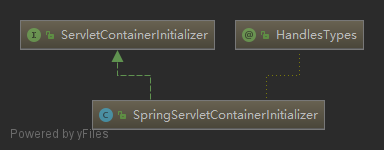
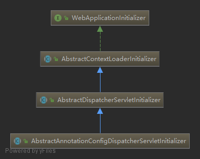

# 整合


### 一.通过javaconfig整合spring和springMVC


```java
public class MyWebConfig extends AbstractAnnotationConfigDispatcherServletInitializer {
    @Override
    protected Class<?>[] getRootConfigClasses() {
        return new Class[]{RootConfig.class};
    }

    @Override
    protected Class<?>[] getServletConfigClasses() {
        return new Class[]{WebConfig.class};
    }

    @Override
    protected String[] getServletMappings() {
        return new String[]{"/"};
    }
}

```


通过继承**AbstractAnnotationConfigDispathcerServletInitiallizer**该类来达到整合配置的效果。

**原理**是servlet容器（3.0版本以上）在启动的时候会从类路径中查找实现了**ServletContainerInitiallizer**接口的类，而springMVC已经在类路径中添加了该接口的实现类**SpringServletContainerInitiallizer**,而这个类又会去查找实现了**WebApplicationInitiallizer**的实现类，  


 

而**AbstractAnnotationConfigDispathcerServletInitiallizer**恰好是**WebApplicationInitiallizer**的实现类。

    

因此只要自定义一个实现了**AbstractAnnotationConfigDispathcerServletInitiallizer**的类即可完成整合配置。

下面是配置类的信息：


rootconfig.class:


```java
@Configuration
@ComponentScan("com.xmcc")
public class RootConfig {
}
```


```java
@ComponentScan("com.xmcc.controller")
@Configuration
@EnableWebMvc
 //这里实现接口也可以,后来的版本中adapter废弃了
public class WebConfig implements WebMvcConfigurer {

    @Bean
    public ViewResolver internalResourceViewResolver(){
        InternalResourceViewResolver viewResolver=new InternalResourceViewResolver();
        viewResolver.setPrefix("/WEB-INF/views/");
        viewResolver.setSuffix(".jsp");
        viewResolver.setExposeContextBeansAsAttributes(true);
        return viewResolver;
    }

    @Override
    public void configureDefaultServletHandling(DefaultServletHandlerConfigurer configurer) {
        configurer.enable();
    }
}
```


### 二.注意的地方

使用maven管理项目依赖时,**spring各个jar包版本要一致**,否则可能出现web项目启动失败

