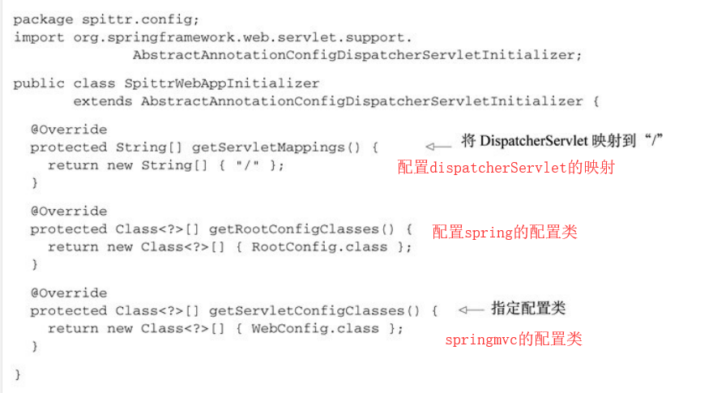

# 整合

### 一.通过javaconfig整合spring和springMVC

通过继承**AbstractAnnotationConfigDispathcerServletInitiallizer**该类来达到整合配置的效果。

**原理**是servlet容器（3.0版本以上）在启动的时候会从类路径中查找实现了**ServletContainerInitiallizer**接口的类，而springMVC已经在类路径中添加了该接口的实现类**SpringServletContainerInitiallizer**,而这个类又会去查找实现了**WebApplicationInitiallizer**的实现类， 而**AbstractAnnotationConfigDispathcerServletInitiallizer**恰好是**WebApplicationInitiallizer**的实现类。    

因此只要自定义一个实现了**AbstractAnnotationConfigDispathcerServletInitiallizer**的类即可完成整合配置。

下面是配置类的信息：

rootconfig.class:

