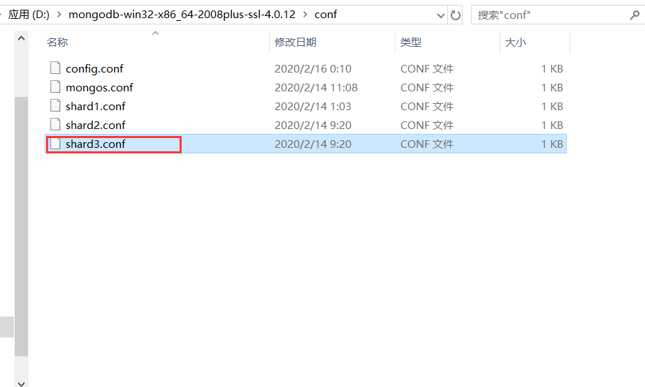

**起步环境**

1.  MongoDB_4.0.12 绿色解压版 
2. OS :Windows Server 2012R2

**编写目的**

1. 为了系统整体稳定性,需要集群
2. 网上关于Windows版的教程比较少

点击百度云链接可以直接下载:

链接: https://pan.baidu.com/s/1kcXRprZBAj9o2CikK9Kj3w 提取码: yxz7

​		最好将下载后的压缩包解压到D盘,这里以MongoDB的根路径为`D:\mongodb-win32-x86_64-2008plus-ssl-4.0.12`  因为这样你可以的一步步快速的向下操作.甚至在第一次配置完，之后再次启动时，都不需要命令启动  直接打开Windows的服务就可以手动点击启动。


​		为了节省时间,此文档省略创建数据文件夹和日志文件夹还有配置文件的步骤,且把所有配置文件和需要创建的文件夹全部打包好了

解压下载下来的文件夹后,内容目录如下:


下载完并解压后,记得配置一下环境变量


## 1、MongoDB机器信息

<table>
<thead>
<tr>
<th style="text-align:center">192.168.252.121</th>
<th style="text-align:center">192.168.252.122</th>
<th style="text-align:center">192.168.252.123</th>
</tr>
</thead>
<tbody>
<tr>
<td style="text-align:center">mongos</td>
<td style="text-align:center">mongos</td>
<td style="text-align:center">mongos</td>
</tr>
<tr>
<td style="text-align:center">config server</td>
<td style="text-align:center">config server</td>
<td style="text-align:center">config server</td>
</tr>
<tr>
<td style="text-align:center">shard server1 主节点</td>
<td style="text-align:center">shard server1 副节点</td>
<td style="text-align:center">shard server1 仲裁</td>
</tr>
<tr>
<td style="text-align:center">shard server2 仲裁</td>
<td style="text-align:center">shard server2 主节点</td>
<td style="text-align:center">shard server2 副节点</td>
</tr>
<tr>
<td style="text-align:center">shard server3 副节点</td>
<td style="text-align:center">shard server3 仲裁</td>
<td style="text-align:center">shard server3 主节点</td>
</tr>
</tbody>
</table>

端口分配:

```cmd
mongos：20000
config：21000
shard1：27001
shard2：27002
shard3：27003
```

## 2、config server配置服务器


 mongodb3.4以后要求配置服务器也创建副本集，不然集群搭建不成功。
(三台机器)修改配置文件


```conf
## 配置文件内容

#修改MongoDB数据存放的路径
#按需要替换MongoDB的路径"D:\mongodb-win32-x86_64-2008plus-ssl-4.0.12"   
#后面的"config\data"这些 不要改动,都是已经配置好了的

dbpath = D:\mongodb-win32-x86_64-2008plus-ssl-4.0.12\config\data

#日志存放路径,同上
logpath = D:\mongodb-win32-x86_64-2008plus-ssl-4.0.12\config\log\congigsrv.log
logappend = true
 
bind_ip = 0.0.0.0
port = 21000
 
#declare this is a config db of a cluster;
configsvr = true

#副本集名称
replSet = configs
 
#设置最大连接数
maxConns = 20000
```

三台机器都配置好了,按任意顺序陆续启动三台机器上的MongoDB配置服务

用命令行打开,启动服务命令如下:

```cmd
mongod -f  D:\mongodb-win32-x86_64-2008plus-ssl-4.0.12\conf\config.conf
```

如果启动失败,请检查该配置文件的编码方式,用记事本打开,另存为ANSI编码,覆盖即可.

 新开一个命令行窗口,登录任意一台配置服务器，初始化配置副本集
连接 MongoDB 

```cmd
mongo --port 21000
```

连接后复制下面的内容到cmd窗口中 

config 变量 

```cmd
config = {
    _id : "configs",
    members : [
    {_id : 0, host : "192.168.252.121:21000" },
    {_id : 1, host : "192.168.252.122:21000" },
    {_id : 2, host : "192.168.252.123:21000" }
    ]
}
```


接着初始化副本集 

```cmd
rs.initiate(config)
```


 成功的话,命令行响应内容大概如下

```cmd
> config = {
... _id : "configs",
... members : [
... {_id : 0, host : "192.168.252.121:21000" },
... {_id : 1, host : "192.168.252.122:21000" },
... {_id : 2, host : "192.168.252.123:21000" }
... ]
... }
{
    "_id" : "configs",
    "members" : [
        {
            "_id" : 0,
            "host" : "192.168.252.121:21000"
        },
        {
            "_id" : 1,
            "host" : "192.168.252.122:21000"
        },
        {
            "_id" : 2,
            "host" : "192.168.252.123:21000"
        }
    ]
}
> rs.initiate(config);
{
    "ok" : 1,
    "operationTime" : Timestamp(1517369899, 1),
    "$gleStats" : {
        "lastOpTime" : Timestamp(1517369899, 1),
        "electionId" : ObjectId("000000000000000000000000")
    },
    "$clusterTime" : {
        "clusterTime" : Timestamp(1517369899, 1),
        "signature" : {
            "hash" : BinData(0,"AAAAAAAAAAAAAAAAAAAAAAAAAAA="),
            "keyId" : NumberLong(0)
        }
    }
}
configs:SECONDARY>
```

 此时会发现终端上的输出已经有了变化。 

```cmd
//从单个一个
>
//变成了
configs:SECONDARY>
```

 查询状态 :

```cmd
configs:SECONDARY> rs.status()
```

## 3. 配置分片副本集

### 3.1 设置第一个分片副本集

 (三台机器)设置第一个分片副本集
配置文件 


```cmd
#配置文件内容
#——————————————–
dbpath = D:\mongodb-win32-x86_64-2008plus-ssl-4.0.12\shard1\data
logpath = D:\mongodb-win32-x86_64-2008plus-ssl-4.0.12\shard1\log\shard1.log
logappend = true

bind_ip = 0.0.0.0
port = 27001

 
#副本集名称
replSet = shard1
 
#declare this is a shard db of a cluster;
shardsvr = true
 
#设置最大连接数
maxConns = 20000
```

这里同样要注意shard1.conf文件的编码

分别启动三台服务器的shard1 server 

```cmd
mongod -f  D:\mongodb-win32-x86_64-2008plus-ssl-4.0.12\conf\shard1.conf
```

 登陆任意一台服务器，初始化副本集(除了192.168.252.123)
连接 MongoDB 

```cmd
mongo --port 27001
```

 使用admin数据库 

```php
use admin
```

 定义副本集配置 

```objectivec
config = {
    _id : "shard1",
     members : [
         {_id : 0, host : "192.168.252.121:27001" },
         {_id : 1, host : "192.168.252.122:27001" },
         {_id : 2, host : "192.168.252.123:27001" , arbiterOnly: true }
     ]
 }
```

 初始化副本集配置 

```css
rs.initiate(config)
```

 响应内容如下 

```python
> use admin
switched to db admin
> config = {
...     _id : "shard1",
...      members : [
...          {_id : 0, host : "192.168.252.121:27001" },
...          {_id : 1, host : "192.168.252.122:27001" },
...          {_id : 2, host : "192.168.252.123:27001" , arbiterOnly: true }
...      ]
...  }
{
    "_id" : "shard1",
    "members" : [
        {
            "_id" : 0,
            "host" : "192.168.252.121:27001"
        },
        {
            "_id" : 1,
            "host" : "192.168.252.122:27001"
        },
        {
            "_id" : 2,
            "host" : "192.168.252.123:27001",
            "arbiterOnly" : true
        }
    ]
}
> rs.initiate(config)
{ "ok" : 1 }
```

 此时会发现终端上的输出已经有了变化。 

```cpp
//从单个一个
>
//变成了
shard1:SECONDARY>
```

 查询状态 

```css
shard1:SECONDARY> rs.status()
```

### 3.2 设置第二个分片副本集

设置第二个分片副本集
配置文件 


```cmd
#配置文件内容
#——————————————–
dbpath = D:\mongodb-win32-x86_64-2008plus-ssl-4.0.12\shard2\data
logpath = D:\mongodb-win32-x86_64-2008plus-ssl-4.0.12\shard2\log\shard2.log
logappend = true

bind_ip = 0.0.0.0
port = 27002
#fork = true
 
#副本集名称
replSet=shard2
 
#declare this is a shard db of a cluster;
shardsvr = true
 
#设置最大连接数
maxConns=20000
```

注意文件编码方式.

**分别**启动三台服务器的shard2 server 

```cmd
mongod -f  D:\mongodb-win32-x86_64-2008plus-ssl-4.0.12\conf\shard2.conf
```

 连接 MongoDB 

```undefined
mongo --port 27002
```

 使用admin数据库 

```php
use admin
```

 定义副本集配置 

```objectivec
config = {
    _id : "shard2",
     members : [
         {_id : 0, host : "192.168.252.121:27002"  , arbiterOnly: true },
         {_id : 1, host : "192.168.252.122:27002" },
         {_id : 2, host : "192.168.252.123:27002" }
     ]
 }
```

 初始化副本集配置 

```css
rs.initiate(config)
```

如果提示失败,在另一台主机上重新从连接数据库开始尝试

成功响应内容如下

```python
> use admin
switched to db admin
> config = {
...     _id : "shard2",
...      members : [
...          {_id : 0, host : "192.168.252.121:27002"  , arbiterOnly: true },
...          {_id : 1, host : "192.168.252.122:27002" },
...          {_id : 2, host : "192.168.252.123:27002" }
...      ]
...  }
{
    "_id" : "shard2",
    "members" : [
        {
            "_id" : 0,
            "host" : "192.168.252.121:27002",
            "arbiterOnly" : true
        },
        {
            "_id" : 1,
            "host" : "192.168.252.122:27002"
        },
        {
            "_id" : 2,
            "host" : "192.168.252.123:27002"
        }
    ]
}
> rs.initiate(config)
{ "ok" : 1 }
shard2:SECONDARY> rs.status()
```


### 3.3 设置第三个分片副本集



```cmd
#配置文件内容
#——————————————–
dbpath = D:\mongodb-win32-x86_64-2008plus-ssl-4.0.12\shard3\data
logpath = D:\mongodb-win32-x86_64-2008plus-ssl-4.0.12\shard3\log\shard3.log
logappend = true

bind_ip = 0.0.0.0
port = 27003
#fork = true

#副本集名称
replSet=shard3
 
#declare this is a shard db of a cluster;
shardsvr = true
 
#设置最大连接数
maxConns=20000
```

**分别**启动三台服务器的shard3 server 

```cmd
mongod -f  D:\mongodb-win32-x86_64-2008plus-ssl-4.0.12\conf\shard3.conf
```

 登陆任意一台服务器，初始化副本集(除了192.168.252.121) 

```undefined
mongo --port 27003
```

 使用admin数据库

```php
use admin
```

 定义副本集配置 

```objectivec
config = {
    _id : "shard3",
     members : [
         {_id : 0, host : "192.168.252.121:27003" },
         {_id : 1, host : "192.168.252.122:27003" , arbiterOnly: true},
         {_id : 2, host : "192.168.252.123:27003" }
     ]
 }
```

 初始化副本集配置 

```css
rs.initiate(config)
```

 响应内容如下 

```python
> use admin
switched to db admin
> config = {
...     _id : "shard3",
...      members : [
...          {_id : 0, host : "192.168.252.121:27003" },
...          {_id : 1, host : "192.168.252.122:27003" , arbiterOnly: true},
...          {_id : 2, host : "192.168.252.123:27003" }
...      ]
...  }
{
    "_id" : "shard3",
    "members" : [
        {
            "_id" : 0,
            "host" : "192.168.252.121:27003"
        },
        {
            "_id" : 1,
            "host" : "192.168.252.122:27003",
            "arbiterOnly" : true
        },
        {
            "_id" : 2,
            "host" : "192.168.252.123:27003"
        }
    ]
}
> rs.initiate(config)
{ "ok" : 1 }
shard3:SECONDARY> rs.status()
```


### 3.4 配置路由服务器 mongos

 （三台机器）到这里我们已经启动配置服务器和分片服务器,接着我们启动前端路由服务器: 


这个配置文件里面的内容把ip换成我们准备的三台服务器的ip,配置为文件如下

```cmd
#内容

logpath = D:\mongodb-win32-x86_64-2008plus-ssl-4.0.12\mongos\log\mongos.log
logappend = true

bind_ip = 0.0.0.0
port = 20000
#fork = true

#监听的配置服务器,只能有1个或者3个 configs为配置服务器的副本集名字,注意ip地址是否写正确了
configdb = configs/192.168.255.121:21000,192.168.255.122:21000,192.168.255.123:21000
 
#设置最大连接数
maxConns = 20000
```

 **分别**启动三台服务器的mongos server 

```cmd
mongos -f D:\mongodb-win32-x86_64-2008plus-ssl-4.0.12\conf\mongos.conf
```

## 4. 串联路由服务器


 目前搭建了mongodb配置服务器、路由服务器，各个分片服务器，不过应用程序连接到mongos路由服务器并不能使用分片机制，还需要在程序里设置分片配置，让分片生效。
登陆任意一台mongos 

```undefined
mongo --port 20000
```

 使用admin数据库 

```php
use  admin
```

 串联路由服务器与分配副本集 

替换成你自己准备的三台主机ip

```bash
sh.addShard("shard1/192.168.252.121:27001,192.168.252.122:27001,192.168.252.123:27001");
sh.addShard("shard2/192.168.252.121:27002,192.168.252.122:27002,192.168.252.123:27002");
sh.addShard("shard3/192.168.252.121:27003,192.168.252.122:27003,192.168.252.123:27003");
```

 查看集群状态 

```css
sh.status()
```

 响应内容如下 

```bash
mongos> sh.status()
--- Sharding Status --- 
  sharding version: {
    "_id" : 1,
    "minCompatibleVersion" : 5,
    "currentVersion" : 6,
    "clusterId" : ObjectId("5a713a37d56e076f3eb47acf")
  }
  shards:
        {  "_id" : "shard1",  "host" : "shard1/192.168.252.121:27001,192.168.252.122:27001",  "state" : 1 }
        {  "_id" : "shard2",  "host" : "shard2/192.168.252.122:27002,192.168.252.123:27002",  "state" : 1 }
        {  "_id" : "shard3",  "host" : "shard3/192.168.252.121:27003,192.168.252.123:27003",  "state" : 1 }
  active mongoses:
        "3.6.2" : 3
  autosplit:
        Currently enabled: yes
  balancer:
        Currently enabled:  yes
        Currently running:  no
        Failed balancer rounds in last 5 attempts:  0
        Migration Results for the last 24 hours: 
                No recent migrations
  databases:
        {  "_id" : "config",  "primary" : "config",  "partitioned" : true }

mongos>
```

## 5. 启用集合分片生效


 目前配置服务、路由服务、分片服务、副本集服务都已经串联起来了，但我们的目的是希望插入数据，数据能够自动分片。连接在mongos上，准备让指定的数据库、指定的集合分片生效。
登陆任意一台mongos 

```undefined
mongo --port 20000
```

 使用admin数据库 

```php
use  admin
```

 指定testdb分片生效，如下图： 

```css
db.runCommand( { enablesharding :"testdb"});
```

    

 指定数据库里需要分片的集合和片键，哈希分片，如下图： 

```bash
db.runCommand( { shardcollection : "testdb.table1",key : {_id: "hashed"} } );
```

 

 通过命令查看mongodb路由服务器上的shards集合会有数据展示，如下图： 

  

我们设置testdb的 table1 表需要分片，根据片键自动分片到 shard1 ，shard2，shard3 上面去。要这样设置是因为不是所有mongodb 的数据库和表 都需要分片！


## 6.测试集群和分片


重开一个cmd窗口  连接 MongoDB 路由服务

```css
mongo  127.0.0.1:20000
```


开启数据插入平衡分片配置

```
use admin
sh.startBalancer()
```


切换到 testdb 数据库 

```php
use  testdb;
```

 插入测试数据 

```ruby
for(i=1;i<=10000;i++){db.table1.insert({"id":i,"name":"penglei"})};
```


 查看分片情况如下 :

```cmd
db.table1.getShardDistribution()
或
db.table1.stats();
```


可以看到分片数据比较均匀


- shard1： "count": 3344
- shard2： "count": 3363,
- shard3： "count": 3293

 结论数据基本均匀 


查看集群状态

```cmd
sh.status()
```


响应如下:

```cmd
mongos> sh.status()
--- Sharding Status ---
  sharding version: {
        "_id" : 1,
        "minCompatibleVersion" : 5,
        "currentVersion" : 6,
        "clusterId" : ObjectId("5e47c4b547423ff6cf108bce")
  }
  shards:
        {  "_id" : "shard1",  "host" : "shard1/192.168.0.101:27001,192.168.0.112
        {  "_id" : "shard2",  "host" : "shard2/192.168.0.103:27002,192.168.0.112
        {  "_id" : "shard3",  "host" : "shard3/192.168.0.101:27003,192.168.0.103
  active mongoses:
        "4.0.12" : 1
  autosplit:
        Currently enabled: yes
  balancer:
        Currently enabled:  yes
        Currently running:  yes
        Failed balancer rounds in last 5 attempts:  0
        Migration Results for the last 24 hours:
        
        .......省略很多
```


## 7. 和java应用集成

如果是springboot项目，直接在配置文件里将URL配置成前端路由的那个端口就行了，读写都是通过路由端口进行的。

如 192.168.252.121:2000