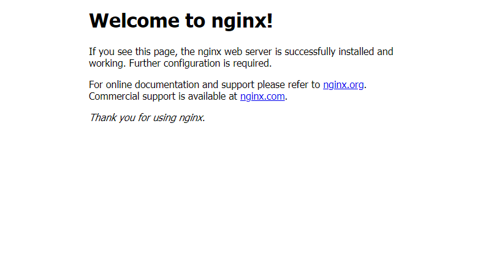
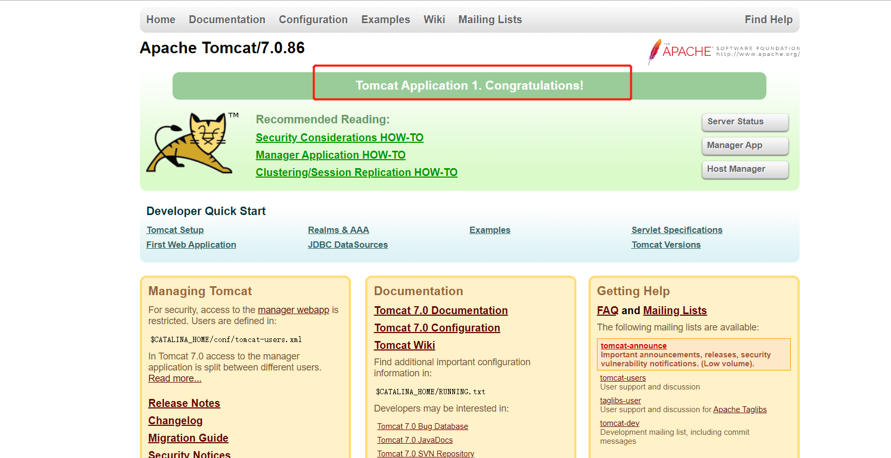
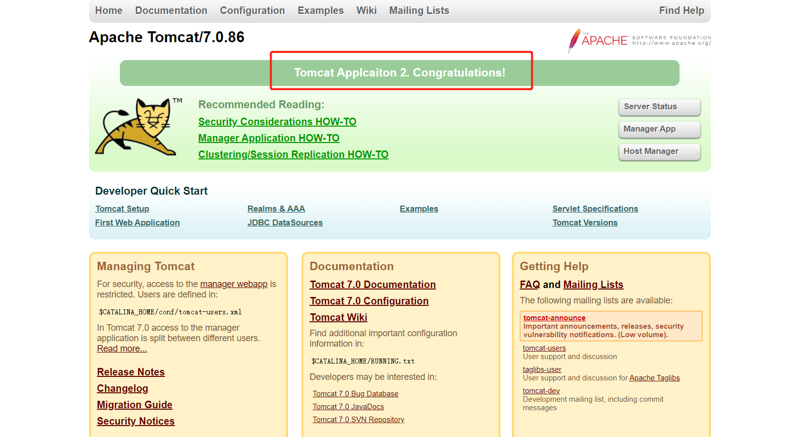

### 部署说明

192.168.0.10服务器作为nginx代理服务器，192.168.0.11与192.168.0.12两台服务器为web服务器。

```cmd
192.168.0.10  80代理服务器
192.168.0.11 8080 应用服务器1
192.168.0.12 8080 应用服务器2
```


### 起步环境

* Windows7/10 , Windows server
* 下载地址: http://nginx.org/download/nginx-1.18.0.zip

解压后得到文件目录


### 启动nginx

nginx的配置是在conf目录下的nginx.conf下完成的

刚下载的nginx应用配置文件 nginx.conf如下:

```conf
#已经去掉了大部分注释 方便阅读
#user  nobody;
worker_processes  1;

events {
    worker_connections  1024;
}


http {
    include       mime.types;
    default_type  application/octet-stream;

    sendfile        on;
    #tcp_nopush     on;

    #keepalive_timeout  0;
    keepalive_timeout  65;

    #gzip  on;

    server {
        listen       80;
        server_name  localhost;

        #charset koi8-r;

        #access_log  logs/host.access.log  main;

        location / {
            root   html;
            index  index.html index.htm;
        }
		
        error_page   500 502 503 504  /50x.html;
        location = /50x.html {
            root   html;
        }
    }


}

```

可以看到其中包含了两个大模块 events和http.

打开cmd命令窗口进入nginx目录下 输入start nginx.exe 或双击nginx.exe 启动nginx.

**验证**

在浏览器上输入localhost回车看到以下页面,则证明成功启动了nginx



### 利用反向代理实现负载均衡

在http模块下创建一个upstream模块,任意命名,比如命名为test

在http模块下添加代码

```conf
upstream test {
server 192.168.0.11 8080;
server 192.168.0.12 8080;
}
```

在刚加的stream下方添加 server模块

```conf
	server {
		listen       80;
        server_name  localhost;
		location /{
		
		 proxy_next_upstream http_502 http_504 error timeout invalid_header;
			proxy_set_header Host $http_host;
			proxy_set_header X-Real-IP $remote_addr;
			proxy_set_header X-Forwarded-For $proxy_add_x_forwarded_for;
			#开启支持ws代理
			proxy_http_version 1.1;
            proxy_set_header Upgrade $http_upgrade;
            proxy_set_header Connection "upgrade";
			proxy_pass http://test;
			proxy_buffering off;
			proxy_connect_timeout 1;
			proxy_send_timeout 1;
			proxy_read_timeout 1;
		}
		
	}
```


修改完毕配置文件并保存,打开cmd进入到nginx目录输入以下内容使配置生效

```cmd
nginx -s reload
```

在192.168.0.10机器上打开浏览器输入 http://localhost即可,多次刷新浏览器发现获得不同的页面







最终的配置文件如下

```conf
#已经去掉了大部分注释 方便阅读
#user  nobody;
worker_processes  1;

events {
    worker_connections  1024;
}


http {
    include       mime.types;
    default_type  application/octet-stream;

  
    sendfile        on;
    #tcp_nopush     on;

    #keepalive_timeout  0;
    keepalive_timeout  65;

    #gzip  on;

	upstream test{
		server 192.168.0.11:8080;
		server 192.168.0.12:9090;
	}

	server {
		listen       80;
        server_name  localhost;
		location /{
		
		 proxy_next_upstream http_502 http_504 error timeout invalid_header;
			proxy_set_header Host $http_host;
			proxy_set_header X-Real-IP $remote_addr;
			proxy_set_header X-Forwarded-For $proxy_add_x_forwarded_for;
			#开启支持ws代理
			proxy_http_version 1.1;
            proxy_set_header Upgrade $http_upgrade;
            proxy_set_header Connection "upgrade";
			proxy_pass http://test;
			proxy_buffering off;
			proxy_connect_timeout 1;
			proxy_send_timeout 1;
			proxy_read_timeout 1;
		}
		
	}
    server {
        listen       80;
        server_name  localhost;

        #charset koi8-r;

        #access_log  logs/host.access.log  main;

        location / {
            root   html;
            index  index.html index.htm;
        }
		
        #error_page  404              /404.html;

        # redirect server error pages to the static page /50x.html
        #
        error_page   500 502 503 504  /50x.html;
        location = /50x.html {
            root   html;
        }
    }

}

```


### 当nginx同时负载均衡多个应用时

当nginx部署在一台机器上，同时反向代理多个应用时，只需在配置文件中添加多个upstream模块和server模块即可.

以四川统建的多规系统为例.以下是配置(以下 upstream模块中server的ip按需配置即可)

```conf
#user  nobody;
worker_processes  1;

events {
    worker_connections  1024;
}

http {
    include       mime.types;
    default_type  application/octet-stream;
    sendfile        on;
    keepalive_timeout  65;
	
	
	#开启支持ws代理
	map $http_upgrade $connection_upgrade {
		default upgrade;
		'' close;
	}


	
	#负载均衡opus-rest
	upstream opus-rest { 
		server localhost:10002; 
		server 172.18.140.39:8883; 
	}

	#负载均衡hurd节点
	upstream hurd { 
		#设置ip_hash转发规则
		ip_hash;
		server localhost:10003; 
		server 172.18.140.39:8000; 
	} 

	#负载均衡agsupport_map
	upstream agsupport_map { 
		server 172.18.140.111:8884; 
		server 172.18.140.124:8884; 
	}
	
	#负载均衡agsupport_map_rest
	upstream agsupport_map_rest { 
		server 172.18.140.111:8885; 
		server 172.18.140.124:8885; 
	}
	
	#负载均衡agcom
	upstream agcom { 
		server 172.18.140.111:8886; 
		server 172.18.140.124:8886; 
	}
	
	#micro
	upstream micro { 
		server 172.18.140.56:8293; 
		server 172.18.140.124:8293; 
	}
	
    server {
        listen       80;
        server_name  localhost;
        error_page   500 502 503 504  /50x.html;
        location = /50x.html {
            root   html;
        }

    }


	#hurd
	server {
        listen       8000;
        server_name  localhost;

        #charset koi8-r;

        #access_log  logs/host.access.log  main;

        location ~ ^/(hurd)(/.*)?$ {
			proxy_next_upstream http_502 http_504 error timeout invalid_header;
			proxy_set_header Host $http_host;
			proxy_set_header X-Real-IP $remote_addr;
			proxy_set_header X-Forwarded-For $proxy_add_x_forwarded_for;
			#开启支持ws代理
			proxy_http_version 1.1;
            proxy_set_header Upgrade $http_upgrade;
            proxy_set_header Connection "upgrade";
			proxy_pass http://hurd;
			proxy_buffering off;
			proxy_connect_timeout 1;
			proxy_send_timeout 1;
			proxy_read_timeout 1;
        }
		
    }

		
	#opus-rest
	server {
        listen       8883;
        server_name  localhost;

        #charset koi8-r;

        #access_log  logs/host.access.log  main;

        location ~ ^/(opus-rest)(/.*)?$ {
			proxy_next_upstream http_502 http_504 error timeout invalid_header;
			proxy_set_header Host $http_host;
			proxy_set_header X-Real-IP $remote_addr;
			proxy_set_header X-Forwarded-For $proxy_add_x_forwarded_for;
			proxy_pass http://opus-rest;
			proxy_buffering off;
			proxy_connect_timeout 1;
			proxy_send_timeout 1;
			proxy_read_timeout 1;
        }
		
    }
	
	#agsupport_map
	server {
        listen       8884;
        server_name  localhost;

        #charset koi8-r;

        #access_log  logs/host.access.log  main;

        location ~ ^/(agsupport_map)(/.*)?$ {
			proxy_next_upstream http_502 http_504 error timeout invalid_header;
			proxy_set_header Host $http_host;
			proxy_set_header X-Real-IP $remote_addr;
			proxy_set_header X-Forwarded-For $proxy_add_x_forwarded_for;
			proxy_pass http://agsupport_map;
			proxy_buffering off;
			proxy_connect_timeout 1;
			proxy_send_timeout 1;
			proxy_read_timeout 1;
        }
		
    }
	
	
	#agsupport_map_rest
	server {
        listen       8885;
        server_name  localhost;

        #charset koi8-r;

        #access_log  logs/host.access.log  main;

        location ~ ^/(agsupport_map_rest)(/.*)?$ {
			proxy_next_upstream http_502 http_504 error timeout invalid_header;
			proxy_set_header Host $http_host;
			proxy_set_header X-Real-IP $remote_addr;
			proxy_set_header X-Forwarded-For $proxy_add_x_forwarded_for;
			proxy_pass http://agsupport_map_rest;
			proxy_buffering off;
			proxy_connect_timeout 1;
			proxy_send_timeout 1;
			proxy_read_timeout 1;
        }
		
    }
	
	#agcom
	server {
        listen       8886;
        server_name  localhost;

        #charset koi8-r;

        #access_log  logs/host.access.log  main;

        location ~ ^/(agcom)(/.*)?$ {
			proxy_next_upstream http_502 http_504 error timeout invalid_header;
			proxy_set_header Host $http_host;
			proxy_set_header X-Real-IP $remote_addr;
			proxy_set_header X-Forwarded-For $proxy_add_x_forwarded_for;
			proxy_pass http://agcom;
			proxy_buffering off;
			proxy_connect_timeout 1;
			proxy_send_timeout 1;
			proxy_read_timeout 1;
        }
		
    }
		
	#micro
	server {
        listen       8293;
        server_name  localhost;

        #charset koi8-r;

        #access_log  logs/host.access.log  main;

        location ~ ^/(micro)(/.*)?$ {
			proxy_next_upstream http_502 http_504 error timeout invalid_header;
			proxy_set_header Host $http_host;
			proxy_set_header X-Real-IP $remote_addr;
			proxy_set_header X-Forwarded-For $proxy_add_x_forwarded_for;
			proxy_pass http://micro;
			proxy_buffering off;
			proxy_connect_timeout 1;
			proxy_send_timeout 1;
			proxy_read_timeout 1;
        }
		
    }

}

```


### 核心配置文件内容详解

```cmd
server: 虚拟主机的名称，一个http中可以配置多个server；
listen：Nginx默认监听本机的端口；
server_name：Nginx服务的地址，可以使用域名，多个用空格分隔。
proxy_pass：代理路径，一般配置upstream后面的名称用于实现负载均衡，可以直接配置ip进行跳转；


proxy_connect_timeout:超时参数
proxy_send_timeout : 超时参数
proxy_read_timeout:超时参数

proxy_set_header: 请求头参数
更多请求头参数查看:
https://blog.csdn.net/zzhongcy/article/details/88801322
https://blog.csdn.net/weixin_41585557/article/details/82426784
```

### 常见问题


* <font color="red">开启支持websocket</font>

> 由于用户认证后,假设应用将用户身份放在A机器上的session中,导致众多请求中有的去请求A机器,有的去请B机器.此时B机器由于没有记录用户身份,导致请求无效出现重定向或40X

解决办法

Linux操作系统可安装stick_session插件 (省略)

Windows操作系统设置ip_hash转发规则

在upstream里面加入ip_hash;

```conf
upstream hurd{
ip_hash;
		server localhost:10003; 
		server 172.18.140.39:8000; 
}
```


* <font color="red">开启支持websocket</font>

```conf
#开启支持ws代理
map $http_upgrade $connection_upgrade {
default upgrade;
'' close;
}
```


还需要在location中添加一些内容

```conf
proxy_http_version 1.1;
proxy_set_header Upgrade $http_upgrade;
proxy_set_header Connection "upgrade";
```


* <font color="red">注意配置文件每行内容以分号结尾,代表一个语句的结束</font>


* <font color="red">nginx网关超时</font>

解决办法设置超时时间大一点,修改这三个参数

proxy_connect_timeout:超时参数
proxy_send_timeout : 超时参数
proxy_read_timeout:超时参数

