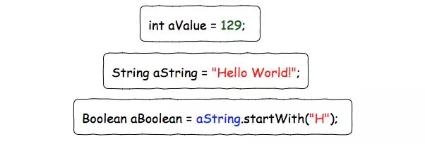
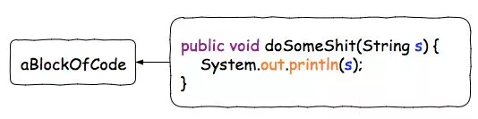
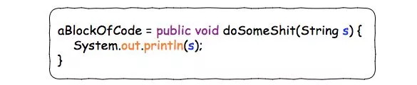
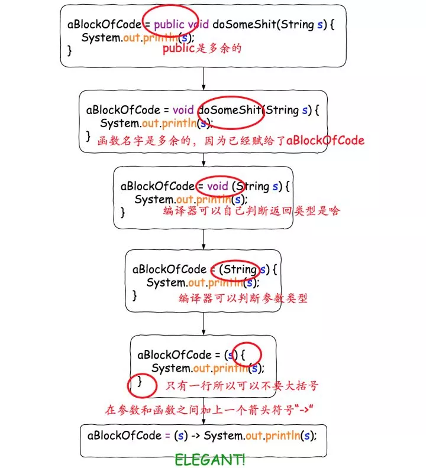
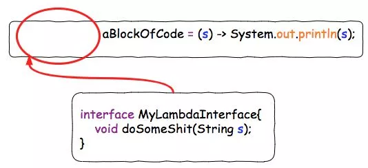
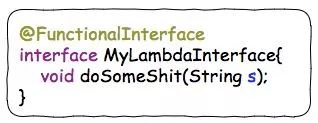

## Lambda是什么?


我们知道，对于一个Java变量，我们可以赋给其一个**“值”**。



如果你想把**“一块代码”**赋给一个Java变量，应该怎么做呢？

比如，我想把右边那块代码，赋给一个叫做aBlockOfCode的Java变量：


  

在Java 8之前，这个是做不到的。但是Java 8问世之后，利用Lambda特性，就可以做到了。




当然，这个并不是一个很简洁的写法。所以，为了使这个赋值操作更加elegant, 我们可以移除一些没用的声明。



这样，我们就成功的非常优雅的把“一块代码”赋给了一个变量。**而“这块代码”，或者说“这个被赋给一个变量的函数”，就是一个Lambda表达式**。

但是这里仍然有一个问题，就是变量aBlockOfCode的类型应该是什么？

在Java 8里面，**所有的Lambda的类型都是一个接口，而Lambda表达式本身，也就是”那段代码“，需要是这个接口的实现。**这是我认为理解Lambda的一个关键所在，简而言之就是，**Lambda表达式本身就是一个接口的实现**。直接这样说可能还是有点让人困扰，我们继续看看例子。我们给上面的aBlockOfCode加上一个类型：
  

这种只有**一个接口函数需要被实现的接口类型，我们叫它”函数式接口“。**为了避免后来的人在这个接口中增加接口函数导致其有多个接口函数需要被实现，变成"非函数接口”，我们可以在这个上面加上一个声明@FunctionalInterface, 这样别人就无法在里面添加新的接口函数了：



这样，我们就得到了一个完整的Lambda表达式声明：


## 通过行为参数化传递代码

* 行为参数化，就是一个方法接受多个不同的行为作为参数，并在内部使用它们，完成不同行为的能力。
*  行为参数化可让代码更好地适应不断变化的要求，减轻未来的工作量。
* 传递代码，就是将新行为作为参数传递给方法。但在Java 8之前这实现起来很啰嗦。为接口声明许多只用一次的实体类而造成的啰嗦代码，在Java 8之前可以用匿名类来减少。
*  Java API包含很多可以用不同行为进行参数化的方法，包括排序、线程和GUI处理。
* **可以把Lambda表达式看作匿名方法，但和匿名类一样，它也可以作为参数传递给一个方法。**


行为参数化步骤,以筛选苹果为例:

1. 先思考着一类具体的行为变化的是哪些,不变化的又是哪些, 比如筛选可能是按颜色,质量,没准两个都是条件,那比如直接封装在Apple对象中
2. 也得给方法起一个一看就懂的名字,其次是思考方法的入参,最后是思考方法的返回值应该是什么类型的

```java
boolean filterByApple(Apple a,Predicate p);
```


## Lambda实战


### 把 Lambda 付诸实践：环绕执行模式

1. 第 1 步：记得行为参数化
2. 第 2 步：使用函数式接口来传递行为
3. 第 3 步：执行一个行为
4. 第 4 步：传递 Lambd


### Lambda 和方法引用实战

* 第 1 步：传递代码
* 第 2 步：使用匿名类
* 第 3 步：使用 Lambda 表达式
* 第 4 步：使用方法引用


### 小结

*   Lambda 表达式可以理解为一种匿名函数：它没有名称，但有参数列表、函数主体、返回类型，可能还有一个可以抛出的异常的列表。
*  Lambda 表达式让你可以简洁地传递代码。
*  函数式接口就是仅仅声明了一个抽象方法的接口。
* 只有在接受函数式接口的地方才可以使用 Lambda 表达式。
* Lambda 表达式允许你直接内联，为函数式接口的抽象方法提供实现，并且将整个表达式作为函数式接口的一个实例。
*   Java 8 自带一些常用的函数式接口，放在 java.util.function 包里，包括 Predicate<T> 、 Function<T,R> 、 Supplier<T> 、 Consumer<T> 和 BinaryOperator<T> 
* 为了避免装箱操作，对 Predicate<T> 和 Function<T, R> 等通用函数式接口的原始类型特化： IntPredicate 、 IntToLongFunction 等。
* 环绕执行模式（即在方法所必需的代码中间，你需要执行点儿什么操作，比如资源分配和清理）可以配合 Lambda 提高灵活性和可重用性。
*  Lambda 表达式所需要代表的类型称为目标类型 ,可以通过强制转换,转换成特定类型的接口.
*  Comparator 、 Predicate 和 Function 等函数式接口都有几个可以用来结合 Lambda 表达式的默认方法。


## Lambda 和方法引用实战

用不同的排序策略给一个 Apple 列表排序，并需要展示如何把一个原始粗暴的解决方法

appleList是一个arraylist类型的数据

```java
appleList.sort(comparing(Apple::getWeight));
```

**第 1 步：传递代码**

很幸运，Java 8的API已经为你提供了一个 List 可用的 sort 方法，你不用自己去实现它。
那么最困难的部分已经搞定了！但是，如何把排序策略传递给 sort 方法呢？你看， sort 方法的
签名是这样的：

```java
void sort(Comparator<? super E> c)
```

它需要一个 Comparator 对象来比较两个 Apple ！这就是在Java中传递策略的方式：它们必
须包裹在一个对象里。我们说 sort 的行为被参数化了：传递给它的排序策略不同，其行为也会
不同。

你的第一个解决方案看上去是这样的：

```java
public class AppleComparator implements Comparator<Apple> {
    public int compare(Apple a1, Apple a2){
        return a1.getWeight().compareTo(a2.getWeight());
    }
}
appleList.sort(new AppleComparator());
```

**第 2 步：使用匿名类**

你在前面看到了，你可以使用匿名类来改进解决方案，而不是实现一个 Comparator 却只实
例化一次：

```java
appleList.sort(new Comparator<Apple>() {
    public int compare(Apple a1, Apple a2){
    return a1.getWeight().compareTo(a2.getWeight());
    }
});
```

**第 3 步：使用 Lambda 表达式**

你的解决方案仍然挺啰嗦的。Java 8引入了Lambda表达式，它提供了一种轻量级语法来实现相同的目标：`传递代码`。

你看到了，在需要函数式接口的地方可以使用Lambda表达式。我们回顾一下：函数式接口就是仅仅定义一个抽象方法的接口。抽象方法的签名（称为函数描述符）描述了Lambda表达式的签名。在这个例子里， Comparator 代表了函数描述符 (T, T) -> int 。因为你用的是苹果，所以它具体代表的就是 (Apple, Apple) -> int 。改进后的新解决方案看上去就是这样的了：

```java
appleList.sort((Apple a1, Apple a2)-> a1.getWeight().compareTo(a2.getWeight()));
```

前面解释过了,Java编译器可以根据Lambda出现的上下文来推断Lambda表达式参数的类型。那么你的解决方案就可以重写成这样：

```java
appleList.sort((a1, a2) -> a1.getWeight().compareTo(a2.getWeight()));
```


代码还能变得更易读一点吗？ Comparator 具有一个叫作 comparing 的静态辅助方法，它可以接受一个 Function 来提取 Comparable 键值，并生成一个 Comparator 对象。它可以像下面这样用（注意你现在传递的Lambda只有一个参数：Lambda说明了如何从苹果中提取需要比较的键值）：

```java
Comparator<Apple> c = Comparator.comparing((Apple a) -> a.getWeight());
```

现在你可以把代码再改得紧凑一点了：

```java
import static java.util.Comparator.comparing;
appleList.sort(comparing((a) -> a.getWeight()));
```

**第 4 步：使用方法引用**

前面解释过，方法引用就是替代那些转发参数的Lambda表达式的语法糖。你可以用方法引用让你的代码更简洁（假设你静态导入了 java.util.Comparator.comparing ）：

```java
appleList.sort(comparing(Apple::getWeight));
```

恭喜你，这就是你的最终解决方案！这比Java 8之前的代码好在哪儿呢？它比较短；它的意思也很明显，并且代码读起来和问题描述差不多：“对库存进行排序，比较苹果的重量。”


**Java 8中方法引用等价的其他一些例子**

```java
(Apple a) -> a.getWeight() 			等价		 Apple::getWeight
() -> Thread.currentThread().dumpStack()  等价 Thread.currentThread()::dumpStack
(str, i) -> str.substring(i)  等价  String::substring
(String s) -> System.out.println(s) 等价 System.out::println
```

你可以把方法引用看作针对仅仅涉及单一方法的Lambda的语法糖，因为你表达同样的事情
时要写的代码更少了。

还会有更复杂的方法应用,构造方法引用等等