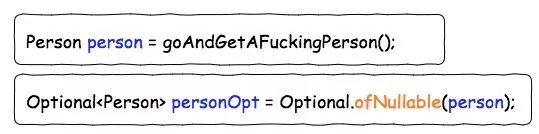
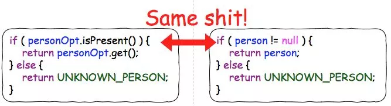
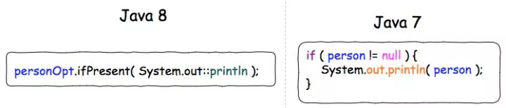
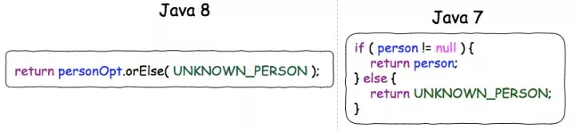
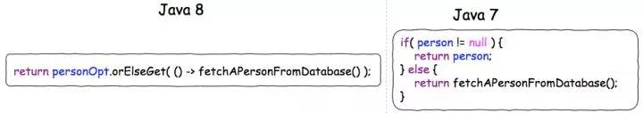
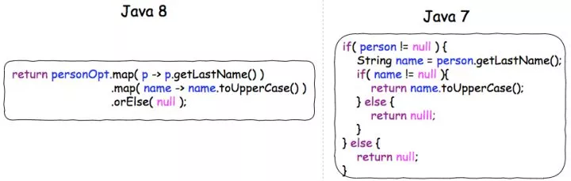

## Optional是什么?

`Optional`容器是Java 8 新引入的对`null`类型数据建模的一种类型,可以简单的理解它是处理NullPointException的一套高效API

**使用Optional容器能做什么 ?**

<font color="red">  去除代码中对 null 的检查</font>

是的,如果你曾经写过以下这样的代码,而且已经受够了这样的夺命连环null检查. 

```java
String cityName = null;
Person person = personMapper.selectByName("张三");
if (person != null) {
    City city = person.getCity();
    if (city != null) {
        cityName = city.getName();
    }
}
```

但是使用`Optional`,你可以用以下非常简洁的代码去替换上面的代码

```java
 Optional.ofNullable(personMapper.selectByName("张三"))
        .map(Person::getCity)
        .map(Person::getCityName);
//你甚至可以把他们写成一行
```

**Optional 可以做的事情只有这么多吗? 绝不,如何 让 Optional 发光发热,下面会慢慢介绍.**


## Optional API

`Optional `API分为两部分,先看第一部分

从对象中生成Optional :

<table><tbody><tr><th><strong>S.N.</strong></th>
			<th><strong>方法及说明</strong></th>
		</tr><tr><td>1</td>
			<td>static&lt;T&gt; Optional&lt;T&gt; empty()<br>
			null包装成的Optional对象</td>
		</tr><tr><td>2</td>
			<td>static &lt;T&gt; Optional&lt;T&gt; of(T value)<br>
			构造一个Optional对象，参数不能是null</td>
		</tr><tr><td>3</td>
			<td>static &lt;T&gt; Optional&lt;T&gt; ofNullable(T value)<br>
			构造一个Optional对象，参数允许为null</td>
		</tr></tbody></table>

对Optional 容器中对象的处理:

<table><tbody><tr><th><strong>S.N.</strong></th>
			<th><strong>方法及说明</strong></th>
		</tr><tr><td>1</td>
			<td><a href="http://lidol.top/2018/06/20/012/#isPresent" rel="nofollow" data-token="83ac1e37f35dfccf2ed25eb5335f7769">boolean isPresent()</a><br>
			检查持有的value是否为null</td>
		</tr><tr><td>2</td>
			<td><a href="http://lidol.top/2018/06/20/012/#ifPresent" rel="nofollow" data-token="eb81278e16f3d2f4e9a1d84ec69fab06">void ifPresent(Consumer&lt;? super T&gt; consumer)</a><br>
			如果持有的value不为null，通过Consumer函数式接口，对持有的value做相应的操作，比如打印等void操作</td>
		</tr><tr><td>3</td>
			<td><a href="http://lidol.top/2018/06/20/012/#orElse" rel="nofollow" data-token="232de29dacf6f355311085846f02f5bf">T orElse(T other)</a><br>
			如果持有的Optional对象isPresent，则返回持有的value，否则返回orElse方法的参数，可用来设置默认值</td>
		</tr><tr><td>4</td>
			<td><a href="http://lidol.top/2018/06/20/012/#orElseGet" rel="nofollow" data-token="ec1dfbda8792d757ad62934bb6ba712c">T orElseGet(Supplier&lt;? extends T&gt; other)</a><br>
			如果持有的Optional对象isPresent，则返回持有的value，否则通过Supplier函数式接口取回一个对象作为默认值返回</td>
		</tr><tr><td>5</td>
			<td><a href="http://lidol.top/2018/06/20/012/#orElseThrow" rel="nofollow" data-token="58a49965915fcf20651886bdcdea62d5">&lt;X extends Throwable&gt; T orElseThrow(Supplier&lt;? extends X&gt; exceptionSupplier) throws X</a><br>
			如果持有的Optional对象isPresent，则返回持有的value，否则抛出一个异常</td>
		</tr><tr><td>6</td>
			<td><a href="http://lidol.top/2018/06/20/012/#get" rel="nofollow" data-token="9580631f0a9ab16cccfc200c31d45975">T get()</a><br>
			取回持有的value，如果value为null，则抛出异常NoSuchElementException</td>
		</tr><tr><td>7</td>
			<td><a href="http://lidol.top/2018/06/20/012/#filter" rel="nofollow" data-token="dd0475b779399b848e8d92b7b3006ffe">Optional&lt;T&gt; filter(Predicate&lt;? super T&gt; predicate)</a><br>
			通过Predicate函数式接口定义的规则测试value，如果函数式接口返回true，则返回原Optional对象，否则通过 empty()方法返回一个Optional对象，可用来对Optional进行过滤</td>
		</tr><tr><td>8</td>
			<td><a href="http://lidol.top/2018/06/20/012/#map" rel="nofollow" data-token="c51f66a43a1a2f23140a57cfafbc83d1">Optional&lt;U&gt; map(Function&lt;? super T, ? extends U&gt; mapper)</a><br>
			对value通过Function函数式接口定义的规则返回一个对象，然后将返回的对象包装成一个Optional对象返回</td>
		</tr><tr><td>9</td>
			<td><a href="http://lidol.top/2018/06/20/012/#flatMap" rel="nofollow" data-token="3edc89f29039f9f4a8a0f44f613a6755">Optional&lt;U&gt; flatMap(Function&lt;? super T, Optional&lt;U&gt;&gt; mapper)</a><br>
			对value通过Function函数式接口定义的规则返回一个Optional对象，然后将返回的Optional对象返回</td>
		</tr></tbody></table>


## Optional 初步使用

### 创建 Optional 对象

1. 声明一个空的 Optional

```java
Optional<Car> optCar = Optional.empty();
```

2. 依据一个非空值创建 Optional,of接受的参数不能是空,否则抛出运行时异常.

```java
Optional<Car> optCar = Optional.of(car);
```

3. 可接受 null 的 Optional

```java
Optional<Car> optCar = Optional.ofNullable(car);
```


### 使用 map 从 Optional 对象中提取和转换值

从对象中提取信息是一种比较常见的模式。比如，你可能想要从 insurance 公司对象中提取公司的名称。提取名称之前，你需要检查 insurance 对象是否为 null ，代码如下所示：

```java
String name = null;
if(insurance != null){
    name = insurance.getName();
}
```

为了支持这种模式， Optional 提供了一个 map 方法。它的工作方式如下:

```java
Optional<Insurance> optInsurance = Optional.ofNullable(insurance);
Optional<String> name = optInsurance.map(Insurance::getName);
```

别忘了<font color="red"> `Optional.ofNullable()`</font>是静态方法.


## Optional 不适用的地方

为了避免滥用optional,所以必须先说明不适用的地方

> 由于 Optional 类设计时就没特别考虑将其作为类的字段使用，所以它也并未实现Serializable 接口。由于这个原因，如果你的应用使用了某些要求序列化的库或者框架，在域模型中使用 Optional ，有可能引发应用程序故障。

```java
public class Person {
    private Optional<Car> car;
    public Optional<Car> getCar() { return car; }
}

public class Car {
    private Optional<Insurance> insurance;
    public Optional<Insurance> getInsurance() { return insurance; }
}
```

上面一大堆的代码根本不符合Java哲学,也不符合optional容器设计的初衷(检查空指针异常),**Optional大部分情况下应该只用于返回类型**

另外如果非要使用Optional 作为字段,且让其支持序列化时,可以改造成下面的代码.

```java
public class Person {
    private Car car;
    public Optional<Car> getCarAsOptional() {
    	return Optional.ofNullable(car);
    }
}
```


## Optional  最佳实践

### optional用于返回类型时

**Lambda配合Optional<T>可以使Java对于null的处理变的异常优雅**

这里假设我们有一个person object，以及一个person object的Optional wrapper:



Optional<T>如果不结合Lambda使用的话，并不能使原来繁琐的null check变的简单。



**只有当Optional<T>结合Lambda一起使用的时候，才能发挥出其真正的威力！**

我们现在就来对比一下下面四种常见的null处理中，Java 8的Lambda+Optional<T>和传统Java两者之间对于null的处理差异。


**情况一 - 存在则开干**



**情况二 - 存在则返回，无则返回屁**



**情况三 - 存在则返回，无则由函数产生**




**情况四 - 夺命连环null检查**



由上述四种情况可以清楚地看到，Optional<T>+Lambda可以让我们少写很多ifElse块。尤其是对于情况四那种夺命连环null检查，传统java的写法显得冗长难懂，而新的Optional<T>+Lambda则清新脱俗，清楚简洁。


### Optional 的链式调用

可以把Optional 成stream流水线那样.  **现在你可以大胆想象把Optional 完全看成一个stream,但是该stream是一个特殊的stream,因为他只能包含一个元素** .

 接下来就好理解,在前面介绍的StreamAPI中说过,stream包含中间操作和终端操作,所以你可以大胆的写出一下的连续调用,而不用考虑空指针异常.

```java
Optional<Insurance> optInsurance = Optional.ofNullable(insurance).map(Insurance::getCity)
    .map(Insurance::getCity)
    .map(Insurance::getName);
```

那后续的用法也是类似的.