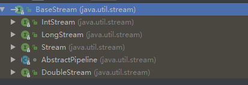

-  


### 一. 流是什么

流是Java API的新成员，它允许你以声明性方式处理数据集合（通过查询语句来表达，而不
是临时编写一个实现）。就现在来说，你可以把它们看成遍历数据集的高级迭代器。

#### 1.1流操作

#####  1.1.1 中间操作

诸如 filter 或 sorted 等**中间操作会返回另一个流**。这让多个操作可以连接起来形成一个查
询。重要的是，除非流水线上触发一个终端操作，否则中间操作不会执行任何处理——它们很懒。
这是因为中间操作一般都可以合并起来，在**终端操作时一次性全部处理**。

**总结:中间操作返回的还是流**

##### 1.1.2 终端操作

终端操作会从流的流水线生成结果。其**结果是任何不是流的值**，比如 List 、 Integer ，甚
至 void 。

**总结:终端操作返回的结果一定不是流**

##### 1.1.3 使用流

*  一个数据源（如集合）来执行一个查询
*  一个中间操作链，形成一条流的流水线
*  一个终端操作，执行流水线，并能生成结果

流的流水线背后的理念类似于构建器模式。构建器模式中有一个调用链用来设置一套配
置（对流来说这就是一个中间操作链），接着是调用 built 方法（对流来说就是终端操作）。

#### 小结

- 流是“从支持数据处理操作的源生成的一系列元素”。
- 流利用内部迭代：迭代通过 filter 、 map 、 sorted 等操作被抽象掉了。
- 流操作有两类：中间操作和终端操作。
- filter 和 map 等中间操作会返回一个流，并可以链接在一起。可以用它们来设置一条流
  水线，但并不会生成任何结果。
- forEach 和 count 等终端操作会返回一个非流的值，并处理流水线以返回结果。
- 流中的元素是按需计算的。


### 二. 使用流

#### 2.1 筛选和切片

在本节中，我们来看看如何选择流中的元素：用谓词筛选，筛选出各不相同的元素，忽略流
中的头几个元素，或将流截短至指定长度。

##### 2.1.1 用谓词筛选

Streams 接口支持 filter 方法。该操作会接受一个谓词（一个返回boolean 的函数）作为参数，并返回一个包括所有符合谓词的元素的流。

```java
List<Dish> vegetarianMenu = menu.stream()
                            .filter(Dish::isVegetarian) //这里用方法引用筛选素食
                            .collect(toList());
```

**filter**实现筛选

**方法引用不是方法调用.**


##### 2.1.2 筛选各异的元素

```java
List<Integer> numbers = Arrays.asList(1, 2, 1, 3, 3, 2, 4);
numbers.stream()
                .filter(i -> i % 2 == 0)
                .distinct()		//去除流中重复的元素
                .forEach(System.out::println);
```

**distinct**去除流中重复的元素.


##### 2.1.3 截短流


````java
List<Dish> dishes = menu.stream()
                                .filter(d -> d.getCalories() > 300)
                                .limit(3)	//截断流,只获取流中前三个元素
                                .collect(toList());
````

**limit(n)**截断流,此方法接受一个数字,**截取**流中前n个元素的**流** .


##### 2.1.4 跳过元素

````java
List<Dish> dishes = menu.stream()
                                .filter(d -> d.getCalories() > 300)
                                .skip(3)	//跳过流中的3个元素
                                .collect(toList());
````

**skip(n)  **,此方法接受一个数字,跳过流中的n个元素,**截取**跳过元素后面的元素作为新流.

**limit(n) 和 skip(n) 是互补的！** 


#### 2.2 映射

一个非常常见的数据处理套路就是从某些对象中选择信息.从元素中选择信息,然后**映射(只创建,不修改)**成另外一种信息.

##### 2.2.1 对流中每一个元素应用函数

流支持 map 方法，它会**接受一个函数作为参数**。这个函数会被应用到每个元素上.

````java
List<String> dishNames = menu.stream()
                                        .map(Dish::getName)	//映射,这里是方法引用
                                        .collect(toList());
````


##### 2.2.2 流的扁平化

```java
   public void test1(){
        String[] words={"hello","world"};
                Arrays.stream(words)	//生成一个流,这个流里面有两个元素
                .map(w -> w.split(""))       // 将每个单词转换为由其字母构成的数组
                .flatMap(Arrays::stream)	//流的扁平化,把每个生成流扁平为单个流
                .distinct()
                .collect(Collectors.toList())
                .forEach(System.out::println);
    }

```

 Arrays.stream(words)的方法声明

```java
public static <T> java.util.stream.Stream<T> stream(@NotNull T[] array)
```

**流的扁平化** 就是将多个单独的流**合并**成一个流. 类似于集合中的**List.toList()** ,可以将两个集合合并成一个集合.

一言以蔽之， **flatmap** 方法让你把一个流中的**每个元素**都换成另一个**流**，这个流中有**多个元素**,然后就会**转换成多个流**,最后把所有的流连接起来成为一个**流**。


#### 2.3 查找和匹配

另一个常见的数据处理套路是看看数据集中的某些元素是否匹配一个给定的属性。Stream API通过 allMatch 、 anyMatch 、 noneMatch 、 findFirst 和 findAny 方法提供了这样的工具。

##### 2.3.1 检查谓词是否至少匹配一个元素

**anyMatch**会检查流中的元素**是否至少有一个满足条件.**

检测菜单里的菜是否满足有一个是素菜

```java
if(menu.stream().anyMatch(Dish::isVegetarian)){
	System.out.println("The menu is (somewhat) vegetarian friendly!!");
}
```

**anyMatch**返回的是一个boolean值,所以它是**终端操作.** 


##### 2.3.2 检查谓词是否匹配所有元素

**allMatch** 方法的工作原理和 **anyMatch** 类似,但它会看流中的元素**是否全部满足条件**.

```java
if(menu.stream().allMatch(Dish::isVegetarian)){
    System.out.println("全部都是素菜");
}
```


和 **allMatch** 相对的是 **noneMatch** ,它可以**确保流中没有任何元素与给定的谓词匹配**。

```JAVA
boolean isHealthy = menu.stream()
								.noneMatch(d -> d.getCalories() >= 1000);
```

anyMatch 、 allMatch 和 noneMatch 这三个操作都用到了我们所谓的**短路**，这就是大家熟悉
的Java中 && 和 || 运算符短路在流中的版本。


##### 2.3.3 查找元素

findAny 方法将返回当前流中的任意元素。它可以与其他流操作结合使用。比如，你可能想找到一道素食菜肴。你可以结合使用 filter 和 findAny 方法来实现这个查询：

```java
Optional<Dish> dish =
                        menu.stream()
                        .filter(Dish::isVegetarian)
                        .findAny();
```

**findAny** 注意这个方法没有任何参数,找到符合条件的菜肴后,立即终止对流的操作.

以下 是**findAny**方法的声明

```java
public abstract java.util.Optional<T> findAny()
```


##### 2.3.4 查找第一个元素

有些流有一个出现顺序,对于这种流,你可能想要找到第一个满足条件的元素.为此有一个 **findFirst**方法

例如，给定一个数字列表，下面的代码能找出第一个平方能被3整除的数：

```java
List<Integer> someNumbers = Arrays.asList(1, 2, 3, 4, 5);
                            Optional<Integer> firstSquareDivisibleByThree =
                            someNumbers.stream()
                            .map(x -> x * x)		
                            .filter(x -> x % 3 == 0)
                            .findFirst(); // 9
```


**何时使用 findFirst 和 findAny**

答案是并行。找到第一个元素,在并行上限制更多。如果你不关心返回的元素是哪个，请使用 findAny ，因为它在使用并行流时限制较少。


#### 2.4 归约

将流中所有元素反复结合起来操作，最后得到**一个结果**值

##### 2.4.1 元素求和

可以像下面这样对流中所有的元素求和：

```java
int sum = numbers.stream().reduce(0, (a, b) -> a + b);
```

reduce 接受两个参数：

*  一个初始值，这里是0  
*   一个 **BinaryOperator**<T> 来将两个元素结合起来产生一个新值，这里我们用的是lambda (a, b) -> a + b 。

也很容易把所有的元素相乘，只需要将另一个Lambda： (a, b) -> a * b 传递给 reduce操作就可以了：

```java
int product = numbers.stream().reduce(1, (a, b) -> a * b);
```


**无初始值**

reduce 还有一个重载的变体，它不接受初始值，但是会返回一个 **Optional** 对象：

```java
Optional<Integer> sum = numbers.stream().reduce((a, b) -> (a + b));
```

考虑流中没有任何元素的情况。 reduce 操作无法返回其和，因为它没有初始值。这就是为什么结果被包裹在一个 Optional 对象里，以表明和可能不存在。


##### 2.4.2 最大值和最小值

你可以像下面这样使用 reduce 来计算流中的最大值

```java
Optional<Integer> max = numbers.stream().reduce(Integer::max);
```

要计算最小值，你需要把 Integer.min 传给 reduce 来替换 Integer.max ：

```java
Optional<Integer> min = numbers.stream().reduce(Integer::min);
```

你当然也可以写成Lambda  (x, y) -> x < y ? x : y 而不是 **Integer::min** ，不过后者比较易读。


**流操作：无状态和有状态** 

> ​	在从集合生成流的时候把 Stream 换成 parallelStream 就可以实现并行。
>
> ​	诸如 map 或 filter 等操作会从输入流中获取每一个元素，并在输出流中得到0或1个结果。
> 这些操作一般都是 无状态的：它们**没有内部状态**（假设用户提供的Lambda或方法引用没有内部可变态）。
>
> ​	但诸如 reduce 、 sum 、 max 等操作需要内部状态来累积结果。在上面的情况下，**内部状态很小**.
>
> ​	相反，诸如 sort 或 distinct 等操作一开始都和 filter 和 map 差不多——都是接受一个流，再生成一个流	（中间操作），但有一个关键的区别。从流中排序和删除重复项时都需要知道先前的历史。我们把这些操作叫作 **有状态操作**。


#### 2.5 数值流

##### 2.5.1 原始类型流特化

**映射到数值流** 

```java
int calories = menu.stream()
    .mapToInt(Dish::getCalories)	//映射流,将流转化为原始类型流.
    .sum();
```

 **IntStream** 还支持其他的方便方法，如**max** 、 **min** 、 **average** 等

**转换回对象流**

```java
IntStream intStream = menu.stream().mapToInt(Dish::getCalories);	//转换为原始流
Stream<Integer> stream = intStream.boxed()	//转换回对象流
```

在需要将数值范围装箱成为一个一般流时， **boxed** 尤其有用。


通过下图可以看出stream和原始类型流处在**同一个层级**上.




##### 2.5.2 数值范围

Java 8引入了两个可以用于 IntStream 和 LongStream 的静态方法，帮助生成这种范围：range 和 rangeClosed 

```java
IntStream evenNumbers = IntStream.rangeClosed(1, 100)	//生成流中的元素范围是[0,100]
													.filter(n -> n % 2 == 0);
```

**rangeClosed左右都是闭区间 ,range 是不包含结束值的。**


#### 2.6 构建流

##### 2.6.1 由值创建流

可以使用静态方法 **Stream.of** ，通过显式值创建一个流。它可以接受任意数量的参数。

```java
Stream<String> stream = Stream.of("Java 8 ", "Lambdas ", "In ", "Action");
```

你可以使用 empty 得到一个空流，如下所示：

```java
Stream<String> emptyStream = Stream.empty();
```


##### 2.6.2 由数组创建流

可以使用静态方法 **Arrays.stream**  从数组创建一个流。它接受一个数组作为参数,这个数组可以是任意类型的.

```java
int [] numbers = {2, 3, 5, 7, 11, 13};	//注意这里的数组类型是int 而不是Intger
IntStream stream = Arrays.stream(numbers);
stream.sum();
```


##### 2.6.3 由文件生成流

```java
Stream<String> strLines = Files.lines(Paths.get("test.xml"),
                                      Charset.defaultCharset());
	strLines.flatMap(line -> Arrays.stream(line.split("")))
    												.forEach(System.out::println);
```


##### 2.6.4 由函数生成流：创建无限流

Stream API提供了两个静态方法来从函数生成流： Stream.iterate 和 Stream.generate 。

**迭代**

```java
Stream.iterate(0, n -> n + 2)
							.limit(10)
							.forEach(System.out::println);
```


**生成**

```java
Stream.generate(Math::random)
                            .limit(5)
                            .forEach(System.out::println);
```

 generate 方法也可让你按需生成一个无限流。但 generate 不是依次对每个新生成的值应用函数的。它接受一个 **Supplier**<T> 类型的Lambda提供新的值。


#### 2.7 小结

流让你可以简洁地表达复杂的数据处理查询。此外，流可以透明地**并行化**。以下是你应从本章中学到的关键概念。

*  Streams API可以表达复杂的数据处理查询。
*  你可以使用 filter 、 distinct 、 skip 和 limit 对流做筛选和切片。
*  你可以使用 map 和 flatMap 提取或转换流中的元素。
* 你可以使用 findFirst 和 findAny 方法查找流中的元素。你可以用 allMatch 、noneMatch 和 anyMatch 方法让流匹配给定的谓词。
*  这些方法都利用了短路：找到结果就立即停止计算；没有必要处理整个流。
*  你可以利用 reduce 方法将流中所有的元素迭代合并成一个结果，例如求和或查找最大元素。
* filter 和 map 等操作是无状态的，它们并不存储任何状态。 reduce 等操作要存储状态才能计算出一个值。sorted 和 distinct 等操作也要存储状态，因为它们需要把流中的所有元素缓存起来才能返回一个新的流。这种操作称为有状态操作。
* 流有三种基本的原始类型特化： IntStream 、 DoubleStream 和 LongStream 。它们的操作也有相应的特化。
*  流不仅可以从集合创建，也可从值、数组、文件以及 iterate 与 generate 等特定方法创建。
* 无限流是没有固定大小的流。


### 三. 使用流收集数据

#### 3.1  收集器简介

##### 3.1.1 收集器用作高级归约

最直接和最常用的收集器是 **toList** 静态方法 ，它会把流中所有的元素收集到一个 List 中：

```java
List<Transaction> transactions =
								transactionStream.collect(Collectors.toList());
```

##### 3.1.2 预定义收集器

我们主要探讨预定义收集器的功能，也就是那些可以从 Collectors类提供的工厂方法（例如 groupingBy ）创建的收集器。它们主要提供了三大功能：

* 将流元素归约和汇总为一个值
*  元素分组
*  元素分区


#### 3.2 归约和汇总

collect方法的参数是**集合收集器**,但collect方法的返回值并不总是一个集合类型的数据.

举一个简单的例子，利用 counting 工厂方法返回的收集器，数一数菜单里有多少种菜：

```java
long howManyDishes = menu.stream().collect(Collectors.counting());
```

这还可以写得更为直接：

```java
long howManyDishes = menu.stream().count();
```

##### 3.2.1 查找流中的最大值和最小值

想要找出菜单中热量最高的菜。你可以使用两个收集器， Collectors.maxBy 和Collectors.minBy ，来计算流中的最大或最小值。

这两个收集器接收一个 Comparator 参数来比较流中的元素。你可以创建一个 Comparator 来根据所含热量对菜肴进行比较，并把它传递给Collectors.maxBy ：

```java
Comparator<Dish> dishCaloriesComparator =Comparator.comparingInt(Dish::getCalories);
Optional<Dish> mostCalorieDish =menu.stream()
    .collect(maxBy(dishCaloriesComparator));
```

Optional<Dish> 是怎么回事? 因为流中可能不存在元素,自然就无法比较出最大或最小元素.

##### 3.2.2 汇总

Collectors 类专门为汇总提供了一个工厂方法： Collectors.summingInt 。

它可接受一个把对象映射为求和所需 int 的函数，并返回一个收集器；该收集器在传递给普通的 collect 方法后即执行我们需要的汇总操作。举个例子来说，你可以这样求出菜单列表的总热量：

```java
int totalCalories = menu.stream().collect(summingInt(Disg::getCalories));
```

但汇总不仅仅是求和；还有 Collectors.averagingInt ，连同对应的 averagingLong 和averagingDouble 可以计算数值的平均数：

```java
double avgCalories =menu.stream().collect(averagingInt(Dish::getCalories));
```

你可以使用 summarizingInt 工厂方法返回的收集器。例如，通过一次 summarizing 操作你可以就数出菜单中元素的个数，并得到菜肴热量总和、平均值、最大值和最小值：

```java
IntSummaryStatistics menuStatistics =
    menu.stream().collect(summarizingInt(Dish::getCalories));
```

这个收集器会把所有这些信息收集到一个叫作 IntSummaryStatistics 的类里，它提供了方便的取值（getter）方法来访问结果。

```java
 IntSummaryStatistics summary = 
    	 dishlsit.stream().collect(summarizingInt(Dish::getCalories));
        summary.getAverage();
        summary.getCount();
        summary.getMax();
        summary.getMin();
        summary.getSum();
```

同样，相应的 summarizingLong 和 summarizingDouble 工厂方法有相关的 LongSummary-Statistics 和 DoubleSummaryStatistics 类型，适用于收集的属性是原始类型 long 或double 的情况。

##### 3.2.3 连接字符串

joining 工厂方法返回的收集器会把对流中每一个对象应用 toString 方法得到的所有字符串连接成一个字符串。这意味着你把菜单中所有菜肴的名称连接起来，如下所示：

```java
String shortMenu = menu.stream().map(Dish::getName).collect(joining());
```

joining其中一个重载的方法声明,joining不接受字符串以外的.

```java
public static java.util.stream.Collector<CharSequence, ?, String> joining()
```

**joining** 在内部使用了 **StringBuilder** 来把生成的字符串逐个追加起来.

如果 Dish 类有一个 toString 方法来返回菜肴的名称，那你无需用提取每一道菜名称的函数来对原流做映射就能够得到相同的结果：

```java
String shortMenu = menu.stream().collect(joining());
```

但该字符串的可读性并不好。幸好， joining 工厂方法有一个重载版本可以接受元素之间的
分界符，这样你就可以得到一个逗号分隔的菜肴名称列表：

```java
 String collect = menu.stream().map(Dish::getName).collect(joining(","));
```

正如我们预期的那样，它会生成：

pork, beef, chicken, french fries, rice, season fruit, pizza, prawns, salmon.


##### 3.2.4 广义的归约汇总

事实上，我们已经讨论的所有收集器，都是一个可以用 reducing 工厂方法定义的归约过程的特殊情况而已。

例如，可以用 reducing 方法创建的收集器来计算你菜单的总热量，如下所示：

```java
int totalCalories = menu.stream().collect(reducing(0,
                                                   Dish::getCalories,
                                                   (i, j) -> i + j));
```

它需要三个参数:

*  第一个参数是归约操作的起始值，也是流中没有元素时的返回值，所以很显然对于数值和而言 0 是一个合适的值。
* 第二个参数Function函数，将菜肴转换成一个表示其所含热量的 int 
* 第三个参数是一个 BinaryOperator ，将两个项目累积成一个同类型的值。这里它就是对两个 int 求和。

**reducing函数的声明** ,可以看到BinaryOperator的参数类型和第一个参数identity一致.

```java
public static <T, U>
Collector<T, ?, U> reducing(U identity,
                            Function<? super T, ? extends U> mapper,
                            BinaryOperator<U> op)
```

下面是两个函数式接口的声明

**BinaryOperator**

```java
public interface BinaryOperator<T> extends BiFunction<T,T,T> 
```

**BiFunction**

```java
public interface BiFunction<T, U, R> 
```


同样，你可以使用下面这样单参数形式的 reducing 来找到热量最高的菜，如下所示：

```java
Optional<Dish> mostCalorieDish =
menu.stream().collect(reducing(
(d1, d2) -> d1.getCalories() > d2.getCalories() ? d1 : d2));
```

可以把单参数 reducing 工厂方法创建的收集器看作三参数方法的特殊情况，它把流中的第一个项目作为起点，把恒等函数（即一个函数仅仅是返回其输入参数）作为一个转换函数。这也意味着，要是把单参数 reducing 收集器传递给空流的 collect 方法，收集器就没有起点；它将因此而返回一个 Optional<Dish> 对象。

**收集框架的灵活性：以不同的方法执行同样的操作**

```java
int totalCalories = menu.stream().collect(reducing(0,
                                                Dish::getCalories,
                                                Integer::sum));
```

还有另一种方法不使用收集器也能执行相同操作——将菜肴流映射为每一道菜的热量，然后用前一个版本中使用的方法引用来归约得到的流：

```java
int totalCalories =
				menu.stream().map(Dish::getCalories).reduce(Integer::sum).get();
```

注意，就像流的任何单参数 reduce 操作一样， reduce(Integer::sum) 返回的不是 int而是 Optional<Integer>

最后，更简洁的方法是把流映射到一个 IntStream ，然后调用 sum 方法，你也可以得到相同的结果：

```java
int totalCalories = menu.stream().mapToInt(Dish::getCalories).sum();
```

**reduce方法和reducing方法的单参数方法都是binaryOperator** .


**根据情况选择最佳解决方案**

 函数式编程通常提供了多种方法来执行同一个操作.

尽可能为手头的问题探索不同的解决方案，但在通用的方案里面，始终选择最专门化的一个。无论是从可读性还是性能上看，这一般都是最好的决定。


#### 3.4 分组

假设你要把菜单中的菜按照类型进行分类，有肉的放一组，有鱼的放一组，其他的都放另一组。用 Collectors.groupingBy 工厂方法返回的收集器就可以轻松地完成这项任务，如下所示：

```java
Map<Dish.Type, List<Dish>> dishesByType =
						menu.stream().collect(groupingBy(Dish::getType));
```

其结果是下面的 Map ：

```json
{FISH=[prawns, salmon], OTHER=[french fries, rice, season fruit, pizza],
MEAT=[pork, beef, chicken]}
```

这里，你给 groupingBy 方法传递了一个 Function （以方法引用的形式），它提取了流中每一道 Dish 的 Dish.Type 。我们把这个 Function 叫作**分类函数**，因为它用来把流中的元素分成不同的组。

分组操作的结果是一个 Map ，把**分组函数返回的值作为映射的键**，把流中所有具有这个分类值的项目的**列表**作为对应的映射值。


但是，分类函数不一定像方法引用那样可用，因为你想用以分类的条件可能比简单的属性访问器要复杂。

例如，你可能想把热量不到400卡路里的菜划分为“低热量”（diet），热量400到700卡路里的菜划为“普通”（normal），高于700卡路里的划为“高热量”（fat）。

```java
public enum CaloricLevel { DIET, NORMAL, FAT }	//外部定义一个分组依据的枚举

 Map<CaloricLevel, List<Dish>> listMap = menu.stream().collect(groupingBy(dish ->
        {
            if (dish.getCalories() >0 && dish.getCalories() < 500)
                return CaloricLevel.DIET;
            else if (dish.getCalories() > 500 && dish.getCalories() < 700) {
                return CaloricLevel.NORMAL;
            } else {
                return CaloricLevel.FAT;
            }

        }));
```


##### 3.4.1 多级分组

除了普通的分类函数之外，还可以接受 collector 类型的第二个参数。那么要进行二级分组的话，我们可以把一个内层 groupingBy 传递给外层 groupingBy ，并定义一个为流中项目分类的二级标:

```java
Map<Dish.Type, Map<CaloricLevel, List<Dish>>> dishesByTypeCaloricLevel =
menu.stream().collect(groupingBy(
    Dish::getType,
        groupingBy(dish -> {
        if (dish.getCalories() <= 400) return CaloricLevel.DIET;
        else if (dish.getCalories() <= 700) return CaloricLevel.NORMAL;
        else return CaloricLevel.FAT;} )
                                   )
                      );
```


这个二级分组的结果就是像下面这样的两级 Map ：

```json
{
    MEAT={DIET=[chicken], NORMAL=[beef], FAT=[pork]},
	FISH={DIET=[prawns], NORMAL=[salmon]},
	OTHER={DIET=[rice, seasonal fruit], NORMAL=[french fries, pizza]}
}
```

这里的外层 Map 的键就是第一级分类函数生成的值：“fish, meat, other”，而这个 Map 的值又是一个 Map ，键是二级分类函数生成的值：“normal, diet, fat”。


##### 3.4.2 按子组收集数据

我们看到可以把第二个 groupingBy 收集器传递给外层收集器来实现多级分组。但进一步说，传递给第一个 groupingBy 的第二个收集器可以是任何类型，而不一定是另一个 groupingBy 。

例如，要数一数菜单中每类菜有多少个，可以传递 counting 收集器作为groupingBy 收集器的第二个参数：

```java
Map<Dish.Type, Long> typesCount = menu.stream().collect(groupingBy(Dish::getType, 
                                                                   counting()));
```

其结果是下面的 Map ：

```json
{MEAT=3, FISH=2, OTHER=4}
```

还要注意，普通的单参数 groupingBy(f) （其中 f 是分类函数）实际上是 groupingBy(f,toList()) 的简便写法。

再举一个例子，你可以把前面用于查找菜单中热量最高的菜肴的收集器改一改，按照菜的类型分类：

```java
Map<Dish.Type, Optional<Dish>> mostCaloricByType =
                            menu.stream()
                            .collect(groupingBy(Dish::getType,
                            maxBy(comparingInt(Dish::getCalories))))
```

个分组的结果显然是一个 map ，以 Dish 的类型作为键，以包装了该类型中热量最高的 Dish的 Optional<Dish> 作为值.

**注意** 这个 Map 中的值是 Optional .这不是好的结果.

包装的 Optional 没什么用，所以你可能想要把它们去掉。要做到这一点，或者更一般地来说，把收集器返回的结果转换为另一种类型，你可以使用Collectors.collectingAndThen 工厂方法返回的收集器，如下所示

```java
Map<Dish.Type, Dish> mostCaloricByType =menu.stream()
.collect(groupingBy(Dish::getType,
					collectingAndThen(
                        maxBy(comparingInt(Dish::getCalories)),
                    Optional::get)));
```

**通过 groupingBy 工厂方法的第二个参数传递的收集器将会对分到同一组中的所有流元素执行进一步归约操作。**

与 groupingBy 联合使用的其他收集器的例子

````java
Map<Dish.Type, Integer> totalCaloriesByType =
                            menu.stream().collect(groupingBy(Dish::getType,
                            summingInt(Dish::getCalories)));
````


然而常常和 groupingBy 联合使用的另一个收集器是 mapping 方法生成的,这个方法接受两个参数：一个函数对流中的元素做变换，另一个则将变换的结果对象收集起来。

比方说你想要知道，对于每种类型的 Dish ，菜单中都有哪些 CaloricLevel 。我们可以把 groupingBy 和 mapping 收集器结合起来，如下所示：

```java
Map<Dish.Type, Set<CaloricLevel>> caloricLevelsByType =
            menu.stream().collect(
            groupingBy(Dish::getType, mapping(
            dish -> { if (dish.getCalories() <= 400) return CaloricLevel.DIET;
            else if (dish.getCalories() <= 700) return CaloricLevel.NORMAL;
            else return CaloricLevel.FAT; },
            toSet() )));
```

方法抽取,重构后得到:

```java
  @Test
  public void test3(){
        Map<Dish.Type, Set<CaloricLevel>> caloricLevelsByType =
                menu.stream().collect(
                        groupingBy(Dish::getType, mapping(
                                getDishCaloricLevelFunction(),	//重构抽取
                                toSet() )));
        System.out.println(caloricLevelsByType);
  }


 private Function<Dish, CaloricLevel> getDishCaloricLevelFunction() {
        return dish -> { if (dish.getCalories() <= 400) return CaloricLevel.DIET;
        else if (dish.getCalories() >= 400&&dish.getCalories() <= 700) return 				CaloricLevel.NORMAL;
        else return CaloricLevel.FAT; };
 }
```

对于返回的 Set 是什么类型并没有任何保证。但通过使用 toCollection ，你就可以有更多的控制。例如，你可以给它传递一个构造函数引用来要求 HashSet ：

```java
Map<Dish.Type, Set<CaloricLevel>> caloricLevelsByType =
            menu.stream().collect(
            groupingBy(Dish::getType, mapping(
                dish -> { if (dish.getCalories() <= 400) return CaloricLevel.DIET;
                else if (dish.getCalories() <= 700) return CaloricLevel.NORMAL;
                else return CaloricLevel.FAT; },
            toCollection(HashSet::new) )));
```


#### 3.5 分区

分区是分组的特殊情况：由一个谓词（返回一个布尔值的函数）作为分类函数，它称分区函数。分区函数返回一布尔值，这意味着得到的分组 Map 的键类型是 Boolean ，于是它最多可以分为两组—— true 是一组， false 是一组。例如，如果你是素食者或是请了一位素食的朋友来共进晚餐，可能会想要把菜单按照素食和非素食分开：

```java
Map<Boolean, List<Dish>> partitionedMenu =menu.stream()
			.collect(partitioningBy(Dish::isVegetarian));	//分区函数
```

你可以把分区看作分组一种特殊情况。 groupingBy 和partitioningBy 收集器之间的相似之处并不止于此；

还可以按照和分组类似的方式进行多级分区。

```java
menu.stream().collect(partitioningBy(Dish::isVegetarian,
              partitioningBy (d -> d.getCalories() > 500)));
```

这是一个有效的多级分区，产生以下二级 Map ：
{ false={false=[chicken, prawns, salmon], true=[pork, beef]},
true={false=[rice, season fruit], true=[french fries, pizza]}}

```java
menu.stream().collect(partitioningBy(Dish::isVegetarian,
partitioningBy (Dish::getType)));
```

这无法编译，因为 partitioningBy 需要一个谓词，也就是返回一个布尔值的函数。方法引用 Dish::getType 不能用作谓词。

```java
menu.stream().collect(partitioningBy(Dish::isVegetarian,
counting()));
```

 它会计算每个分区中项目的数目，得到以下 Map ：{false=5, true=4}


#### 3.6 小结

以下是你应从本章中学到的关键概念。

*  collect 是一个终端操作，它接受的参数是将流中元素累积到汇总结果的各种方式（称为收集器）。
* 预定义收集器包括将流元素归约和汇总到一个值，例如计算最小值、最大值或平均值。
* 预定义收集器可以用 groupingBy 对流中元素进行分组，或用 partitioningBy 进行分区。
* 收集器可以高效地复合起来，进行多级分组、分区和归约。
* 你可以实现 Collector 接口中定义的方法来开发你自己的收集器。