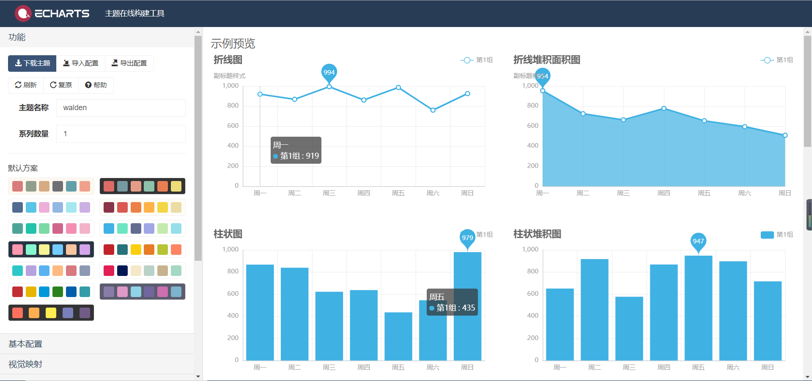
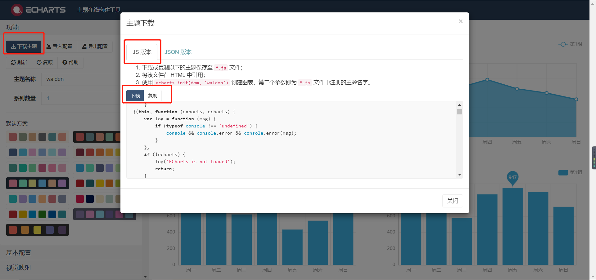
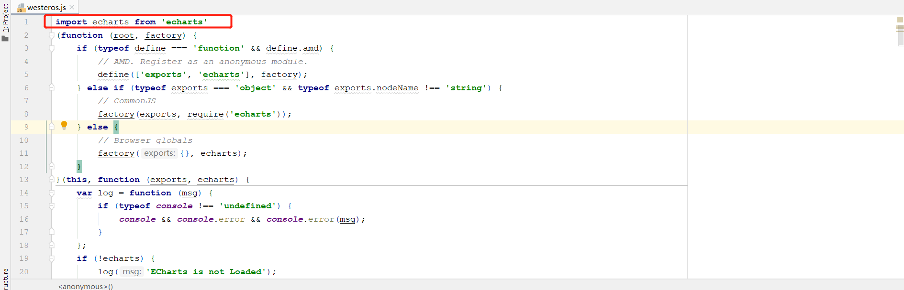

点击[主题在线构建工具](https://www.echartsjs.com/theme-builder/)

自定义主题样式 名称及系列数量




选择导出js




普通html页面导入安装官方示例即可。

npm方式导入需要

1. 在main.js入库文件文件导入

```js
import  "./assets/js/westeros";
```

2. 需要在下载的文件中加上

```js
import echarts from 'echarts'
```




另外需要将该样式文件中的字符串 `root.echarts` 替换成`echarts`


最后初始化dom的时候绑定样式即可

```js
//westeros就是样式名称
var myChart = this.$echarts.init(document.getElementById('myChart'),"westeros")
```

